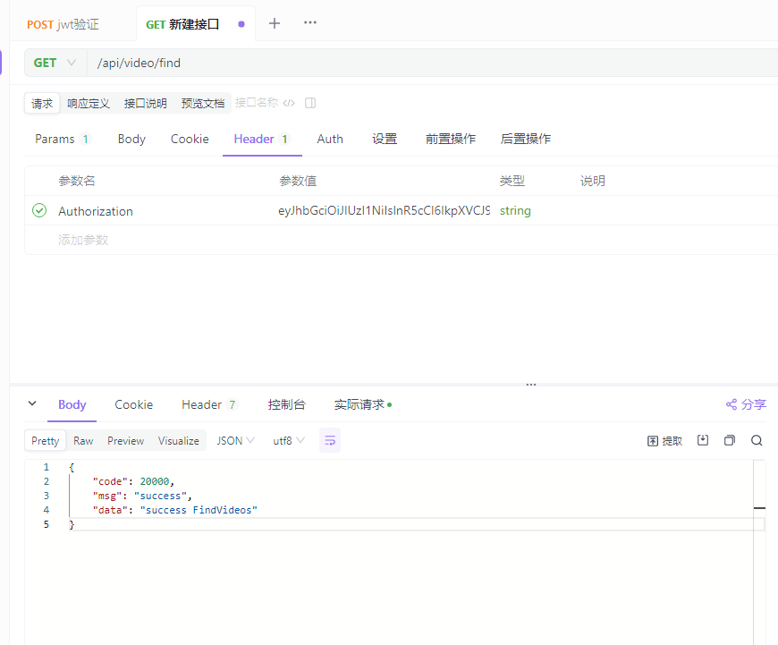

# 架构分析

 使用gin作为web服务，使用vue作为前端服务，来构建一个admin管理后台系统。

**模板文件**

Goland创建go文件添加作者信息：

- File -> Settings -> Editor -> File and Code Templates -> Go File

- 右侧填入模板

- ```go
  /* 
  @Author: 梦无矶小仔
  @Date:   ${DATE} ${TIME}
  */
  package ${GO_PACKAGE_NAME}
  ```

## web框架Gin

安装gin的组件

```go
go get -u github.com/gin-gonic/gin
```

定义go的初始化

```go
package main

import (
	"fmt"
	"github.com/gin-gonic/gin"
)

func main() {
	//  初始化 gin服务
	rootRouter := gin.Default()
	// 启动HTTP服务,可以修改端口
	address := fmt.Sprintf(":%d", 8088)
	rootRouter.Run(address)
}

```


## 初始化-1

main.go中进行初始化

```go
package main

import (
   "fmt"
   "xz-go-frame/initlization"
)

//go:generate go env -w GO111MODULE=on
//go:generate go env -w GOPROXY=https://goproxy.cn,direct
//go:generate go mod tidy
//go:generate go mod download

func main() {
   // 开始初始化gin路由服务
   initlization.WebRouterInit()
   fmt.Println("启动xz-go-frame后端成功")
}
```

## 路由-1

新建initlization包，创建router.go

```go
package initlization

import (
	"github.com/gin-gonic/gin"
	"net/http"
)

func WebRouterInit() {
	// 初始化 gin 服务
	rootRouter := gin.Default()

	// 登录路由
	rootRouter.GET("/login", func(context *gin.Context) {
		context.JSON(http.StatusOK,"我是gin")
	})

	// 启动HTTP服务
	rootRouter.Run("127.0.0.1:8888")
}

```


启动之后可以直接访问`127.0.0.1:8888/login`，就能访问你的页面了。


**接下来开始简单的一些封装。**

## 封装api

新建api包

```go
api
	- admin
		-- index.go
	- bbs
		-- bbs.go
	- login
		-- login.go
	- video
		-- video.go
```

### index.go

```go
package admin

import (
	"github.com/gin-contrib/sessions"
	"github.com/gin-gonic/gin"
	"net/http"
)

type AdminApi struct {
}

// 登录处理的逻辑

func (e *AdminApi) Index(c *gin.Context) {
	// 获取会话
	session := sessions.Default(c)
	// 获取登录用户信息
	user := session.Get("user")
	username := user.(string)
	c.JSON(http.StatusOK, "我是gin"+username)

}

```

### bbs.go

```go
package bbs

import (
	"github.com/gin-gonic/gin"
	"net/http"
)

type BbsApi struct {
}

// 首页处理
func (e *BbsApi) BbsIndex(c *gin.Context) {
	username, _ := c.Get("username")
	// 可以获取到的login放入session的数据
	c.JSON(http.StatusOK, "我是bbs的首页："+username.(string))
}

// 获取明细
func (e *BbsApi) GetBbsDetailById(c *gin.Context) {
	username, _ := c.Get("username")
	// 可以获取到login放入session的数据
	param := c.Param("id")
	c.JSON(http.StatusOK,"我是bbs的名字，参数："+param+" : "+username.(string))
}

```


### login.go

```go
package login

import (
	"github.com/gin-contrib/sessions"
	"github.com/gin-gonic/gin"
	"net/http"
)

type LoginApi struct {
}

func (e *LoginApi) Login(c *gin.Context) {
	// session ---- 是一种所有请求之间的数据共享机制，为什么会出现session，是因为http请求是一种无状态。
	// 什么叫无状态：就是指，用户在浏览器输入方位地址的时候，地址请求到服务区，到响应服务，并不会存储任何数据在客户端或者服务端，
	// 也是就：一次request---response就意味着内存消亡，也就以为整个过程请求和响应过程结束。
	// 但是往往在开发中，我们可能要存存储一些信息，让各个请求之间进行共享。所有就出现了session会话机制
	// session会话机制其实是一种服务端存储技术，底层原理是一个map
	// 比如：我登录的时候，要把用户信息存储session中，然后给 map[key]any =
	// key = sdf365454klsdflsd --sessionid

	// 初始化session对象
	session := sessions.Default(c)
	// 存放用户信息到session中
	session.Set("user", "xiaozai") // map[sessionid] == map[user][xiaozai]
	// 记住一定要调用save方法，否则内存不会写入进去
	session.Save()
	username := session.Get("user")
	c.JSON(http.StatusOK, "我是gin:登录用户名："+username.(string))
}

```

### video.go

```go
package video

import (
	"github.com/gin-gonic/gin"
	"net/http"
)

type Video struct {
}

// 首页处理
func (e *Video) VideoIndex(c *gin.Context) {
	username, _ := c.Get("username")
	// 可以获取到login放入session的数据
	c.JSON(http.StatusOK, "我是video的首页: "+username.(string))
}

// 获取明细

func (e *Video) GetVideoDetailById(c *gin.Context) {
	username, _ := c.Get("username")
	// 可以获取到login放入session的数据
	param := c.Param("id")
	c.JSON(http.StatusOK, "我是VideoApi的名字,参数:"+param+"  ： "+username.(string))
}

```

## 抽离router

新建router包

```go
router
	- bbs
		-- bbs.go
	- video
		-- video.go
```


### bbs.go

```go
package bbs

import (
	"github.com/gin-gonic/gin"
	"xz-go-frame/api/bbs"
)

type BbsRouter struct {
}

func (bBsRouter BbsRouter) InitBBSRouter(group *gin.RouterGroup) {
	// 帖子路由
	bbsApi := bbs.BbsApi{}
	bbsApiGroup := group.Group("bbs")
	{
		// 函数封装
		bbsApiGroup.GET("/indexx", bbsApi.BbsIndex)
		bbsApiGroup.GET("/get/:id", bbsApi.GetBbsDetailById)
	}
}

```

### video.go

```go
package video

import (
	"github.com/gin-gonic/gin"
	"xz-go-frame/api/video"
)

type VideoRouter struct {
}

func (videoRouter VideoRouter) InitVideoRouter(group *gin.RouterGroup) {
	// 帖子路由
	videoApi := video.Video{}
	videoGroup := group.Group("video")
	{
		videoGroup.GET("/index", videoApi.VideoIndex)
		videoGroup.GET("/get/:id", videoApi.GetVideoDetailById)
	}
}

```


## 封装中间件

新建middle包

```go
middle
	- loginfilter.go
```

### loginfilter.go

```go
package middle

import (
	"github.com/gin-contrib/sessions"
	"github.com/gin-gonic/gin"
	"net/http"
)

func LoginInterceptor() gin.HandlerFunc {
	return func(c *gin.Context) {
		// 获取会话
		session := sessions.Default(c)
		// 获取用户登录信息
		user := session.Get("user")
		// 如果用户没有登录，直接重定向返回登录
		if user == nil {
			c.Redirect(http.StatusMovedPermanently, "/login")
			c.Abort() // 拦截，到这里就不会往下执行了
		}
		// 取出会话信息
		username := user.(string)
		// 把session用户信息，放入到context中，给后续路由进行使用
		// 好处就是： router中方法不需要再次获取session再来拿会话中的信息
		c.Set("username", username)
		c.Next() //放行，默认就会放行
	}
}

```


## 封装路由

initlization -> router.go

```go
package initlization

import (
	"fmt"
	"github.com/gin-contrib/sessions"
	"github.com/gin-contrib/sessions/cookie"
	"github.com/gin-gonic/gin"
	"xz-go-frame/api/login"
	"xz-go-frame/middle"
	"xz-go-frame/router/bbs"
	"xz-go-frame/router/video"
)

func WebRouterInit() {
	// 初始化 gin 服务
	rootRouter := gin.Default()
	
	// 创建cookie存储
	store := cookie.NewStore([]byte("secret"))
	// 路由上加入session中间件
	rootRouter.Use(sessions.Sessions("mysession",store))
	
	bbsRouter := bbs.BbsRouter{}
	videoRouter := video.VideoRouter{}
	loginApi := login.LoginApi{}
	

	// 登录路由
	rootRouter.GET("/login", loginApi.Login)
	
	// 首页路由
	AdminGroup := rootRouter.Group("admin")
	AdminGroup.Use(middle.LoginInterceptor())
	{
		bbsRouter.InitBBSRouter(AdminGroup)
		videoRouter.InitVideoRouter(AdminGroup)
	}

	// 启动HTTP服务,可以修改端口
	address := fmt.Sprintf(":%d", 8088)
	rootRouter.Run(address)
}

```


到此，就拥有了一个session登录拦截中间件请求的服务。

```shell
1、直接访问 http://127.0.0.1:8088/admin/video/index
会跳转至登录 http://127.0.0.1:8088/login
2、登录成功后再次访问才是正常 http://127.0.0.1:8088/admin/video/index
3、http://127.0.0.1:8088/admin/video/get/100
显示"我是VideoApi的名字,参数:100  ： xiaozai"
```

# 配置viper

详见知识点viper库

```go
configfile
	- application.yaml
```

## 1、下载viper
```go
go get github.com/spf13/viper
```
## 2、编写一个yaml的配置文件application.yaml
```yaml
# 数据配置的设定 tab对齐，shift+tab 回退对齐
mysql:
  database:
    host: 127.0.0.1
    user: root
    dbname: test
    pwd: 123456
# 服务组配置信息
server:
  port: 8088
  cookiname: mysession
```
## 3、基本读取

在initlization包下新建`init_viper.go`文件。

```go
/*
* @Author: 梦无矶小仔
* @Date:   2023/12/27 14:43
 */
package initlization

import (
	"fmt"
	"github.com/fsnotify/fsnotify"
	"github.com/spf13/viper"
	"os"
)

func InitViper() {
	// 获取项目的执行路径
	path, err := os.Getwd() // D:\Z_Enviroment\GoWorks\src\xz-go-frame
	if err != nil {
		panic(err)
	}
	// 初始化一个viper解析配置对象
	config := viper.New()
	// 开始设置从哪个目录下去找yaml文件
	config.AddConfigPath(path + "/configfile") // 设置读取的文件路径
	// 设置配置文件的名字
	config.SetConfigName("application") // 设置读取的文件名
	// 设置配置文件的后缀
	config.SetConfigType("yaml") // 设置文件类型

	// 尝试进行配置读取
	if err := config.ReadInConfig(); err != nil {
		panic(err)
	}
	// 监控配置文件的变化
	config.WatchConfig()
	config.OnConfigChange(func(e fsnotify.Event) {
		fmt.Println("配置文件发生变化：", e.Name)
		//// 把改变的值重新放入到config配置中去
		//if err = config.Unmarshal(&config); err!= nil {
		//	fmt.Println(err)
		//}
	})

	// 打印文件读取出来的内容
	fmt.Println(len(config.Get("mysql.database.host").(string))) // 9
	fmt.Println(config.Get("mysql.database.host")) // 127.0.0.1
	fmt.Println(config.Get("mysql.database.user")) // root
	fmt.Println(config.Get("mysql.database.dbname")) // test
	fmt.Println(config.Get("mysql.database.pwd")) // 123456
	fmt.Println(config.Get("server.port")) // 8888
	fmt.Println(config.Get("server.cookiname")) // mysession

}

```

测试代码，修改为如下代码进行测试配置文件的读取。

```go
func main() {
	//  开始初始化配置文件
	initlization.InitViper()
	fmt.Println("初始化配置文件成功！")
	// 开始初始化gin路由服务
	//initlization.WebRouterInit()
	//fmt.Println("启动xz-go-frame后端成功")
}

```


进一步封装配置见代码

# 全局global属性配置

配置文件`application.yaml`

```yaml
# 服务端口的配置
server:
  port: 8989
  context: /
# 数据库配置
# "root:123456@tcp(127.0.0.1:3306)/xz-go-frame-db?charset=utf8&parseTime=True&loc=Local", // DSN data source name
database:
  mysql:
    host: 127.0.0.1
    port: 3306
    dbname: xz-go-frame-db
    username: root
    password: 123456
    config: charset=utf8&parseTime=True&loc=Local
# nosql数据的配置
nosql:
  redis:
    host: 127.0.0.1
    port: 3306
    password: 123
    db: 0
  es:
    host: 127.0.0.1
    port: 9300
    password: 456
ksd:
  alipay:
    appid: 12454545
    screat: 45587
    paths: 1,2,3
    detail:
      id: 100
      name: xiaozai
    map:
      name: xiaozai
      age: 18
      phone: 3245646
    urls:
      - 1
      - 2
      - 3
    routers:
      - id: 100
        url: /user/
        filter: 1
      - id: 200
        url: /video/
        filter: 2

```

1、新建global包，在下面新建global.go文件

```go
/*
* @Author: 梦无矶小仔
* @Date:   2023/12/27 16:29
 */
package global

import "gorm.io/gorm"

var (
	Yaml map[string]any
	Config *parse.Config
)
```


2、新建commons包，在下面新建相关配置包和文件进行属性管理。

```go
commons
	- parse
		- Config.go
		- Database.go
		- Ksd.go
		- NoSql.go
```

**Config.go**

```go
package parse

// 配置
type Config struct {
	// 数据库
	Database Database `mapstructure:"database" json:"database" yaml:"database"`
	Ksd      Ksd      `mapstructure:"ksd" json:"ksd" yaml:"ksd"`
	NoSQL    NoSQL    `mapstructure:"nosql" json:"nosql" yaml:"nosql"`
}

```

**Database.go**

```go
/*
* @Author: 梦无矶小仔
* @Date:   2023/12/27 17:02
 */
package parse

// Database 配置展示
// database:--------------------------------struct
//
//	mysql: --------------------------------struct
//		host: 127.0.0.1 -------------------field
//		port: 3306 -------------------field
//		dbname: xz-go-frame-db -------------------field
//		username: root -------------------field
//		password: 123456 -------------------field
//		config: charset=utf8&parseTime=True&loc=Local -------------------field
type Database struct {
	Mysql Mysql `mapstructure:"mysql" json:"mysql" yaml:"mysql"`
}

type Mysql struct {
	Host     string `mapstructure:"host" json:"host" yaml:"host"`
	Port     string    `mapstructure:"port" json:"port" yaml:"port"`
	Dbname   string `mapstructure:"dbname" json:"dbname" yaml:"dbname"`
	Username string `mapstructure:"username" json:"username" yaml:"username"`
	Password string `mapstructure:"password" json:"password" yaml:"password"`
	Config   string `mapstructure:"config" json:"config" yaml:"config"`
}

```

**Ksd.go**

```go
/*
* @Author: 梦无矶小仔
* @Date:   2023/12/27 17:03
 */
package parse

// Ksd 数据格式展示
/*
ksd:
  alipay:
    appid: 12454545
    screat: 45587
    paths: 1,2,3
    detail:
      id: 100
      name: feige
    map:
      name: feige
      age: 30
      phone: 3245646
    urls:
      - 1
      - 2
      - 3
    routers:
      - id: 100
        url: /user/
        filter: 1
      - id: 200
        url: /video/
        filter: 2


*/
type Ksd struct {
	Alipay Alipay `mapstructure:"alipay" json:"alipay" yaml:"alipay"`
}

type Alipay struct {
	Appid   string         `mapstructure:"appid" json:"appid" yaml:"appid"`
	Screat  string         `mapstructure:"screat" json:"screat" yaml:"screat"`
	URLS    []string       `mapstructure:"urls" json:"urls" yaml:"urls"`
	Paths   []string       `mapstructure:"paths" json:"path" yaml:"paths"`
	Routers []Router       `mapstructure:"routers" json:"routers" yaml:"routers"`
	Detail  Detail         `mapstructure:"detail" json:"detail" yaml:"detail"`
	Map     map[string]any `mapstructure:"map" json:"map" yaml:"map"`
}

type Detail struct {
	Id   int    `mapstructure:"id" json:"id" yaml:"id"`
	Name string `mapstructure:"name" json:"name" yaml:"name"`
}

type Router struct {
	Id     int    `mapstructure:"id" json:"id" yaml:"id"`
	Url    string `mapstructure:"url" json:"url" yaml:"url"`
	Filter string `mapstructure:"filter" json:"filter" yaml:"filter"`
}

```

**NoSql.go**

```go
/*
* @Author: 梦无矶小仔
* @Date:   2023/12/27 17:03
 */
package parse

// NoSQL # nosql数据的配置
// nosql:
//
//	redis:
//		host: 127.0.0.1
//		port: 3306
//		password:
//		db: 0
type NoSQL struct {
	Name     string `mapstructure:"name" json:"name" yaml:"name"`
	Host     string `mapstructure:"host" json:"host" yaml:"host"`
	Port     int    `mapstructure:"port" json:"port" yaml:"port"`
	Username string `mapstructure:"username" json:"username" yaml:"username"`
	Password string `mapstructure:"password" json:"password" yaml:"password"`
}

```


修改`init_viper.go`文件的代码，当配置文件进行修改时，执行回调函数实时更改配置信息

```go
/*
* @Author: 梦无矶小仔
* @Date:   2023/12/27 14:43
 */
package initlization

import (
	"fmt"
	"github.com/fsnotify/fsnotify"
	"github.com/spf13/viper"
	"os"
	"xz-go-frame/global"
)

func InitViper() {
	// 获取项目的执行路径
	path, err := os.Getwd() // D:\Z_Enviroment\GoWorks\src\xz-go-frame
	if err != nil {
		panic(err)
	}
	// 初始化一个viper解析配置对象
	config := viper.New()
	// 开始设置从哪个目录下去找yaml文件
	config.AddConfigPath(path + "/configfile") // 设置读取的文件路径
	// 设置配置文件的名字
	config.SetConfigName("application") // 设置读取的文件名
	// 设置配置文件的后缀
	config.SetConfigType("yaml") // 设置文件类型

	// 尝试进行配置读取
	if err := config.ReadInConfig(); err != nil {
		panic(err)
	}
	// 监控配置文件的变化
	config.WatchConfig()
	// 当配置文件发生变化时，执行回调函数
	config.OnConfigChange(func(e fsnotify.Event) {
		fmt.Println("配置文件发生变化：", e.Name)
		// 把改变的值重新放入到config配置中去
		if err = config.Unmarshal(&global.Config); err != nil {
			fmt.Println(err)
		}
	})

	// 这里才是把yaml配置文件解析放入到Config对象的过程---map---config
	if err = config.Unmarshal(&global.Config); err != nil {
		fmt.Println(err)
	}

	// 遍历打印文件读取来的内容
	keys := config.AllKeys()
	dataMap := make(map[string]any)
	for _, key := range keys {
		fmt.Println("yaml存在的key是: "+key+" : ", config.Get(key))
		dataMap[key] = config.Get(key)
	}

	global.Yaml = dataMap


}

```


输出结果

```shell
yaml存在的key是: database.mysql.dbname :  xz-go-frame-db
yaml存在的key是: nosql.redis.host :  127.0.0.1
yaml存在的key是: ksd.alipay.paths :  1,2,3
yaml存在的key是: ksd.alipay.map.phone :  3245646
yaml存在的key是: database.mysql.host :  127.0.0.1
yaml存在的key是: database.mysql.username :  root
yaml存在的key是: nosql.redis.password :  123
yaml存在的key是: ksd.alipay.map.name :  xiaozai
yaml存在的key是: ksd.alipay.urls :  [1 2 3]
yaml存在的key是: nosql.es.port :  9300
yaml存在的key是: ksd.alipay.routers :  [map[filter:1 id:100 url:/user/] map[filter:2 id:200 url:/video/]]
yaml存在的key是: server.port :  8989
yaml存在的key是: server.context :  /
yaml存在的key是: database.mysql.password :  123456
yaml存在的key是: database.mysql.config :  charset=utf8&parseTime=True&loc=Local
yaml存在的key是: nosql.redis.db :  0
yaml存在的key是: nosql.redis.port :  3306
yaml存在的key是: ksd.alipay.screat :  45587
yaml存在的key是: ksd.alipay.detail.id :  100
yaml存在的key是: ksd.alipay.detail.name :  xiaozai
yaml存在的key是: ksd.alipay.map.age :  18
yaml存在的key是: database.mysql.port :  3306
yaml存在的key是: nosql.es.host :  127.0.0.1
yaml存在的key是: nosql.es.password :  456
yaml存在的key是: ksd.alipay.appid :  12454545
初始化配置文件成功！
```


# 整合GORM框架

官方文档：[连接到数据库 | GORM - The fantastic ORM library for Golang, aims to be developer friendly.](https://gorm.io/zh_CN/docs/connecting_to_the_database.html)

https://gorm.io/zh_CN/docs/

## Gorm的安装

```go
go get -u gorm.io/gorm
go get -u gorm.io/driver/mysql
```

编写main.go来连接数据库

需要自己在本地安装好mysql新建数据库，这里不做演示。

## 初始化数据库&建表&简单封装

### 1、global.go文件代码修改

```go
var (
	Yaml   map[string]any
	Config *parse.Config
	XZ_DB  *gorm.DB
)
```

### 2、commons -> parse -> Database.go新增方法

```go
func (m *Mysql) Dsn() string {
	return m.Username + ":" + m.Password + "@tcp(" + m.Host + ":" + m.Port + ")/" + m.Dbname + "?" + m.Config
}
```

### 3、新建model文件夹

```shell
model
	- user
		- xz_user.go
```

```go
/*
* @Author: 梦无矶小仔
* @Date:   2023/12/27 19:03
 */
package user

import (
	"gorm.io/gorm"
	"time"
)

type User struct {
	ID        uint           `gorm:"primaryKey" json:"id"`
	Name      string         `json:"name"`
	Account   string         `gorm:"unique" json:"account"`
	Password  string         `json:"password"`
	Email     *string        `json:"email"`
	Age       uint8          `json:"age"`
	Birthday  time.Time      `json:"birthday"`
	CreatedAt time.Time      `gorm:"autoUpdateTime" json:"createAt"`
	UpdatedAt time.Time      `gorm:"autoUpdateTime" json:"updatedAt"`
	DeletedAt gorm.DeletedAt `gorm:"index"`
}

// 覆盖生成表
func (User) TableName() string {
	return "xz_admin_user"
}
```


### 4、commons ->新建orm->新建registertable.go注册表

```go
package orm

func RegisterTable() {
	db := global.XZ_DB
	// 注册和声明model
	db.AutoMigrate(&user.User{})
}
```


### 5、在initlization下新建`init_gorm.go`，初始化数据库

```go
/*
* @Author: 梦无矶小仔
* @Date:   2023/12/27 16:32
 */
package initlization

import (
	"fmt"
	"gorm.io/driver/mysql"
	"gorm.io/gorm"
	"xz-go-frame/commons/orm"
	"xz-go-frame/global"
)

func InitMySQL() {
	m := global.Config.Database.Mysql
	fmt.Println(m.Dsn())
	db, err := gorm.Open(mysql.New(mysql.Config{
		DSN:               m.Dsn(), // DNS data source name
		DefaultStringSize: 191,     //string类型字段的默认长度
		//DisableDatetimePrecision: true, // 禁用 datetime 精度，MySQL 5.6 之前的数据库不支持
		DontSupportRenameIndex:    true,  // 重命名索引时采用删除并新建的方式，MySQL 5.7 之前的数据库和 MariaDB 不支持重命名索引
		DontSupportRenameColumn:   true,  // 用 `change` 重命名列，MySQL 8 之前的数据库和 MariaDB 不支持重命名列
		SkipInitializeWithVersion: false, // 根据当前 MySQL 版本自动配置
	}))

	// 如果报错，请检查数据库配置
	if err != nil {
		panic("数据连接出错了" + err.Error()) // 把程序直接阻断，把数据连接好了在启动
	}

	global.XZ_DB = db // 数据库信息全局变量

	// 初始化数据库
	orm.RegisterTable()

	fmt.Println("数据库初始化完成,开始运行：", db)
}

```


### 6、修改main.go的代码

```go
func main() {
	//  开始初始化配置文件
	initlization.InitViper()
	fmt.Println("初始化配置文件成功！")
	// 初始化数据库
	initlization.InitMySQL()
	//开始初始化gin路由服务
	initlization.WebRouterInit()
	fmt.Println("启动xz-go-frame后端成功")

}
```


### 7、启动服务,控制台显示如下

```shell
root:123456@tcp(127.0.0.1:3306)/xz-go-frame-db?charset=utf8&parseTime=True&loc=Local
数据库初始化完成,开始运行： &{0xc0000a6090 <nil> 0 0xc0003ea000 1}
```


### 8、数据库中新增了`xz_admin_user表`


到此，你的gorm框架整合完毕，后续进行相关封装


# 层级封装

api层我新建了一个v1文件夹，把之前的代码放到了这个v1文件夹下，起到api版本管理的作用。

## service层

这一层主要是操作数据库，给api层提供数据

新建service文件夹在根目录

```shell
service
	- user
		- xz_user.go
```


xz_user.go代码如下

```go
/*
* @Author: 梦无矶小仔
* @Date:   2024/1/11 14:11
 */
package user

import (
	"xz-go-frame/global"
	"xz-go-frame/model/user"
)

// 对用户表的数据层处理
type UserService struct{}

// nil 是go空值处理，必须是指针类型
func (service *UserService) GetUserByAccount(account string) (user *user.User, err error) {
	// 根据account进行查询
	err = global.XZ_DB.Where("account = ?", account).First(&user).Error
	if err != nil {
		return nil, err
	} else {
		return user, nil
	}
}

```


路由router层和api层之后会加入enter.go文件，起到初始化聚合加载的作用。


# 关于Http.status响应状态码

### 1、 HTTP Status Code 1xx 请求信息

这一组[状态码](https://so.csdn.net/so/search?q=状态码&spm=1001.2101.3001.7020)表明这是一个临时性响应。此响应仅由状态行和可选的HTTP头组成，以一个空行结尾。由于HTTP／1.0未定义任何1xx状态码，所以不要向HTTP／1.0客户端发送1xx响应。

| Http状态码    | Http Status Code                                             | Http状态码含义中文说明 |
| :------------ | :----------------------------------------------------------- | :--------------------- |
| ***\*100\**** | [100 Continue](https://seo.juziseo.com/doc/http_code/100)    | 请继续请求             |
| ***\*101\**** | [101 Switching Protocols](https://seo.juziseo.com/doc/http_code/101) | 请切换协议             |
| ***\*102\**** | [102 Processing](https://seo.juziseo.com/doc/http_code/102)  | 将继续执行请求         |


### 2、 HTTP Status Code 2xx 成功状态

这一组状态码表明客户端的请求已经被服务器端成功接收并正确解析。

| Http状态码    | Http Status Code                                             | Http状态码含义中文说明                  |
| :------------ | :----------------------------------------------------------- | :-------------------------------------- |
| ***\*200\**** | [200 OK](https://seo.juziseo.com/doc/http_code/200)          | 请求成功                                |
| ***\*201\**** | [201 Created](https://seo.juziseo.com/doc/http_code/201)     | 请求已被接受，等待资源响应              |
| ***\*202\**** | [202 Accepted](https://seo.juziseo.com/doc/http_code/202)    | 请求已被接受，但尚未处理                |
| ***\*203\**** | [203 Non-Authoritative Information](https://seo.juziseo.com/doc/http_code/203) | 请求已成功处理，结果来自第三方拷贝      |
| ***\*204\**** | [204 No Content](https://seo.juziseo.com/doc/http_code/204)  | 请求已成功处理，但无返回内容            |
| ***\*205\**** | [205 Reset Content](https://seo.juziseo.com/doc/http_code/205) | 请求已成功处理，但需重置内容            |
| ***\*206\**** | [206 Partial Content](https://seo.juziseo.com/doc/http_code/206) | 请求已成功处理，但仅返回了部分内容      |
| ***\*207\**** | [207 Multi-Status](https://seo.juziseo.com/doc/http_code/207) | 请求已成功处理，返回了多个状态的XML消息 |
| ***\*208\**** | [208 Already Reported](https://seo.juziseo.com/doc/http_code/208) | 响应已发送                              |
| ***\*226\**** | [226 IM Used](https://seo.juziseo.com/doc/http_code/226)     | 已完成响应                              |

### 3、 HTTP Status Code 3xx 重定向状态

这一组状态码表示客户端需要采取更进一步的行动来完成请求。通常，这些状态码用来重定向，后续的请求地址（重定向目标）在本次响应的Location域中指明。

| Http状态码    | Http Status Code                                             | Http状态码含义中文说明         |
| :------------ | :----------------------------------------------------------- | :----------------------------- |
| ***\*300\**** | [300 Multiple Choices](https://seo.juziseo.com/doc/http_code/300) | 返回多条重定向供选择           |
| ***\*301\**** | [301 Moved Permanently](https://seo.juziseo.com/doc/http_code/301) | 永久重定向                     |
| ***\*302\**** | [302 Found](https://seo.juziseo.com/doc/http_code/302)       | 临时重定向                     |
| ***\*303\**** | [303 See Other](https://seo.juziseo.com/doc/http_code/303)   | 当前请求的资源在其它地址       |
| ***\*304\**** | [304 Not Modified](https://seo.juziseo.com/doc/http_code/304) | 请求资源与本地缓存相同，未修改 |
| ***\*305\**** | [305 Use Proxy](https://seo.juziseo.com/doc/http_code/305)   | 必须通过代理访问               |
| ***\*306\**** | [306 (已废弃)Switch Proxy](https://seo.juziseo.com/doc/http_code/306) | (已废弃)请切换代理             |
| ***\*307\**** | [307 Temporary Redirect](https://seo.juziseo.com/doc/http_code/307) | 临时重定向，同302              |
| ***\*308\**** | [308 Permanent Redirect](https://seo.juziseo.com/doc/http_code/308) | 永久重定向，且禁止改变http方法 |

### 4、 HTTP Status Code 4xx 客户端错误

这一组状态码表示客户端的请求存在错误，导致服务器无法处理。除非响应的是一个HEAD请求，否则服务器就应该返回一个解释当前错误状况的实体，以及这是临时的还是永久性的状况。这些状态码适用于任何请求方法。浏览器应当向用户显示任何包含在此类错误响应中的实体内容。

| Http状态码    | Http Status Code                                             | Http状态码含义中文说明               |
| :------------ | :----------------------------------------------------------- | :----------------------------------- |
| ***\*400\**** | [400 Bad Request](https://seo.juziseo.com/doc/http_code/400) | 请求错误，通常是访问的域名未绑定引起 |
| ***\*401\**** | [401 Unauthorized](https://seo.juziseo.com/doc/http_code/401) | 需要身份认证验证                     |
| ***\*402\**** | [402 Payment Required](https://seo.juziseo.com/doc/http_code/402) | -                                    |
| ***\*403\**** | [403 Forbidden](https://seo.juziseo.com/doc/http_code/403)   | 禁止访问                             |
| ***\*404\**** | [404 Not Found](https://seo.juziseo.com/doc/http_code/404)   | 请求的内容未找到或已删除             |
| ***\*405\**** | [405 Method Not Allowed](https://seo.juziseo.com/doc/http_code/405) | 不允许的请求方法                     |
| ***\*406\**** | [406 Not Acceptable](https://seo.juziseo.com/doc/http_code/406) | 无法响应，因资源无法满足客户端条件   |
| ***\*407\**** | [407 Proxy Authentication Required](https://seo.juziseo.com/doc/http_code/407) | 要求通过代理的身份认证               |
| ***\*408\**** | [408 Request Timeout](https://seo.juziseo.com/doc/http_code/408) | 请求超时                             |
| ***\*409\**** | [409 Conflict](https://seo.juziseo.com/doc/http_code/409)    | 存在冲突                             |
| ***\*410\**** | [410 Gone](https://seo.juziseo.com/doc/http_code/410)        | 资源已经不存在(过去存在)             |
| ***\*411\**** | [411 Length Required](https://seo.juziseo.com/doc/http_code/411) | 无法处理该请求                       |
| ***\*412\**** | [412 Precondition Failed](https://seo.juziseo.com/doc/http_code/412) | 请求条件错误                         |
| ***\*413\**** | [413 Payload Too Large](https://seo.juziseo.com/doc/http_code/413) | 请求的实体过大                       |
| ***\*414\**** | [414 Request-URI Too Long](https://seo.juziseo.com/doc/http_code/414) | 请求的URI过长                        |
| ***\*415\**** | [415 Unsupported Media Type](https://seo.juziseo.com/doc/http_code/415) | 无法处理的媒体格式                   |
| ***\*416\**** | [416 Range Not Satisfiable](https://seo.juziseo.com/doc/http_code/416) | 请求的范围无效                       |
| ***\*417\**** | [417 Expectation Failed](https://seo.juziseo.com/doc/http_code/417) | 无法满足的Expect                     |
| ***\*418\**** | [418 I'm a teapot](https://seo.juziseo.com/doc/http_code/418) | 愚人节笑话                           |
| ***\*421\**** | [421 There are too many connections from your internet address](https://seo.juziseo.com/doc/http_code/421) | 连接数超限                           |
| ***\*422\**** | [422 Unprocessable Entity](https://seo.juziseo.com/doc/http_code/422) | 请求的语义错误                       |
| ***\*423\**** | [423 Locked](https://seo.juziseo.com/doc/http_code/423)      | 当前资源被锁定                       |
| ***\*424\**** | [424 Failed Dependency](https://seo.juziseo.com/doc/http_code/424) | 当前请求失败                         |
| ***\*425\**** | [425 Unordered Collection](https://seo.juziseo.com/doc/http_code/425) | 未知                                 |
| ***\*426\**** | [426 Upgrade Required](https://seo.juziseo.com/doc/http_code/426) | 请切换到TLS/1.0                      |
| ***\*428\**** | [428 Precondition Required](https://seo.juziseo.com/doc/http_code/428) | 请求未带条件                         |
| ***\*429\**** | [429 Too Many Requests](https://seo.juziseo.com/doc/http_code/429) | 并发请求过多                         |
| ***\*431\**** | [431 Request Header Fields Too Large](https://seo.juziseo.com/doc/http_code/431) | 请求头过大                           |
| ***\*449\**** | [449 Retry With](https://seo.juziseo.com/doc/http_code/449)  | 请重试                               |
| ***\*451\**** | [451 Unavailable For Legal Reasons](https://seo.juziseo.com/doc/http_code/451) | 访问被拒绝（法律的要求）             |
| ***\*499\**** | [499 Client Closed Request](https://seo.juziseo.com/doc/http_code/499) | 客户端主动关闭了连接                 |

### 5、 HTTP Status Code 5xx 服务器错误状态

这一组状态码说明服务器在处理请求的过程中有错误或者异常状态发生，也有可能是服务器意识到以当前的软硬件资源无法完成对请求的处理。除非这是一个HEAD请求，否则服务器应当包含一个解释当前错误状态以及这个状况是临时的还是永久的解释信息实体。浏览器应当向用户展示任何在当前响应中被包含的实体。

| Http状态码    | Http Status Code                                             | Http状态码含义中文说明   |
| :------------ | :----------------------------------------------------------- | :----------------------- |
| ***\*500\**** | [500 Internal Server Error](https://seo.juziseo.com/doc/http_code/500) | 服务器端程序错误         |
| ***\*501\**** | [501 Not Implemented](https://seo.juziseo.com/doc/http_code/501) | 服务器不支持的请求方法   |
| ***\*502\**** | [502 Bad Gateway](https://seo.juziseo.com/doc/http_code/502) | 网关无响应               |
| ***\*503\**** | [503 Service Unavailable](https://seo.juziseo.com/doc/http_code/503) | 服务器端临时错误         |
| ***\*504\**** | [504 Gateway Timeout](https://seo.juziseo.com/doc/http_code/504) | 网关超时                 |
| ***\*505\**** | [505 HTTP Version Not Supported](https://seo.juziseo.com/doc/http_code/505) | 服务器不支持的HTTP版本   |
| ***\*506\**** | [506 Variant Also Negotiates](https://seo.juziseo.com/doc/http_code/506) | 服务器内部配置错误       |
| ***\*507\**** | [507 Insufficient Storage](https://seo.juziseo.com/doc/http_code/507) | 服务器无法存储请求       |
| ***\*508\**** | [508 Loop Detected](https://seo.juziseo.com/doc/http_code/508) | 服务器因死循环而终止操作 |
| ***\*509\**** | [509 Bandwidth Limit Exceeded](https://seo.juziseo.com/doc/http_code/509) | 服务器带宽限制           |
| ***\*510\**** | [510 Not Extended](https://seo.juziseo.com/doc/http_code/510) | 获取资源策略未被满足     |
| ***\*511\**** | [511 Network Authentication Required](https://seo.juziseo.com/doc/http_code/511) | 需验证以许可连接         |
| ***\*599\**** | [599 Network Connect Timeout Error](https://seo.juziseo.com/doc/http_code/599) | 网络连接超时             |

上面的这些状态全部都是描述请求和响应的整个过程的状态。不包含业务的状态。我举例例子

```go
c.JSON(http.StatusOK, "你输入的账号和密码有误!!!")
```

在开发中一个接口：成功只有一种情况，但是失败和错误就有N种情况。那么这些N情况的返回到底选择什么样子状态就变得非常的重要。你接下来就困难选择症（你不知道到底选择什么？），而且你在这些状态找不到适合的，所以业务的状态处理不应该选择web框架中提供的。因为这些状态根本就不是让你来做业务错误的状态监控，别人专门去web请求和响应的状态的监听。

那么怎么处理。通过自己的方式来定义状态。但是所有的返回都用：http.StatusOK

- 只要请求和响应是正常的，无论正确和错误，我们都用http.StatusOK来返回，但是区分和界定用自己定义的状态来定义业务、

这也就是为什么我们要做自定义返回的意义和价值了.


# 集成验证码功能

- 短信验证码的重要性一：作为身份证明。
  - 在生活中，短信验证码随处可见，网络产品在开发过程中，几乎都会加入短信验证模块，如网站、app用户注册、安全登录、找回密码、绑定手机、手机银行转账等等，这就是短信验证码的重要性。
- 短信验证码的重要性二：提高注册信息的真实性，防止恶意注册。
  - 与以往的数字验证、图片验证相比，短信验证码更能防止恶意用户注册。一些朋友可能知道，市场上一些不法之徒使用作弊器等工具恶意注册、攻击企业网站，导致网站服务器无法承载而瘫痪，严重时会影响企业网站的运作。而且短信验证码的应用，能很好地识别用户身份的真实性，一个用户只能注册一个账户，有效地避免了恶意注册。

### 1:  下载验证码的组件

- 官网：https://github.com/mojocn/base64Captcha

- 下载模块：

  ```
  go get github.com/mojocn/base64Captcha
  ```

### 2: 定义生成验证码的接口

```shell
api -> v1 -> code -> code.go
```

```go
/*
@Author: 梦无矶小仔
@Date:   2024/1/11 14:32
*/

package code

import (
	"github.com/gin-gonic/gin"
	"github.com/mojocn/base64Captcha"
	"xz-go-frame/commons/response"
)

// 验证码生成
type CodeApi struct{}

// 1、定义验证的store -- 默认是存储在go的内存中
var store = base64Captcha.DefaultMemStore

// 2、创建验证码
func (api *CodeApi) CreateCaptcha(c *gin.Context) {
	// 2、生成验证码的类型，这个默认类型是一个数字的验证码
	driver := &base64Captcha.DriverDigit{Height: 70, Width: 240, Length: 6, MaxSkew: 0.8, DotCount: 120}
	// 3、调用NewCaptcha方法生成具体的验证码对象
	captcha := base64Captcha.NewCaptcha(driver, store)
	// 4、调用Generate()生成具体base64验证码的图片地址和id
	// id 是用于后续校验使用，后续根据id和用户输入的验证码去调用store的get方法，就可以得到你输入的验证码是否正确，正确的true，错误的false
	id, baseURL, _, err := captcha.Generate()
	if err != nil {
		response.Fail(40001, "验证生成错误!", c)
		return
	}

	response.Ok(map[string]any{"id": id, "baseURL": baseURL}, c)
}

//func (api *CodeApi) CreateCaptcha(c *gin.Context) {
//	// 2：生成验证码的类型,这个默认类型是一个数字的验证码
//	driver := &base64Captcha.DriverString{
//		Height:          40,
//		Width:           240,
//		NoiseCount:      0,
//		ShowLineOptions: 2 | 2,
//		Length:          6,
//		Source:          "1234567890qwertyuioplkjhgfdsazxcvbnm",
//		BgColor: &color.RGBA{
//			R: 3,
//			G: 102,
//			B: 214,
//			A: 125,
//		},
//		Fonts: []string{"wqy-microhei.ttc"},
//	}
//	// 3：调用NewCaptcha方法生成具体验证码对象
//	captcha := base64Captcha.NewCaptcha(driver, store)
//	// 4: 调用Generate()生成具体base64验证码的图片地址，和id
//	// id 是用于后续校验使用，后续根据id和用户输入的验证码去调用store的get方法，就可以得到你输入的验证码是否正确，正确true,错误false
//	id, baseURL, err := captcha.Generate()
//
//	if err != nil {
//		response.Fail(40001, "验证生成错误", c)
//		return
//	}
//
//	response.Ok(map[string]any{"id": id, "baseURL": baseURL}, c)
//}

// 3、开始校验用户输入的验证码是否是正确的
func (api *CodeApi) VerifyCaptcha(c *gin.Context) {

	type BaseCaptcha struct {
		Id   string `json:"id"`
		Code string `json:"code"`
	}
	baseCaptcha := BaseCaptcha{}
	// 开始把用户输入的id和code进行绑定
	err2 := c.ShouldBindQuery(&baseCaptcha)

	if err2 != nil {
		response.Fail(402, "参数绑定失败", c)
		return
	}

	// 开始校验验证码是否正确
	verify := store.Verify(baseCaptcha.Id, baseCaptcha.Code,true)
	
	if verify {
		response.Ok("success", c)
	} else {
		response.Fail(403, "您输入的验证码有误！", c)
	}
	

}

```


封装了一个响应方法，`commons->response->response.go`

```go
/*
@Author: 梦无矶小仔
@Date:   2024/1/11 14:53
*/
package response

import (
	"github.com/gin-gonic/gin"
	"net/http"
)

type Response struct {
	Code int         `json:"code"`
	Msg  string      `json:"msg"`
	Data interface{} `json:"data"`
}

func Result(code int, msg string, data interface{}, c *gin.Context) {
	c.JSON(http.StatusOK, Response{
		Code: code,
		Msg:  msg,
		Data: data,
	})
}

var (
	CODE = 20000
	MSG  = "success"
)

/*
Ok
请求响应成功
*/
func Ok(data any, c *gin.Context) {
	Result(CODE, MSG, data, c)
}

/*
Fail
请求响应失败（无响应数据）
*/
func Fail(code int,msg string,c *gin.Context) {
	Result(code, msg, map[string]any{}, c)
}

/*
FailWithData
请求响应失败（有响应数据）
*/
func FailWithData(code int,msg string,data any,c *gin.Context) {
	Result(code, msg, data, c)
}

```

### 3:定义生成验证码的router

router -> code -> code.go

```go
/*
@Author: 梦无矶小仔
@Date:   2024/1/11 16:23
*/
package code

import (
	"github.com/gin-gonic/gin"
	"xz-go-frame/api/v1/code"
)

type CodeRouter struct{}

func (e *CodeRouter) InitCodeRouter(Router *gin.Engine) {
	codeApi := code.CodeApi{}
	// 这个路由多了一个对post\put请求的中间件处理，而这个中间件做了一些对post和put参数的处理和一些公共信息的处理
	coureseRouter := Router.Group("code")
	{
		coureseRouter.GET("get", codeApi.CreateCaptcha)
		coureseRouter.GET("verify", codeApi.VerifyCaptcha)
	}
	
}

```

### 4:注册路由

```go
// 验证码接口
codeRouter := code.CodeRouter{}
codeRouter.InitCodeRouter(rootRouter)
```

到这一步，就可以去测试验证码功能了。

### 5：跨域请求处理

在之后和前端联调，需要设置跨域，所以还要新增跨域请求的代码。

`common -> filter -> cors.go`

```go
/*
@Author: 梦无矶小仔
@Date:   2024/1/11 17:28
*/
package filter

import (
	"github.com/gin-gonic/gin"
	"net/http"
)

func Cors() gin.HandlerFunc {
	return func(c *gin.Context) {
		method := c.Request.Method
		// 注意这一行，不能配置为通配符“*”号 比如未来写域名或者你想授权的域名都可以
		//c.Header("Access-Control-Allow-Origin", "http://localhost:8088")
		c.Header("Access-Control-Allow-Origin", "*")
		// 响应头表示是否可以将对请求的响应暴露给页面。返回true则可以，其他值均不可以。
		c.Header("Access-Control-Allow-Credentials", "true")
		// 表示此次请求中可以使用那些header字段
		c.Header("Access-Control-Allow-Headers", "Access-Control-Allow-Headers,Cookie, Content-Length,Origin,cache-control,X-Requested-With, Content-Type, Accept, Authorization, Token, Timestamp, UserId") // 我们自定义的header字段都需要在这里声明
		// 表示此次请求中可以使用那些请求方法 GET/POST(多个使用逗号隔开)
		c.Header("Access-Control-Allow-Methods", "POST, GET, OPTIONS,DELETE,PUT")
		// 放行所有OPTIONS方法
		if method == "OPTIONS" {
			//c.AbortWithStatus(http.StatusNoContent)
			c.AbortWithStatus(http.StatusOK)
		}
		// 处理请求
		c.Next()
	}
}

```


# 构建前端

## 1、 打开 vite的官网

https://vitejs.cn/

## 2、开始构建项目

> ​	兼容性注意
>
> Vite 需要 [Node.js](https://nodejs.org/en/) 版本 14.18+，16+。然而，有些模板需要依赖更高的 Node 版本才能正常运行，当你的包管理器发出警告时，请注意升级你的 Node 版本。

使用nodejs 下载一些工具，由于国内访问很多外网的限制，会出现下载失败的问题,这个时候，需要配置路径为阿里的免费 registry，如下：

官方链接：[npmmirror 镜像站](https://www.npmmirror.com/)

```shell
1、临时使用
npm --registry https://registry.npmmirror.com install express
2、永久使用
npm config set registry https://registry.npmmirror.com

-- 配置后可通过下面方式来验证是否成功
npm config get registry
-- 或npm info express

# 如果需要恢复成原来的官方地址只需要执行如下命令
npm config set registry https://registry.npmjs.org

#使用cnpm
#安装阿里的cnpm，然后在使用时直接将npm命令替换成cnpm命令即可（淘宝的已经停止解析）
npm install -g cnpm --registry=https://registry.npmmirror.com
```


## 3、进入目标文件夹下执行如下命令

```js
npm create vite@latest
```

当前下载的是vite@5.1.0

## 4、勾选内容如下


```shell
D:\Y_WebProject>npm create vite@latest
√ Project name: ... xz-vue-admin
√ Select a framework: » Vue
√ Select a variant: » Customize with create-vue ↗
Need to install the following packages:
  create-vue@3.9.1
Ok to proceed? (y) y
[##################] - reify:create-vue: http fetch GET 200 https://cdn.npmmirror.com/packages/create-vue/3.9.1/create- 

```

vue.js相关配置勾选，蓝色的就是我选择的，左右箭头可以进行选择，回车表示确认。


## 5、整体命令如下

```bash
D:\Y_WebProject>npm create vite@latest
√ Project name: ... xz-vue-admin
√ Select a framework: » Vue
√ Select a variant: » Customize with create-vue ↗
Need to install the following packages:
  create-vue@3.9.1
Ok to proceed? (y) y

Vue.js - The Progressive JavaScript Framework

√ 是否使用 TypeScript 语法？ ... 否 / 是
√ 是否启用 JSX 支持？ ... 否 / 是
√ 是否引入 Vue Router 进行单页面应用开发？ ... 否 / 是
√ 是否引入 Pinia 用于状态管理？ ... 否 / 是
√ 是否引入 Vitest 用于单元测试？ ... 否 / 是
√ 是否要引入一款端到端（End to End）测试工具？ » 不需要
√ 是否引入 ESLint 用于代码质量检测？ ... 否 / 是
√ 是否引入 Prettier 用于代码格式化？ ... 否 / 是

正在构建项目 D:\Y_WebProject\xz-vue-admin...

项目构建完成，可执行以下命令：

  cd xz-vue-admin
  npm install
  npm run format
  npm run dev
```

此时可以看到我们的项目创建好啦


## 6、下载依赖

cd到我们创建好的项目中，执行命令下载相关依赖

```bash
cd xz-vue-admin
npm install
```

显示如下表示下载依赖完成

```shell
D:\Y_WebProject>cd xz-vue-admin

D:\Y_WebProject\xz-vue-admin>npm install

added 152 packages in 2m
```

## 7、启动项目

```shell
npm run dev
```

显示如下

```shell
  VITE v5.0.11  ready in 438 ms

  ➜  Local:   http://localhost:5173/
  ➜  Network: use --host to expose
  ➜  press h + enter to show help
```

## 8、访问项目

访问本地的5173端口，显示页面如下表示你的项目构建成功


## 9、同步到自己的仓库进行版本管理即可。

修改项目根目录下的`.git/config`文件内容，把需要同步的仓库链接都填进去，这样可以多个仓库同时同步。

```yaml
[core]
	repositoryformatversion = 0
	filemode = false
	bare = false
	logallrefupdates = true
	symlinks = false
	ignorecase = true
[remote "origin"]
	# github
	url = https://github.com/Lvan826199/xz-vue-admin.git
	# gitee
	url = https://gitee.com/xiaozai-van-liu/xz-vue-admin.git
	fetch = +refs/heads/*:refs/remotes/origin/*
[branch "master"]
	remote = origin
	merge = refs/heads/master

```


## 03、实战案例：验证码使用到登录和注册

- 1：下载验证码模块组件

- 2：通过验证码返回的captchaid和用户输入的code和手机号码调用短信发送接口
- 3：通过captchaid和code进行验证比较看是否输入的正确的，如果正确返回success,否则返回错误
- 4：思考

具体查看视频和代码。核心js和文件

login.js

```js
var vue = new Vue({
    el:"#app",
    data:{
        // 控制登录按钮是否可以登录.
        btndisabled:true,
        // 60s倒计时
        sendcount:60,
        // 默认显示发送短信
        sendflag:true,
        // 用于清楚倒计时
        sendTimer:null,
        // 倒计时状态
        sendmsg:"发送短信",
        // 验证码
        codeimg:"",
        // 登录的数据
        user:{
            phone:"15074816437",
            phonecode:"",
            captchaId:""
        }
    },
    created(){
      this.handleCaptchaCode();
    },
    methods:{
        toLogin(){

            if(!this.user.phone){
                alert("请输入手机号码")
                this.$refs.phoneRef.focus();
                return;
            }

            if(!this.user.phonecode){
                alert("请输入手机短信码")
                this.$refs.phonecodeRef.focus();
                return;
            }

            // 正则校验手机号码合法性
            // if(!/phonerege/.test(phone)){
            //     alert("请输入合法的手机号码!")
            //     this.$refs.phoneRef.focus();
            //     return;
            // }

            axios.post("/api/logined",this.user).then(res=>{
                if(res.data.code == 200){
                    window.location.href = "/"
                }else{
                    if(res.data.code == 601){  // 601: 短信验证码输入有误
                        alert(res.data.message)
                        this.$refs.phonecodeRef.focus();
                        this.user.phonecode = "";
                    }else if(res.data.code == 602){ // 602: 手机号码不存在
                        alert(res.data.message)
                        this.$refs.phoneRef.focus();
                        this.user.phone = "";
                    }
                }
            })
        },

        // 发送短信
        handleSendPhone(){
            var phone = this.user.phone;
            if(!phone){
                alert("请正确的输入手机号码!")
                this.$refs.phoneRef.focus();
                return;
            }
            // 正则校验手机号码合法性 phonerege = ?
            // if(!/phonerege/.test(phone)){
            //     alert("请输入合法的手机号码!")
            //     this.$refs.phoneRef.focus();
            //     return;
            // }

            // 更改前端的状态
            this.handleChangeSendMsg();
            // 发送短信-------发送短信接口
            axios.post("/api/sendsms",{"phone":phone}).then(res=>{
                if(res.data == "success"){
                    alert("短信发送成功!!!!");
                    // 打开登录按钮。--同时禁止发送短信按钮
                    this.btndisabled = false;
                    // 恢复短信发送的状态
                    this.sendmsg = "发送短信";
                    this.sendcount = 60;
                    // 关闭定时任务
                    if(this.sendTimer)clearInterval(this.sendTimer);
                }else{
                    alert(res.data)
                }
            })
        },

        // 更改文案和倒计时
        handleChangeSendMsg(){
            this.sendmsg = this.sendcount+"s";
            if(this.sendTimer)clearInterval(this.sendTimer);
            // 开始倒计时状态
            this.sendflag = false;
            // 开启倒计时
            this.sendTimer = setInterval(()=>{
                if(this.sendcount<=1){
                    // 关闭倒计时
                    this.sendflag = true;
                    clearInterval(this.sendTimer);
                    this.sendmsg = "发送短信"
                    this.sendcount = 60;
                    return;
                }
                this.sendcount--;
                this.sendmsg = this.sendcount+"s";
            },1000)
        },

        handleCaptchaCode(){
            axios.post("/code/captcha").then(res=>{
                this.codeimg = res.data.img;
                this.user.captchaId = res.data.captchaId;
            })
        },
    }
})
```


# 实现登录和验证码的校验

### 1: 配置登录路由和首页

如果报错记得安装一下：sass

```sh
pnpm install sass sass-loader
```

```vue
<template>
    <div class="login-box">
        <div class="loginbox">
            <div class="login-wrap">
                <h1 class="header">{{ title }}</h1>
                <form action="#">
                    <div class="ksd-el-items"><input type="text" class="ksd-login-input"  placeholder="请输入账号"></div>
                    <div class="ksd-el-items"><input type="text" class="ksd-login-input" placeholder="请输入密码"></div>
                    <div class="ksd-el-items"><input type="text" class="ksd-login-input" placeholder="请输入验证码"></div>
                    <div class="ksd-el-items"><input type="button" class="ksd-login-btn" value="登录"></div>            
                </form>
            </div>
        </div>
        <div class="imgbox">
                
        </div>
    </div>
</template>

<script setup>
import { ref } from 'vue';
const title = ref("我是一个登录页面")
</script>

<style scoped lang="scss">
    .ksd-el-items{margin: 15px 0;}
    .ksd-login-input{border:1px solid #eee;padding:12px 8px;width: 100%;box-sizing: border-box;outline: none;border-radius: 4px;}

    .ksd-login-btn{border:1px solid #eee;padding:12px 8px;width: 100%;box-sizing: border-box;
        background:#2196F3;color:#fff;border-radius:4px;cursor: pointer;}
        .ksd-login-btn:hover{background:#1789e7;}
    .login-box{
        display: flex;
        flex-wrap: wrap;
        background: url("../assets/imgs/login_background.jpg");
        background-size:cover;
        .loginbox{
            width: 50%;height: 100vh;
            display: flex;
            align-items: center;
            justify-content: center;
            .header{margin-bottom: 10px;}
            .login-wrap{
                width: 500px;
                height: 444px;
                padding:20px 100px;
                box-sizing: border-box;
                border-radius: 8px;
                box-shadow: 0 0 10px #fafafa;
                background: rgba(255,255,255,0.6);
                text-align: center;
                display: flex;
                flex-direction: column;
                justify-content: center;
            }
        }
        .imgbox{
            width: 50%;
            height: 100vh;
            display: flex;
            align-items: center;
        }
    }
</style>
```

2：配置路由

```js
import { createRouter, createWebHistory } from 'vue-router'

const router = createRouter({
  history: createWebHistory(import.meta.env.BASE_URL),
  routes: [
    {
      path: '/',
      name: 'index',
      component: () => import('../views/index.vue')
    },
    {
      path: '/login',
      name: 'login',
      component: () => import('../views/login.vue')
    }
  ]
})

export default router

```

3: 访问login.vue

http://localhost:8777/login


4： 调用验证码的接口和登录接口

安装axios的异步请求组件

```js
pnpm install axios
```

开始调用接口?

```js
import { onMounted, ref } from 'vue';
import axios from 'axios'
const title = ref("我是一个登录页面")

// 根据axios官方文档开始调用生成验证码的接口
const handleGetCapatcha = async () => {
    const resp = await axios.get("http://localhost:8989/code/get")
    console.log('resp', resp)
}

// 用生命周期去加载生成验证码
onMounted(() => {
    handleGetCapatcha()
})

```


上面的错误很明显的告诉，你浏览器http://localhost:8777/login，服务的接口地址：http://localhost:8989/code/get 

电脑 localhost 代表本机 127.0.0.1

- 8777 你服务端口
- /login  其实就是服务里某个请求资源

—A酒店 广州127.0.01

- 8989  就是你酒店某个房子号
- /code/get  可能


# JWT

`JSON Web Token(JWT)`是一个常用语HTTP的客户端和服务端间进行身份认证和鉴权的标准规范，使用JWT可以允许我们在用户和服务器之间传递安全可靠的信息。

在开始学习**[JWT](https://link.zhihu.com/?target=https%3A//jwt.io/)**之前，我们可以先了解下早期的几种方案。


### **token、cookie、session的区别**

**Cookie**

Cookie总是保存在客户端中，按在客户端中的存储位置，可分为`内存Cookie`和`硬盘Cookie`。

内存Cookie由浏览器维护，保存在内存中，浏览器关闭后就消失了，其存在时间是短暂的。硬盘Cookie保存在硬盘里，有一个过期时间，除非用户手工清理或到了过期时间，硬盘Cookie不会被删除，其存在时间是长期的。所以，按存在时间，可分为`非持久Cookie和持久Cookie`。

cookie 是一个非常具体的东西，指的就是浏览器里面能永久存储的一种数据，仅仅是浏览器实现的一种数据存储功能。

`cookie由服务器生成，发送给浏览器`，浏览器把cookie以key-value形式保存到某个目录下的文本文件内，下一次请求同一网站时会把该cookie发送给服务器。由于cookie是存在客户端上的，所以浏览器加入了一些限制确保cookie不会被恶意使用，同时不会占据太多磁盘空间，所以每个域的cookie数量是有限的。

**Session**

Session字面意思是会话，主要用来标识自己的身份。比如在无状态的api服务在多次请求数据库时，如何知道是同一个用户，这个就可以通过session的机制，服务器要知道当前发请求给自己的是谁

为了区分客户端请求，`服务端会给具体的客户端生成身份标识session`，然后客户端每次向服务器发请求的时候，都带上这个“身份标识”，服务器就知道这个请求来自于谁了。

至于客户端如何保存该标识，可以有很多方式，对于浏览器而言，一般都是使用`cookie`的方式

服务器使用session把用户信息临时保存了服务器上，用户离开网站就会销毁，这种凭证存储方式相对于cookie来说更加安全，但是session会有一个缺陷: 如果web服务器做了负载均衡，那么下一个操作请求到了另一台服务器的时候session会丢失。

因此，通常企业里会使用`redis,memcached`缓存中间件来实现session的共享，此时web服务器就是一个完全无状态的存在，所有的用户凭证可以通过共享session的方式存取，当前session的过期和销毁机制需要用户做控制。

**Token**

token的意思是“令牌”，是用户身份的验证方式，最简单的token组成: `uid(用户唯一标识)`+`time(当前时间戳)`+`sign(签名,由token的前几位+盐以哈希算法压缩成一定长度的十六进制字符串)`，同时还可以将不变的参数也放进token

这里我们主要想讲的就是`Json Web Token`，也就是本篇的主题:JWT

### **Json-Web-Token(JWT)介绍**

一般而言，用户注册登陆后会生成一个jwt token返回给浏览器，浏览器向服务端请求数据时携带`token`，服务器端使用`signature`中定义的方式进行解码，进而对token进行解析和验证。

### **JWT Token组成部分**


- header: 用来指定使用的算法(HMAC SHA256 RSA)和token类型(如JWT)
- payload: 包含声明(要求)，声明通常是用户信息或其他数据的声明，比如用户id，名称，邮箱等. 声明可分为三种: registered,public,private
- signature: 用来保证JWT的真实性，可以使用不同的算法

**header**

```text
{
    "alg": "HS256",
    "typ": "JWT"
}
```

对上面的json进行base64编码即可得到JWT的第一个部分

**payload**

- registered claims: 预定义的声明，通常会放置一些预定义字段，比如过期时间，主题等(iss:issuer,exp:expiration time,sub:subject,aud:audience)
- public claims: 可以设置公开定义的字段
- private claims: 用于统一使用他们的各方之间的共享信息

```text
{
    "sub": "xxx-api",
    "name": "bgbiao.top",
    "admin": true
}
```

对payload部分的json进行base64编码后即可得到JWT的第二个部分

`注意:` 不要在header和payload中放置敏感信息，除非信息本身已经做过脱敏处理

**signature**

为了得到签名部分，必须有编码过的header和payload，以及一个秘钥，签名算法使用header中指定的那个，然后对其进行签名即可

```
HMACSHA256(base64UrlEncode(header)+"."+base64UrlEncode(payload),secret)
```

签名是`用于验证消息在传递过程中有没有被更改`，并且，对于使用私钥签名的token，它还可以验证JWT的发送方是否为它所称的发送方。

在**[jwt.io](https://link.zhihu.com/?target=https%3A//jwt.io/)**网站中，提供了一些JWT token的编码，验证以及生成jwt的工具。

下图就是一个典型的jwt-token的组成部分。


### **什么时候用JWT**

- Authorization(授权): 典型场景，用户请求的token中包含了该令牌允许的路由，服务和资源。单点登录其实就是现在广泛使用JWT的一个特性
- Information Exchange(信息交换): 对于安全的在各方之间传输信息而言，JSON Web Tokens无疑是一种很好的方式.因为JWTs可以被签名，例如，用公钥/私钥对，你可以确定发送人就是它们所说的那个人。另外，由于签名是使用头和有效负载计算的，您还可以验证内容没有被篡改

### **JWT(Json Web Tokens)是如何工作的**


所以，基本上整个过程分为两个阶段，第一个阶段，客户端向服务端获取token，第二阶段，客户端带着该token去请求相关的资源.

通常比较重要的是，服务端如何根据指定的规则进行token的生成。

在认证的时候，当用户用他们的凭证成功登录以后，一个JSON Web Token将会被返回。

此后，token就是用户凭证了，你必须非常小心以防止出现安全问题。

一般而言，你保存令牌的时候不应该超过你所需要它的时间。

无论何时用户想要访问受保护的路由或者资源的时候，用户代理（通常是浏览器）都应该带上JWT，典型的，通常放在Authorization header中，用Bearer schema: `Authorization: Bearer <token>`

服务器上的受保护的路由将会检查Authorization header中的JWT是否有效，如果有效，则用户可以访问受保护的资源。如果JWT包含足够多的必需的数据，那么就可以减少对某些操作的数据库查询的需要，尽管可能并不总是如此。

如果token是在授权头（Authorization header）中发送的，那么跨源资源共享(CORS)将不会成为问题，因为它不使用cookie.


- 客户端向授权接口请求授权
- 服务端授权后返回一个access token给客户端
- 客户端使用access token访问受保护的资源

### **基于Token的身份认证和基于服务器的身份认证**

**1.基于服务器的认证**

前面说到过session，cookie以及token的区别，在之前传统的做法就是基于存储在服务器上的session来做用户的身份认证，但是通常会有如下问题:

- Sessions: 认证通过后需要将用户的session数据保存在内存中，随着认证用户的增加，内存开销会大
- 扩展性: 由于session存储在内存中，扩展性会受限，虽然后期可以使用redis,memcached来缓存数据
- CORS: 当多个终端访问同一份数据时，可能会遇到禁止请求的问题
- CSRF: 用户容易受到CSRF攻击

**2.Session和JWT Token的异同**

都可以存储用户相关信息，但是session存储在服务端，JWT存储在客户端


**3.基于Token的身份认证如何工作**

基于Token的身份认证是无状态的，服务器或者session中不会存储任何用户信息.(很好的解决了共享session的问题)

- 用户携带用户名和密码请求获取token(接口数据中可使用appId,appKey)
- 服务端校验用户凭证，并返回用户或客户端一个Token
- 客户端存储token,并在请求头中携带Token
- 服务端校验token并返回数据

```
注意:
```

- 随后客户端的每次请求都需要使用token
- token应该放在header中
- 需要将服务器设置为接收所有域的请求: `Access-Control-Allow-Origin: *`

**4.用Token的好处**

- 无状态和可扩展性
- 安全: 防止CSRF攻击;token过期重新认证

**5.JWT和OAuth的区别**

- 1.OAuth2是一种授权框架 ，JWT是一种认证协议
- 2.无论使用哪种方式切记用HTTPS来保证数据的安全性
- 3.OAuth2用在`使用第三方账号登录的情况`(比如使用weibo, qq, github登录某个app)，而`JWT是用在前后端分离`, 需要简单的对后台API进行保护时使用

# 使用Gin框架集成JWT

在Golang语言中，**[jwt-go](https://link.zhihu.com/?target=https%3A//github.com/dgrijalva/jwt-go)**库提供了一些jwt编码和验证的工具，因此我们很容易使用该库来实现token认证。

另外，我们也知道**[gin](https://link.zhihu.com/?target=https%3A//github.com/gin-gonic/gin)**框架中支持用户自定义middleware，我们可以很好的将jwt相关的逻辑封装在middleware中，然后对具体的接口进行认证。

## JWT的使用

下载组件

官网：  https://github.com/golang-jwt/jwt

```go
go get -u github.com/golang-jwt/jwt/v5
```

参考文章：https://blog.csdn.net/qq_39463535/article/details/133061861

防止缓存击穿神器-singleflight,参考资料见知识点。

```go
go get golang.org/x/sync/singleflight
```

### jwt的基本使用封装

在commons下新建jwtgo -> jwt_go.go

```go
/*
@Author: 梦无矶小仔
@Date:   2024/1/12 17:14
*/
package jwtgo

import (
	"errors"
	jwt "github.com/golang-jwt/jwt/v5"
	"golang.org/x/sync/singleflight"
)

var (
	TokenExpired     = errors.New("Token is expired")
	TokenNotValidYet = errors.New("Token not active yet")
	TokenMalformed   = errors.New("That's not even a token")
	TokenInvalid     = errors.New("Couldn't handle this token:")
)

// 定义一个JWT对象
type JWT struct {
	// 声明签名信息
	SigningKey []byte
}

// 初始化jwt对象
func NewJWT() *JWT {
	return &JWT{
		[]byte("www.mengwuji.com"),
	}
}

// CustomClaims 自定义声明类型 并内嵌jwt.RegisteredClaims
// jwt包自带的jwt.RegisteredClaims只包含了官方字段
// 假设我们这里需要额外记录一个username字段，所以要自定义结构体
// 如果想要保存更多信息，都可以添加到这个结构体中
type CustomClaims struct {
	UserId   uint   `json:"userId"`
	Username string `json:"username"`
	// 续期使用
	BufferTime int64
	// RegisteredClaims 内嵌标准的声明
	jwt.RegisteredClaims
}

// 创建一个token
// 指定编码的算法为jwt.SigningMethodHS256
func (j *JWT) CreateToken(claims CustomClaims) (string, error) {
	// 返回一个token的结构体指针
	token := jwt.NewWithClaims(jwt.SigningMethodHS256, claims)
	return token.SignedString(j.SigningKey)
}

// CreateTokenByOldToken 旧token 换新token 使用归并回源避免并发问题
func (j *JWT) CreateTokenByOldToken(oldToken string, claims CustomClaims) (string, error) {
	singleflightGroup := &singleflight.Group{}
	v, err, _ := singleflightGroup.Do("JWT:"+oldToken, func() (interface{}, error) {
		return j.CreateToken(claims)
	})
	return v.(string), err
}

// 解析 token
func (j *JWT) ParseToken(tokenString string) (*CustomClaims, error) {

	token, err := jwt.ParseWithClaims(tokenString, &CustomClaims{}, func(token *jwt.Token) (i interface{}, e error) {
		return j.SigningKey, nil
	})
	if err != nil {
		return nil, err
	}
	// 将token中的claims信息解析出来并断言成用户自定义的有效载荷结构
	if claims, ok := token.Claims.(*CustomClaims); ok && token.Valid {
		return claims, nil
	}
	return nil, errors.New("invalid token")
}
```

### 定义jwt的model

model -> jwt -> jwt.go

```go
/*
@Author: 梦无矶小仔
@Date:   2024/1/12 18:23
*/
package jwt

import (
	"gorm.io/gorm"
	"time"
)

type JwtBlacklist struct {
	ID        uint           `gorm:"primarykey;comment:主键ID"` // 主键ID
	CreatedAt time.Time      `gorm:"type:datetime(0);comment:创建时间" json:"createdAt"`
	UpdatedAt time.Time      `gorm:"type:datetime(0);comment:更新时间" json:"updatedAt"`
	DeletedAt gorm.DeletedAt `gorm:"index;comment:删除时间" json:"-"` // 删除时间
	Jwt       string         `gorm:"type:text;comment:jwt"`
}

```

### 注册jwt表

commons -> orm -> registertable.go

```go
package orm

import (
	"xz-go-frame/global"
	"xz-go-frame/model/jwt"
	"xz-go-frame/model/user"
)

func RegisterTable() {
	db := global.XZ_DB
	// 注册和声明model
	db.AutoMigrate(&user.User{})
	db.AutoMigrate(jwt.JwtBlacklist{})
}

```


### 定义JWT的中间件

middle -> jwt.go

```go
/*
@Author: 梦无矶小仔
@Date:   2024/1/15 11:36
*/
package middle

import (
	"github.com/gin-gonic/gin"
	"xz-go-frame/commons/jwtgo"
	"xz-go-frame/commons/response"
)


// 定义一个JWTAuth的中间件
func JWTAuth() gin.HandlerFunc {
	return func(c *gin.Context) {
		// 通过http header中的token解析来认证
		// 获取token
		// 我们这里jwt鉴权取头部信息 Authorization 登录时回返回token信息 这里前端需要把token存储到cookie或者本地localStorage中 不过需要跟后端协商过期时间 可以约定刷新令牌或者重新登录
		token := c.GetHeader("Authorization")
		if token == "" {
			response.Fail(701, "请求未携带token，无权限访问", c)
			c.Abort()
			return
		}
		// 生成jwt的对象
		myJwt := jwtgo.NewJWT()
		// parseToken 解析token包含的信息
		customClaims, err := myJwt.ParseToken(token)
		// 如果解析失败就出现异常
		if err != nil {
			response.Fail(60001, "token失效了", c)
			c.Abort()
			return
			}
		// 让后续的路由方法可以直接通过c.Get("claims")
		c.Set("claims", customClaims)
		c.Next()
		}
		
}

```


## 更新login相关Api内容

api -> v1 -> login -> login.go

```go
package login

import (
	"fmt"
	"github.com/gin-gonic/gin"
	"github.com/golang-jwt/jwt/v5"
	"github.com/mojocn/base64Captcha"
	"time"
	"xz-go-frame/commons/jwtgo"
	"xz-go-frame/commons/response"
	service "xz-go-frame/service/user"
)

// 登录业务
type LoginApi struct {
}

// 1、定义验证码的store -- 默认是存储在go的内存中
var store = base64Captcha.DefaultMemStore

// 登录接口的处理
func (api *LoginApi) ToLogined(c *gin.Context) {
	type LoginParam struct {
		Account  string
		Code     string
		CodeId   string
		Password string
	}
	// 1、获取用户在页面上输入账号和密码，开始在数据库里对数据进行校验
	userService := service.UserService{}
	param := LoginParam{}
	err2 := c.ShouldBindJSON(&param)
	if err2 != nil {
		response.Fail(60002, "参数绑定有误", c)
		return
	}

	//if len(param.Code) == 0 {
	//	response.Fail(60002, "请输入验证码", c)
	//	return
	//}
	//
	//if len(param.CodeId) == 0 {
	//	response.Fail(60002, "验证码获取失败", c)
	//	return
	//}
	//
	//// 开始校验验证码是否正确
	//verify := store.Verify(param.CodeId, param.Code, true)
	//if !verify {
	//	response.Fail(60002, "你输入的验证码有误!!", c)
	//	return
	//}
	inputAccount := param.Account
	inputPassword := param.Password

	if len(inputAccount) == 0 {
		response.Fail(60002, "请输入账号", c)
		return
	}

	if len(inputPassword) == 0 {
		response.Fail(60002, "请输入密码", c)
		return
	}

	dbUser, err := userService.GetUserByAccount(inputAccount)
	if err != nil {
		response.Fail(60002, "您输入的账号或密码错误", c)
		return
	}

	// 校验用户的账号密码输入是否和数据库一致
	if dbUser != nil && dbUser.Password == inputPassword {
		// 1、jwt 生成token
		myJwt := jwtgo.NewJWT()
		// 2、生成token
		token, err2 := myJwt.CreateToken(jwtgo.CustomClaims{
			dbUser.ID,
			dbUser.Name,
			int64(1545),
			jwt.RegisteredClaims{
				Audience:  jwt.ClaimStrings{"XZ-USER"},                                            // 受众
				Issuer:    "MWJ-ADMIN",                                                            // 签发者
				IssuedAt:  jwt.NewNumericDate(time.Now()),                                         // 签发时间
				NotBefore: jwt.NewNumericDate(time.Now().Add(-1000)),                              // 生效时间
				ExpiresAt: jwt.NewNumericDate(time.Now().Add(1 * time.Second * 60 * 60 * 24 * 7)), // 过期时间 7天
			},
		})
		fmt.Println("当前时间是：", time.Now().Unix())
		fmt.Println("签发时间：" + time.Now().Format("2006-01-02 15:04:05"))
		fmt.Println("生效时间：" + time.Now().Add(-1000*time.Second).Format("2006-01-02 15:04:05"))
		fmt.Println("过期时间：" + time.Now().Add(1*time.Second*60*60*24*7).Format("2006-01-02 15:04:05"))
		if err2 != nil {
			response.Fail(60002, "登录失败,token颁发不成功！", c)
			return
		}
		response.Ok(map[string]any{"user": dbUser, "token": token}, c)

	} else {
		response.Fail(60002, "你输入的账号和密码有误", c)
	}
}

```


## 更新login的路由

router-> login -> login.go

```go
package login

import (
	"github.com/gin-gonic/gin"
	"xz-go-frame/api/v1/login"
)

// 登录路由
type LoginRouter struct{}

func (router *LoginRouter) InitLoginRouter(Router *gin.Engine) {
	loginApi := login.LoginApi{}
	// 单个定义
	//Router.GET("/login/toLogin", loginApi.ToLogined)
	//Router.GET("/login/toReg", loginApi.ToLogined)
	//Router.GET("/login/forget", loginApi.ToLogined)

	// 用组定义 ---》 推荐
	loginRouter := Router.Group("/login")
	{
		loginRouter.POST("/toLogin", loginApi.ToLogined)
	}
}
```

## 新建启动服务初始化

initlization -> init_server.go

```go
/*
@Author: 梦无矶小仔
@Date:   2024/1/15 13:48
*/
package initlization

import (
	"github.com/gin-gonic/gin"
	"net/http"
	"time"
)

type server interface {
	ListenAndServe() error
}

func initServer(address string, router *gin.Engine) server {
	return &http.Server{
		Addr:           address,
		Handler:        router,
		ReadTimeout:    20 * time.Second,
		WriteTimeout:   20 * time.Second,
		MaxHeaderBytes: 1 << 20,
	}
}

```


## 路由初始化时加入JWT

initlization -> init_router.go

```go
package initlization

import (
	"fmt"
	"github.com/gin-gonic/gin"
	"net/http"
	"time"
	"xz-go-frame/commons/filter"
	"xz-go-frame/global"
	"xz-go-frame/middle"
	"xz-go-frame/router"
	"xz-go-frame/router/code"
	"xz-go-frame/router/login"
)

func InitGinRouter() *gin.Engine {
	// 初始化 gin 服务
	ginServer := gin.Default()

	// 提供服务组
	videoRouter := router.RouterWebGroupApp.Video.VideoRouter

	// 解决接口的跨域问题
	ginServer.Use(filter.Cors())
	// 登录接口
	loginRouter := login.LoginRouter{}
	// 验证码接口
	codeRouter := code.CodeRouter{}

	// 接口隔离，比如登录，健康检查都不需要拦截和做任何处理
	loginRouter.InitLoginRouter(ginServer)
	codeRouter.InitCodeRouter(ginServer)

	// 业务模块接口
	publicGroup := ginServer.Group("/api")
	// 只要是api接口都使用jwt拦截
	publicGroup.Use(middle.JWTAuth())
	{
		videoRouter.InitVideoRouter(publicGroup)
	}

	fmt.Println("router register success")
	return ginServer
}

func RunServer() {
	// 初始化路由
	Router := InitGinRouter()
	// 为用户头像和文件提供静态地址
	Router.StaticFS("/static", http.Dir("/static"))
	address := fmt.Sprintf(":%d", global.Yaml["server.port"])
	// 启动HTTP服务，courseController
	s := initServer(address, Router)
	// 保证文本顺序输出
	time.Sleep(10*time.Microsecond)
	
	s2 := s.ListenAndServe().Error()
	fmt.Println("服务启动完毕",s2)

}

```


## 修改main.go的启动函数

```go
func main() {
	//  开始初始化配置文件
	initlization.InitViper()
	fmt.Println("初始化配置文件成功！")
	// 初始化数据库
	initlization.InitMySQL()
	//开始初始化gin路由服务
	initlization.RunServer() // 修改的地方
	fmt.Println("启动xz-go-frame后端成功")

}
```


## token的时限多长才合适？

使用JWT时，一个让人纠结的问题就是“Token的时限多长才合适？”。

- 面对极度敏感的信息，如钱或银行数据，那就根本不要在本地存放Token，只存放在内存中。这样，随着App关闭，Token也就没有了。（一次性token）
- 此外，将Token的时限设置成较短的时间（如1小时）。
- 对于那些虽然敏感但跟钱没关系，如健身App的进度，这个时间可以设置得长一点，如1个月。
- 对于像游戏或社交类App，时间可以更长些，半年或1年。

并且，文章还建议增加一个“Token吊销”过程来应对Token被盗的情形，类似于当发现银行卡或电话卡丢失，用户主动挂失的过程。

```go
github.com/songzhibin97/gkit
```

## 修改video接口的jwt验证

api -> v1 -> video -> video.go

```go
package video

import (
	"fmt"
	"github.com/gin-gonic/gin"
	"xz-go-frame/commons/jwtgo"
	"xz-go-frame/commons/response"
)

type Video struct {
}

// 查询video
func (videoController *Video) FindVideos(c *gin.Context) {
	claims, _ := c.Get("claims")
	customClaims := claims.(*jwtgo.CustomClaims)
	fmt.Println(customClaims.UserId)
	fmt.Println(customClaims.Username)
	response.Ok("success FindVideos", c)
}

// 获取视频明细
func (videoController *Video) GetByID(c *gin.Context) {
	// 绑定参数用来获取/:id 这个方式
	// id := c.Param("id")
	// 绑定参数 ?ids = 1111
	claims, _ := c.Get("claims")
	customClaims := claims.(*jwtgo.CustomClaims)
	fmt.Println(customClaims.UserId)
	fmt.Println(customClaims.Username)
	response.Ok("success GetByID", c)
}
```


### 修改video的router

router -> video -> video.go

```go
package video

import (
	"github.com/gin-gonic/gin"
	"xz-go-frame/api/v1/video"
)
type VideoRouter struct {
}
func (videoRouter *VideoRouter) InitVideoRouter(group *gin.RouterGroup) {
	// 帖子路由
	videoApi := video.Video{}
	videoGroup := group.Group("video")
	{
		videoGroup.GET("find", videoApi.FindVideos)
		videoGroup.GET("get", videoApi.GetByID)
	}
}
```


## 校验jwt测试

校验，在Navicat连接数据库，创建几个用户账号密码用于测试。


后端打印了jwt的时间

```shell
当前时间是： 1705299158
签发时间：2024-01-15 14:12:38
生效时间：2024-01-15 13:55:58
过期时间：2024-01-22 14:12:38
```


请求头携带Autorization的token访问 `http://localhost:8088/api/video/find`



后端打印出来了解析出来的用户id和用户名

```go
1
xiaozai
```


# 目录

# 知识点

记录框架涉及到的知识点

## viper库

在 Go 语言中，Viper 是一个流行的配置管理库。它被设计用来处理应用程序配置需求，如读取、写入和管理配置文件。Viper 支持多种不同的配置格式，包括 JSON、TOML、YAML、HCL、envfile 和 Java properties 配置文件。

Viper 的一些关键特性包括：

1. **设置默认值**：你可以为不同的配置选项设置默认值。
2. **读取配置文件**：Viper 可以从文件系统中的文件、环境变量、命令行参数等多个来源读取配置。
3. **重载配置**：在运行时，Viper 可以让你重载配置文件，无需重新启动应用。
4. **环境变量**：Viper 可以绑定到环境变量，使得配置可以通过环境变量进行覆盖。
5. **远程配置系统**：Viper 可以从远程配置系统（如 etcd 或 Consul）读取并监视配置变化。
6. **命令行参数解析**：Viper 集成了 Cobra 库，可以与命令行参数解析库一起使用。

基本上，Viper 被用来处理应用程序中所有的配置需求，使得配置管理变得简单而统一。它特别适合用在12因素应用程序和云原生应用程序中，这些应用程序经常从环境变量和服务发现层面读取配置。

使用 Viper，开发者可以轻松地编写读取配置的代码，而不必担心配置数据来自哪里，或者是什么格式，这帮助开发者专注于构建应用程序的业务逻辑。

### 基本使用

Viper 是一个用于 Go 应用程序的配置解决方案，它允许你从多种来源加载配置，包括 JSON、YAML、TOML、环境变量和命令行参数。以下是 Viper 的一些基本用法：

首先，你需要安装 Viper。假设你已经设置了 Go 环境，你可以使用 `go get` 命令来安装 Viper：

```sh
go get github.com/spf13/viper
```

接下来，你可以在你的 Go 程序中使用 Viper。以下是一个简单的例子，展示了如何使用 Viper 来加载配置文件和读取配置项：

```go
package main

import (
	"fmt"
	"log"

	"github.com/spf13/viper"
)

func main() {
	// 设置配置文件的名称和类型
	viper.SetConfigName("config") // 配置文件名称(无扩展名)
	viper.SetConfigType("yaml")   // 如果配置文件的名称中没有扩展名，则需要配置此项
	viper.AddConfigPath(".")      // 查找配置文件所在的路径

	// 尝试读取配置文件
	if err := viper.ReadInConfig(); err != nil {
		log.Fatalf("Error reading config file, %s", err)
	}

	// 显示配置文件路径
	fmt.Printf("Using config: %s\n", viper.ConfigFileUsed())

	// 获取并打印一个配置值
	if viper.IsSet("item.key") {
		value := viper.Get("item.key") // 返回 interface{}
		fmt.Printf("Value: %v\n", value)
	} else {
		fmt.Println("Key not found")
	}

	// 直接获取字符串类型的配置值
	strValue := viper.GetString("item.key") // 返回 string
	fmt.Printf("String Value: %s\n", strValue)

	// 从环境变量读取
	viper.AutomaticEnv() // 自动读取匹配的环境变量

	// 假设有一个环境变量名为 PREFIX_ITEM_KEY
	envValue := viper.Get("PREFIX_ITEM_KEY") // 返回 interface{}
	fmt.Printf("Environment Value: %v\n", envValue)
}
```

在上面的例子中，我们首先设置了配置文件的名称和类型，并告诉 Viper 在当前目录中查找配置文件。然后我们尝试读取配置文件，并在成功加载后，使用 `viper.Get` 和 `viper.GetString` 方法来获取配置项的值。我们还使用了 `viper.AutomaticEnv` 来自动读取环境变量。

你需要有一个名为 `config.yaml` 的配置文件在你的工作目录中，内容如下：

```yaml
item:
  key: value
```

此外，如果你有一个环境变量 `PREFIX_ITEM_KEY`，Viper 也可以读取它的值。

这只是 Viper 的一些基本功能。Viper 还支持更复杂的配置结构、配置文件热重载、远程配置等特性。


## go卸载安装三方库

### 1、查看包

```go
go list -m all
```


### 2、安装

```go
go get [包名]
```


### 3、卸载

```go
go clean -i [包名]
```


## OS库


## golang防缓存击穿神器【singleflight】

[golang防缓存击穿神器【singleflight】 - 知乎 (zhihu.com)](https://zhuanlan.zhihu.com/p/382965636)

```go
go get golang.org/x/sync/singleflight
```

