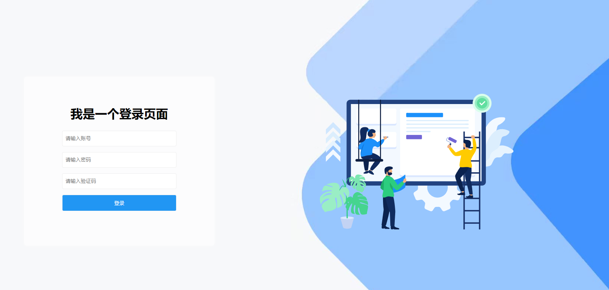

# 架构分析

 使用gin作为web服务，使用vue作为前端服务，来构建一个admin管理后台系统。

**模板文件**

Goland创建go文件添加作者信息：

- File -> Settings -> Editor -> File and Code Templates -> Go File

- 右侧填入模板

- ```go
  /* 
  @Author: 梦无矶小仔
  @Date:   ${DATE} ${TIME}
  */
  package ${GO_PACKAGE_NAME}
  ```

## web框架Gin

安装gin的组件

```go
go get -u github.com/gin-gonic/gin
```

定义go的初始化

```go
package main

import (
	"fmt"
	"github.com/gin-gonic/gin"
)

func main() {
	//  初始化 gin服务
	rootRouter := gin.Default()
	// 启动HTTP服务,可以修改端口
	address := fmt.Sprintf(":%d", 8088)
	rootRouter.Run(address)
}

```


## 初始化-1

main.go中进行初始化

```go
package main

import (
   "fmt"
   "xz-go-frame/initlization"
)

//go:generate go env -w GO111MODULE=on
//go:generate go env -w GOPROXY=https://goproxy.cn,direct
//go:generate go mod tidy
//go:generate go mod download

func main() {
   // 开始初始化gin路由服务
   initlization.WebRouterInit()
   fmt.Println("启动xz-go-frame后端成功")
}
```

## 路由-1

新建initlization包，创建router.go

```go
package initlization

import (
	"github.com/gin-gonic/gin"
	"net/http"
)

func WebRouterInit() {
	// 初始化 gin 服务
	rootRouter := gin.Default()

	// 登录路由
	rootRouter.GET("/login", func(context *gin.Context) {
		context.JSON(http.StatusOK,"我是gin")
	})

	// 启动HTTP服务
	rootRouter.Run("127.0.0.1:8888")
}

```


启动之后可以直接访问`127.0.0.1:8888/login`，就能访问你的页面了。


**接下来开始简单的一些封装。**

## 封装api

新建api包

```go
api
	- admin
		-- index.go
	- bbs
		-- bbs.go
	- login
		-- login.go
	- video
		-- video.go
```

### index.go

```go
package admin

import (
	"github.com/gin-contrib/sessions"
	"github.com/gin-gonic/gin"
	"net/http"
)

type AdminApi struct {
}

// 登录处理的逻辑

func (e *AdminApi) Index(c *gin.Context) {
	// 获取会话
	session := sessions.Default(c)
	// 获取登录用户信息
	user := session.Get("user")
	username := user.(string)
	c.JSON(http.StatusOK, "我是gin"+username)

}

```

### bbs.go

```go
package bbs

import (
	"github.com/gin-gonic/gin"
	"net/http"
)

type BbsApi struct {
}

// 首页处理
func (e *BbsApi) BbsIndex(c *gin.Context) {
	username, _ := c.Get("username")
	// 可以获取到的login放入session的数据
	c.JSON(http.StatusOK, "我是bbs的首页："+username.(string))
}

// 获取明细
func (e *BbsApi) GetBbsDetailById(c *gin.Context) {
	username, _ := c.Get("username")
	// 可以获取到login放入session的数据
	param := c.Param("id")
	c.JSON(http.StatusOK,"我是bbs的名字，参数："+param+" : "+username.(string))
}

```


### login.go

```go
package login

import (
	"github.com/gin-contrib/sessions"
	"github.com/gin-gonic/gin"
	"net/http"
)

type LoginApi struct {
}

func (e *LoginApi) Login(c *gin.Context) {
	// session ---- 是一种所有请求之间的数据共享机制，为什么会出现session，是因为http请求是一种无状态。
	// 什么叫无状态：就是指，用户在浏览器输入方位地址的时候，地址请求到服务区，到响应服务，并不会存储任何数据在客户端或者服务端，
	// 也是就：一次request---response就意味着内存消亡，也就以为整个过程请求和响应过程结束。
	// 但是往往在开发中，我们可能要存存储一些信息，让各个请求之间进行共享。所有就出现了session会话机制
	// session会话机制其实是一种服务端存储技术，底层原理是一个map
	// 比如：我登录的时候，要把用户信息存储session中，然后给 map[key]any =
	// key = sdf365454klsdflsd --sessionid

	// 初始化session对象
	session := sessions.Default(c)
	// 存放用户信息到session中
	session.Set("user", "xiaozai") // map[sessionid] == map[user][xiaozai]
	// 记住一定要调用save方法，否则内存不会写入进去
	session.Save()
	username := session.Get("user")
	c.JSON(http.StatusOK, "我是gin:登录用户名："+username.(string))
}

```

### video.go

```go
package video

import (
	"github.com/gin-gonic/gin"
	"net/http"
)

type Video struct {
}

// 首页处理
func (e *Video) VideoIndex(c *gin.Context) {
	username, _ := c.Get("username")
	// 可以获取到login放入session的数据
	c.JSON(http.StatusOK, "我是video的首页: "+username.(string))
}

// 获取明细

func (e *Video) GetVideoDetailById(c *gin.Context) {
	username, _ := c.Get("username")
	// 可以获取到login放入session的数据
	param := c.Param("id")
	c.JSON(http.StatusOK, "我是VideoApi的名字,参数:"+param+"  ： "+username.(string))
}

```

## 抽离router

新建router包

```go
router
	- bbs
		-- bbs.go
	- video
		-- video.go
```


### bbs.go

```go
package bbs

import (
	"github.com/gin-gonic/gin"
	"xz-go-frame/api/bbs"
)

type BbsRouter struct {
}

func (bBsRouter BbsRouter) InitBBSRouter(group *gin.RouterGroup) {
	// 帖子路由
	bbsApi := bbs.BbsApi{}
	bbsApiGroup := group.Group("bbs")
	{
		// 函数封装
		bbsApiGroup.GET("/indexx", bbsApi.BbsIndex)
		bbsApiGroup.GET("/get/:id", bbsApi.GetBbsDetailById)
	}
}

```

### video.go

```go
package video

import (
	"github.com/gin-gonic/gin"
	"xz-go-frame/api/video"
)

type VideoRouter struct {
}

func (videoRouter VideoRouter) InitVideoRouter(group *gin.RouterGroup) {
	// 帖子路由
	videoApi := video.Video{}
	videoGroup := group.Group("video")
	{
		videoGroup.GET("/index", videoApi.VideoIndex)
		videoGroup.GET("/get/:id", videoApi.GetVideoDetailById)
	}
}

```


## 封装中间件

新建middle包

```go
middle
	- loginfilter.go
```

### loginfilter.go

```go
package middle

import (
	"github.com/gin-contrib/sessions"
	"github.com/gin-gonic/gin"
	"net/http"
)

func LoginInterceptor() gin.HandlerFunc {
	return func(c *gin.Context) {
		// 获取会话
		session := sessions.Default(c)
		// 获取用户登录信息
		user := session.Get("user")
		// 如果用户没有登录，直接重定向返回登录
		if user == nil {
			c.Redirect(http.StatusMovedPermanently, "/login")
			c.Abort() // 拦截，到这里就不会往下执行了
		}
		// 取出会话信息
		username := user.(string)
		// 把session用户信息，放入到context中，给后续路由进行使用
		// 好处就是： router中方法不需要再次获取session再来拿会话中的信息
		c.Set("username", username)
		c.Next() //放行，默认就会放行
	}
}

```


## 封装路由

initlization -> router.go

```go
package initlization

import (
	"fmt"
	"github.com/gin-contrib/sessions"
	"github.com/gin-contrib/sessions/cookie"
	"github.com/gin-gonic/gin"
	"xz-go-frame/api/login"
	"xz-go-frame/middle"
	"xz-go-frame/router/bbs"
	"xz-go-frame/router/video"
)

func WebRouterInit() {
	// 初始化 gin 服务
	rootRouter := gin.Default()
	
	// 创建cookie存储
	store := cookie.NewStore([]byte("secret"))
	// 路由上加入session中间件
	rootRouter.Use(sessions.Sessions("mysession",store))
	
	bbsRouter := bbs.BbsRouter{}
	videoRouter := video.VideoRouter{}
	loginApi := login.LoginApi{}
	

	// 登录路由
	rootRouter.GET("/login", loginApi.Login)
	
	// 首页路由
	AdminGroup := rootRouter.Group("admin")
	AdminGroup.Use(middle.LoginInterceptor())
	{
		bbsRouter.InitBBSRouter(AdminGroup)
		videoRouter.InitVideoRouter(AdminGroup)
	}

	// 启动HTTP服务,可以修改端口
	address := fmt.Sprintf(":%d", 8088)
	rootRouter.Run(address)
}

```


到此，就拥有了一个session登录拦截中间件请求的服务。

```shell
1、直接访问 http://127.0.0.1:8088/admin/video/index
会跳转至登录 http://127.0.0.1:8088/login
2、登录成功后再次访问才是正常 http://127.0.0.1:8088/admin/video/index
3、http://127.0.0.1:8088/admin/video/get/100
显示"我是VideoApi的名字,参数:100  ： xiaozai"
```

# 配置viper

详见知识点viper库

```go
configfile
	- application.yaml
```

## 1、下载viper
```go
go get github.com/spf13/viper
```
## 2、编写一个yaml的配置文件application.yaml
```yaml
# 数据配置的设定 tab对齐，shift+tab 回退对齐
mysql:
  database:
    host: 127.0.0.1
    user: root
    dbname: test
    pwd: 123456
# 服务组配置信息
server:
  port: 8088
  cookiname: mysession
```
## 3、基本读取

在initlization包下新建`init_viper.go`文件。

```go
/*
* @Author: 梦无矶小仔
* @Date:   2023/12/27 14:43
 */
package initlization

import (
	"fmt"
	"github.com/fsnotify/fsnotify"
	"github.com/spf13/viper"
	"os"
)

func InitViper() {
	// 获取项目的执行路径
	path, err := os.Getwd() // D:\Z_Enviroment\GoWorks\src\xz-go-frame
	if err != nil {
		panic(err)
	}
	// 初始化一个viper解析配置对象
	config := viper.New()
	// 开始设置从哪个目录下去找yaml文件
	config.AddConfigPath(path + "/configfile") // 设置读取的文件路径
	// 设置配置文件的名字
	config.SetConfigName("application") // 设置读取的文件名
	// 设置配置文件的后缀
	config.SetConfigType("yaml") // 设置文件类型

	// 尝试进行配置读取
	if err := config.ReadInConfig(); err != nil {
		panic(err)
	}
	// 监控配置文件的变化
	config.WatchConfig()
	config.OnConfigChange(func(e fsnotify.Event) {
		fmt.Println("配置文件发生变化：", e.Name)
		//// 把改变的值重新放入到config配置中去
		//if err = config.Unmarshal(&config); err!= nil {
		//	fmt.Println(err)
		//}
	})

	// 打印文件读取出来的内容
	fmt.Println(len(config.Get("mysql.database.host").(string))) // 9
	fmt.Println(config.Get("mysql.database.host")) // 127.0.0.1
	fmt.Println(config.Get("mysql.database.user")) // root
	fmt.Println(config.Get("mysql.database.dbname")) // test
	fmt.Println(config.Get("mysql.database.pwd")) // 123456
	fmt.Println(config.Get("server.port")) // 8888
	fmt.Println(config.Get("server.cookiname")) // mysession

}

```

测试代码，修改为如下代码进行测试配置文件的读取。

```go
func main() {
	//  开始初始化配置文件
	initlization.InitViper()
	fmt.Println("初始化配置文件成功！")
	// 开始初始化gin路由服务
	//initlization.WebRouterInit()
	//fmt.Println("启动xz-go-frame后端成功")
}

```


进一步封装配置见代码

# 全局global属性配置

配置文件`application.yaml`

```yaml
# 服务端口的配置
server:
  port: 8989
  context: /
# 数据库配置
# "root:123456@tcp(127.0.0.1:3306)/xz-go-frame-db?charset=utf8&parseTime=True&loc=Local", // DSN data source name
database:
  mysql:
    host: 127.0.0.1
    port: 3306
    dbname: xz-go-frame-db
    username: root
    password: 123456
    config: charset=utf8&parseTime=True&loc=Local
# nosql数据的配置
nosql:
  redis:
    host: 127.0.0.1
    port: 3306
    password: 123
    db: 0
  es:
    host: 127.0.0.1
    port: 9300
    password: 456
ksd:
  alipay:
    appid: 12454545
    screat: 45587
    paths: 1,2,3
    detail:
      id: 100
      name: xiaozai
    map:
      name: xiaozai
      age: 18
      phone: 3245646
    urls:
      - 1
      - 2
      - 3
    routers:
      - id: 100
        url: /user/
        filter: 1
      - id: 200
        url: /video/
        filter: 2

```

1、新建global包，在下面新建global.go文件

```go
/*
* @Author: 梦无矶小仔
* @Date:   2023/12/27 16:29
 */
package global

import "gorm.io/gorm"

var (
	Yaml map[string]any
	Config *parse.Config
)
```


2、新建commons包，在下面新建相关配置包和文件进行属性管理。

```go
commons
	- parse
		- Config.go
		- Database.go
		- Ksd.go
		- NoSql.go
```

**Config.go**

```go
package parse

// 配置
type Config struct {
	// 数据库
	Database Database `mapstructure:"database" json:"database" yaml:"database"`
	Ksd      Ksd      `mapstructure:"ksd" json:"ksd" yaml:"ksd"`
	NoSQL    NoSQL    `mapstructure:"nosql" json:"nosql" yaml:"nosql"`
}

```

**Database.go**

```go
/*
* @Author: 梦无矶小仔
* @Date:   2023/12/27 17:02
 */
package parse

// Database 配置展示
// database:--------------------------------struct
//
//	mysql: --------------------------------struct
//		host: 127.0.0.1 -------------------field
//		port: 3306 -------------------field
//		dbname: xz-go-frame-db -------------------field
//		username: root -------------------field
//		password: 123456 -------------------field
//		config: charset=utf8&parseTime=True&loc=Local -------------------field
type Database struct {
	Mysql Mysql `mapstructure:"mysql" json:"mysql" yaml:"mysql"`
}

type Mysql struct {
	Host     string `mapstructure:"host" json:"host" yaml:"host"`
	Port     string    `mapstructure:"port" json:"port" yaml:"port"`
	Dbname   string `mapstructure:"dbname" json:"dbname" yaml:"dbname"`
	Username string `mapstructure:"username" json:"username" yaml:"username"`
	Password string `mapstructure:"password" json:"password" yaml:"password"`
	Config   string `mapstructure:"config" json:"config" yaml:"config"`
}

```

**Ksd.go**

```go
/*
* @Author: 梦无矶小仔
* @Date:   2023/12/27 17:03
 */
package parse

// Ksd 数据格式展示
/*
ksd:
  alipay:
    appid: 12454545
    screat: 45587
    paths: 1,2,3
    detail:
      id: 100
      name: feige
    map:
      name: feige
      age: 30
      phone: 3245646
    urls:
      - 1
      - 2
      - 3
    routers:
      - id: 100
        url: /user/
        filter: 1
      - id: 200
        url: /video/
        filter: 2


*/
type Ksd struct {
	Alipay Alipay `mapstructure:"alipay" json:"alipay" yaml:"alipay"`
}

type Alipay struct {
	Appid   string         `mapstructure:"appid" json:"appid" yaml:"appid"`
	Screat  string         `mapstructure:"screat" json:"screat" yaml:"screat"`
	URLS    []string       `mapstructure:"urls" json:"urls" yaml:"urls"`
	Paths   []string       `mapstructure:"paths" json:"path" yaml:"paths"`
	Routers []Router       `mapstructure:"routers" json:"routers" yaml:"routers"`
	Detail  Detail         `mapstructure:"detail" json:"detail" yaml:"detail"`
	Map     map[string]any `mapstructure:"map" json:"map" yaml:"map"`
}

type Detail struct {
	Id   int    `mapstructure:"id" json:"id" yaml:"id"`
	Name string `mapstructure:"name" json:"name" yaml:"name"`
}

type Router struct {
	Id     int    `mapstructure:"id" json:"id" yaml:"id"`
	Url    string `mapstructure:"url" json:"url" yaml:"url"`
	Filter string `mapstructure:"filter" json:"filter" yaml:"filter"`
}

```

**NoSql.go**

```go
/*
* @Author: 梦无矶小仔
* @Date:   2023/12/27 17:03
 */
package parse

// NoSQL # nosql数据的配置
// nosql:
//
//	redis:
//		host: 127.0.0.1
//		port: 3306
//		password:
//		db: 0
type NoSQL struct {
	Name     string `mapstructure:"name" json:"name" yaml:"name"`
	Host     string `mapstructure:"host" json:"host" yaml:"host"`
	Port     int    `mapstructure:"port" json:"port" yaml:"port"`
	Username string `mapstructure:"username" json:"username" yaml:"username"`
	Password string `mapstructure:"password" json:"password" yaml:"password"`
}

```


修改`init_viper.go`文件的代码，当配置文件进行修改时，执行回调函数实时更改配置信息

```go
/*
* @Author: 梦无矶小仔
* @Date:   2023/12/27 14:43
 */
package initlization

import (
	"fmt"
	"github.com/fsnotify/fsnotify"
	"github.com/spf13/viper"
	"os"
	"xz-go-frame/global"
)

func InitViper() {
	// 获取项目的执行路径
	path, err := os.Getwd() // D:\Z_Enviroment\GoWorks\src\xz-go-frame
	if err != nil {
		panic(err)
	}
	// 初始化一个viper解析配置对象
	config := viper.New()
	// 开始设置从哪个目录下去找yaml文件
	config.AddConfigPath(path + "/configfile") // 设置读取的文件路径
	// 设置配置文件的名字
	config.SetConfigName("application") // 设置读取的文件名
	// 设置配置文件的后缀
	config.SetConfigType("yaml") // 设置文件类型

	// 尝试进行配置读取
	if err := config.ReadInConfig(); err != nil {
		panic(err)
	}
	// 监控配置文件的变化
	config.WatchConfig()
	// 当配置文件发生变化时，执行回调函数
	config.OnConfigChange(func(e fsnotify.Event) {
		fmt.Println("配置文件发生变化：", e.Name)
		// 把改变的值重新放入到config配置中去
		if err = config.Unmarshal(&global.Config); err != nil {
			fmt.Println(err)
		}
	})

	// 这里才是把yaml配置文件解析放入到Config对象的过程---map---config
	if err = config.Unmarshal(&global.Config); err != nil {
		fmt.Println(err)
	}

	// 遍历打印文件读取来的内容
	keys := config.AllKeys()
	dataMap := make(map[string]any)
	for _, key := range keys {
		fmt.Println("yaml存在的key是: "+key+" : ", config.Get(key))
		dataMap[key] = config.Get(key)
	}

	global.Yaml = dataMap


}

```


输出结果

```shell
yaml存在的key是: database.mysql.dbname :  xz-go-frame-db
yaml存在的key是: nosql.redis.host :  127.0.0.1
yaml存在的key是: ksd.alipay.paths :  1,2,3
yaml存在的key是: ksd.alipay.map.phone :  3245646
yaml存在的key是: database.mysql.host :  127.0.0.1
yaml存在的key是: database.mysql.username :  root
yaml存在的key是: nosql.redis.password :  123
yaml存在的key是: ksd.alipay.map.name :  xiaozai
yaml存在的key是: ksd.alipay.urls :  [1 2 3]
yaml存在的key是: nosql.es.port :  9300
yaml存在的key是: ksd.alipay.routers :  [map[filter:1 id:100 url:/user/] map[filter:2 id:200 url:/video/]]
yaml存在的key是: server.port :  8989
yaml存在的key是: server.context :  /
yaml存在的key是: database.mysql.password :  123456
yaml存在的key是: database.mysql.config :  charset=utf8&parseTime=True&loc=Local
yaml存在的key是: nosql.redis.db :  0
yaml存在的key是: nosql.redis.port :  3306
yaml存在的key是: ksd.alipay.screat :  45587
yaml存在的key是: ksd.alipay.detail.id :  100
yaml存在的key是: ksd.alipay.detail.name :  xiaozai
yaml存在的key是: ksd.alipay.map.age :  18
yaml存在的key是: database.mysql.port :  3306
yaml存在的key是: nosql.es.host :  127.0.0.1
yaml存在的key是: nosql.es.password :  456
yaml存在的key是: ksd.alipay.appid :  12454545
初始化配置文件成功！
```


# 整合GORM框架

官方文档：[连接到数据库 | GORM - The fantastic ORM library for Golang, aims to be developer friendly.](https://gorm.io/zh_CN/docs/connecting_to_the_database.html)

https://gorm.io/zh_CN/docs/

## Gorm的安装

```go
go get -u gorm.io/gorm
go get -u gorm.io/driver/mysql
```

编写main.go来连接数据库

需要自己在本地安装好mysql新建数据库，这里不做演示。

## 初始化数据库&建表&简单封装

### 1、global.go文件代码修改

```go
var (
	Yaml   map[string]any
	Config *parse.Config
	XZ_DB  *gorm.DB
)
```

### 2、commons -> parse -> Database.go新增方法

```go
func (m *Mysql) Dsn() string {
	return m.Username + ":" + m.Password + "@tcp(" + m.Host + ":" + m.Port + ")/" + m.Dbname + "?" + m.Config
}
```

### 3、新建model文件夹

```shell
model
	- user
		- xz_user.go
```

```go
/*
* @Author: 梦无矶小仔
* @Date:   2023/12/27 19:03
 */
package user

import (
	"gorm.io/gorm"
	"time"
)

type User struct {
	ID        uint           `gorm:"primaryKey" json:"id"`
	Name      string         `json:"name"`
	Account   string         `gorm:"unique" json:"account"`
	Password  string         `json:"password"`
	Email     *string        `json:"email"`
	Age       uint8          `json:"age"`
	Birthday  time.Time      `json:"birthday"`
	CreatedAt time.Time      `gorm:"autoUpdateTime" json:"createAt"`
	UpdatedAt time.Time      `gorm:"autoUpdateTime" json:"updatedAt"`
	DeletedAt gorm.DeletedAt `gorm:"index"`
}

// 覆盖生成表
func (User) TableName() string {
	return "xz_admin_user"
}
```


### 4、commons ->新建orm->新建registertable.go注册表

```go
package orm

func RegisterTable() {
	db := global.XZ_DB
	// 注册和声明model
	db.AutoMigrate(&user.User{})
}
```


### 5、在initlization下新建`init_gorm.go`，初始化数据库

```go
/*
* @Author: 梦无矶小仔
* @Date:   2023/12/27 16:32
 */
package initlization

import (
	"fmt"
	"gorm.io/driver/mysql"
	"gorm.io/gorm"
	"xz-go-frame/commons/orm"
	"xz-go-frame/global"
)

func InitMySQL() {
	m := global.Config.Database.Mysql
	fmt.Println(m.Dsn())
	db, err := gorm.Open(mysql.New(mysql.Config{
		DSN:               m.Dsn(), // DNS data source name
		DefaultStringSize: 191,     //string类型字段的默认长度
		//DisableDatetimePrecision: true, // 禁用 datetime 精度，MySQL 5.6 之前的数据库不支持
		DontSupportRenameIndex:    true,  // 重命名索引时采用删除并新建的方式，MySQL 5.7 之前的数据库和 MariaDB 不支持重命名索引
		DontSupportRenameColumn:   true,  // 用 `change` 重命名列，MySQL 8 之前的数据库和 MariaDB 不支持重命名列
		SkipInitializeWithVersion: false, // 根据当前 MySQL 版本自动配置
	}))

	// 如果报错，请检查数据库配置
	if err != nil {
		panic("数据连接出错了" + err.Error()) // 把程序直接阻断，把数据连接好了在启动
	}

	global.XZ_DB = db // 数据库信息全局变量

	// 初始化数据库
	orm.RegisterTable()

	fmt.Println("数据库初始化完成,开始运行：", db)
}

```


### 6、修改main.go的代码

```go
func main() {
	//  开始初始化配置文件
	initlization.InitViper()
	fmt.Println("初始化配置文件成功！")
	// 初始化数据库
	initlization.InitMySQL()
	//开始初始化gin路由服务
	initlization.WebRouterInit()
	fmt.Println("启动xz-go-frame后端成功")

}
```


### 7、启动服务,控制台显示如下

```shell
root:123456@tcp(127.0.0.1:3306)/xz-go-frame-db?charset=utf8&parseTime=True&loc=Local
数据库初始化完成,开始运行： &{0xc0000a6090 <nil> 0 0xc0003ea000 1}
```


### 8、数据库中新增了`xz_admin_user表`


到此，你的gorm框架整合完毕，后续进行相关封装


# 层级封装

api层我新建了一个v1文件夹，把之前的代码放到了这个v1文件夹下，起到api版本管理的作用。

## service层

这一层主要是操作数据库，给api层提供数据

新建service文件夹在根目录

```shell
service
	- user
		- xz_user.go
```


xz_user.go代码如下

```go
/*
* @Author: 梦无矶小仔
* @Date:   2024/1/11 14:11
 */
package user

import (
	"xz-go-frame/global"
	"xz-go-frame/model/user"
)

// 对用户表的数据层处理
type UserService struct{}

// nil 是go空值处理，必须是指针类型
func (service *UserService) GetUserByAccount(account string) (user *user.User, err error) {
	// 根据account进行查询
	err = global.XZ_DB.Where("account = ?", account).First(&user).Error
	if err != nil {
		return nil, err
	} else {
		return user, nil
	}
}

```


路由router层和api层之后会加入enter.go文件，起到初始化聚合加载的作用。


# 关于Http.status响应状态码

### 1、 HTTP Status Code 1xx 请求信息

这一组[状态码](https://so.csdn.net/so/search?q=状态码&spm=1001.2101.3001.7020)表明这是一个临时性响应。此响应仅由状态行和可选的HTTP头组成，以一个空行结尾。由于HTTP／1.0未定义任何1xx状态码，所以不要向HTTP／1.0客户端发送1xx响应。

| Http状态码 | Http Status Code                                             | Http状态码含义中文说明 |
| :--------- | :----------------------------------------------------------- | :--------------------- |
| 100        | [100 Continue](https://seo.juziseo.com/doc/http_code/100)    | 请继续请求             |
| 101        | [101 Switching Protocols](https://seo.juziseo.com/doc/http_code/101) | 请切换协议             |
| 102        | [102 Processing](https://seo.juziseo.com/doc/http_code/102)  | 将继续执行请求         |


### 2、 HTTP Status Code 2xx 成功状态

这一组状态码表明客户端的请求已经被服务器端成功接收并正确解析。

| Http状态码    | Http Status Code                                             | Http状态码含义中文说明                  |
| :------------ | :----------------------------------------------------------- | :-------------------------------------- |
| ***\*200\**** | [200 OK](https://seo.juziseo.com/doc/http_code/200)          | 请求成功                                |
| ***\*201\**** | [201 Created](https://seo.juziseo.com/doc/http_code/201)     | 请求已被接受，等待资源响应              |
| ***\*202\**** | [202 Accepted](https://seo.juziseo.com/doc/http_code/202)    | 请求已被接受，但尚未处理                |
| ***\*203\**** | [203 Non-Authoritative Information](https://seo.juziseo.com/doc/http_code/203) | 请求已成功处理，结果来自第三方拷贝      |
| ***\*204\**** | [204 No Content](https://seo.juziseo.com/doc/http_code/204)  | 请求已成功处理，但无返回内容            |
| ***\*205\**** | [205 Reset Content](https://seo.juziseo.com/doc/http_code/205) | 请求已成功处理，但需重置内容            |
| ***\*206\**** | [206 Partial Content](https://seo.juziseo.com/doc/http_code/206) | 请求已成功处理，但仅返回了部分内容      |
| ***\*207\**** | [207 Multi-Status](https://seo.juziseo.com/doc/http_code/207) | 请求已成功处理，返回了多个状态的XML消息 |
| ***\*208\**** | [208 Already Reported](https://seo.juziseo.com/doc/http_code/208) | 响应已发送                              |
| ***\*226\**** | [226 IM Used](https://seo.juziseo.com/doc/http_code/226)     | 已完成响应                              |

### 3、 HTTP Status Code 3xx 重定向状态

这一组状态码表示客户端需要采取更进一步的行动来完成请求。通常，这些状态码用来重定向，后续的请求地址（重定向目标）在本次响应的Location域中指明。

| Http状态码    | Http Status Code                                             | Http状态码含义中文说明         |
| :------------ | :----------------------------------------------------------- | :----------------------------- |
| ***\*300\**** | [300 Multiple Choices](https://seo.juziseo.com/doc/http_code/300) | 返回多条重定向供选择           |
| ***\*301\**** | [301 Moved Permanently](https://seo.juziseo.com/doc/http_code/301) | 永久重定向                     |
| ***\*302\**** | [302 Found](https://seo.juziseo.com/doc/http_code/302)       | 临时重定向                     |
| ***\*303\**** | [303 See Other](https://seo.juziseo.com/doc/http_code/303)   | 当前请求的资源在其它地址       |
| ***\*304\**** | [304 Not Modified](https://seo.juziseo.com/doc/http_code/304) | 请求资源与本地缓存相同，未修改 |
| ***\*305\**** | [305 Use Proxy](https://seo.juziseo.com/doc/http_code/305)   | 必须通过代理访问               |
| ***\*306\**** | [306 (已废弃)Switch Proxy](https://seo.juziseo.com/doc/http_code/306) | (已废弃)请切换代理             |
| ***\*307\**** | [307 Temporary Redirect](https://seo.juziseo.com/doc/http_code/307) | 临时重定向，同302              |
| ***\*308\**** | [308 Permanent Redirect](https://seo.juziseo.com/doc/http_code/308) | 永久重定向，且禁止改变http方法 |

### 4、 HTTP Status Code 4xx 客户端错误

这一组状态码表示客户端的请求存在错误，导致服务器无法处理。除非响应的是一个HEAD请求，否则服务器就应该返回一个解释当前错误状况的实体，以及这是临时的还是永久性的状况。这些状态码适用于任何请求方法。浏览器应当向用户显示任何包含在此类错误响应中的实体内容。

| Http状态码    | Http Status Code                                             | Http状态码含义中文说明               |
| :------------ | :----------------------------------------------------------- | :----------------------------------- |
| ***\*400\**** | [400 Bad Request](https://seo.juziseo.com/doc/http_code/400) | 请求错误，通常是访问的域名未绑定引起 |
| ***\*401\**** | [401 Unauthorized](https://seo.juziseo.com/doc/http_code/401) | 需要身份认证验证                     |
| ***\*402\**** | [402 Payment Required](https://seo.juziseo.com/doc/http_code/402) | -                                    |
| ***\*403\**** | [403 Forbidden](https://seo.juziseo.com/doc/http_code/403)   | 禁止访问                             |
| ***\*404\**** | [404 Not Found](https://seo.juziseo.com/doc/http_code/404)   | 请求的内容未找到或已删除             |
| ***\*405\**** | [405 Method Not Allowed](https://seo.juziseo.com/doc/http_code/405) | 不允许的请求方法                     |
| ***\*406\**** | [406 Not Acceptable](https://seo.juziseo.com/doc/http_code/406) | 无法响应，因资源无法满足客户端条件   |
| ***\*407\**** | [407 Proxy Authentication Required](https://seo.juziseo.com/doc/http_code/407) | 要求通过代理的身份认证               |
| ***\*408\**** | [408 Request Timeout](https://seo.juziseo.com/doc/http_code/408) | 请求超时                             |
| ***\*409\**** | [409 Conflict](https://seo.juziseo.com/doc/http_code/409)    | 存在冲突                             |
| ***\*410\**** | [410 Gone](https://seo.juziseo.com/doc/http_code/410)        | 资源已经不存在(过去存在)             |
| ***\*411\**** | [411 Length Required](https://seo.juziseo.com/doc/http_code/411) | 无法处理该请求                       |
| ***\*412\**** | [412 Precondition Failed](https://seo.juziseo.com/doc/http_code/412) | 请求条件错误                         |
| ***\*413\**** | [413 Payload Too Large](https://seo.juziseo.com/doc/http_code/413) | 请求的实体过大                       |
| ***\*414\**** | [414 Request-URI Too Long](https://seo.juziseo.com/doc/http_code/414) | 请求的URI过长                        |
| ***\*415\**** | [415 Unsupported Media Type](https://seo.juziseo.com/doc/http_code/415) | 无法处理的媒体格式                   |
| ***\*416\**** | [416 Range Not Satisfiable](https://seo.juziseo.com/doc/http_code/416) | 请求的范围无效                       |
| ***\*417\**** | [417 Expectation Failed](https://seo.juziseo.com/doc/http_code/417) | 无法满足的Expect                     |
| ***\*418\**** | [418 I'm a teapot](https://seo.juziseo.com/doc/http_code/418) | 愚人节笑话                           |
| ***\*421\**** | [421 There are too many connections from your internet address](https://seo.juziseo.com/doc/http_code/421) | 连接数超限                           |
| ***\*422\**** | [422 Unprocessable Entity](https://seo.juziseo.com/doc/http_code/422) | 请求的语义错误                       |
| ***\*423\**** | [423 Locked](https://seo.juziseo.com/doc/http_code/423)      | 当前资源被锁定                       |
| ***\*424\**** | [424 Failed Dependency](https://seo.juziseo.com/doc/http_code/424) | 当前请求失败                         |
| ***\*425\**** | [425 Unordered Collection](https://seo.juziseo.com/doc/http_code/425) | 未知                                 |
| ***\*426\**** | [426 Upgrade Required](https://seo.juziseo.com/doc/http_code/426) | 请切换到TLS/1.0                      |
| ***\*428\**** | [428 Precondition Required](https://seo.juziseo.com/doc/http_code/428) | 请求未带条件                         |
| ***\*429\**** | [429 Too Many Requests](https://seo.juziseo.com/doc/http_code/429) | 并发请求过多                         |
| ***\*431\**** | [431 Request Header Fields Too Large](https://seo.juziseo.com/doc/http_code/431) | 请求头过大                           |
| ***\*449\**** | [449 Retry With](https://seo.juziseo.com/doc/http_code/449)  | 请重试                               |
| ***\*451\**** | [451 Unavailable For Legal Reasons](https://seo.juziseo.com/doc/http_code/451) | 访问被拒绝（法律的要求）             |
| ***\*499\**** | [499 Client Closed Request](https://seo.juziseo.com/doc/http_code/499) | 客户端主动关闭了连接                 |

### 5、 HTTP Status Code 5xx 服务器错误状态

这一组状态码说明服务器在处理请求的过程中有错误或者异常状态发生，也有可能是服务器意识到以当前的软硬件资源无法完成对请求的处理。除非这是一个HEAD请求，否则服务器应当包含一个解释当前错误状态以及这个状况是临时的还是永久的解释信息实体。浏览器应当向用户展示任何在当前响应中被包含的实体。

| Http状态码    | Http Status Code                                             | Http状态码含义中文说明   |
| :------------ | :----------------------------------------------------------- | :----------------------- |
| ***\*500\**** | [500 Internal Server Error](https://seo.juziseo.com/doc/http_code/500) | 服务器端程序错误         |
| ***\*501\**** | [501 Not Implemented](https://seo.juziseo.com/doc/http_code/501) | 服务器不支持的请求方法   |
| ***\*502\**** | [502 Bad Gateway](https://seo.juziseo.com/doc/http_code/502) | 网关无响应               |
| ***\*503\**** | [503 Service Unavailable](https://seo.juziseo.com/doc/http_code/503) | 服务器端临时错误         |
| ***\*504\**** | [504 Gateway Timeout](https://seo.juziseo.com/doc/http_code/504) | 网关超时                 |
| ***\*505\**** | [505 HTTP Version Not Supported](https://seo.juziseo.com/doc/http_code/505) | 服务器不支持的HTTP版本   |
| ***\*506\**** | [506 Variant Also Negotiates](https://seo.juziseo.com/doc/http_code/506) | 服务器内部配置错误       |
| ***\*507\**** | [507 Insufficient Storage](https://seo.juziseo.com/doc/http_code/507) | 服务器无法存储请求       |
| ***\*508\**** | [508 Loop Detected](https://seo.juziseo.com/doc/http_code/508) | 服务器因死循环而终止操作 |
| ***\*509\**** | [509 Bandwidth Limit Exceeded](https://seo.juziseo.com/doc/http_code/509) | 服务器带宽限制           |
| ***\*510\**** | [510 Not Extended](https://seo.juziseo.com/doc/http_code/510) | 获取资源策略未被满足     |
| ***\*511\**** | [511 Network Authentication Required](https://seo.juziseo.com/doc/http_code/511) | 需验证以许可连接         |
| ***\*599\**** | [599 Network Connect Timeout Error](https://seo.juziseo.com/doc/http_code/599) | 网络连接超时             |

上面的这些状态全部都是描述请求和响应的整个过程的状态。不包含业务的状态。我举例例子

```go
c.JSON(http.StatusOK, "你输入的账号和密码有误!!!")
```

在开发中一个接口：成功只有一种情况，但是失败和错误就有N种情况。那么这些N情况的返回到底选择什么样子状态就变得非常的重要。你接下来就困难选择症（你不知道到底选择什么？），而且你在这些状态找不到适合的，所以业务的状态处理不应该选择web框架中提供的。因为这些状态根本就不是让你来做业务错误的状态监控，别人专门去web请求和响应的状态的监听。

那么怎么处理。通过自己的方式来定义状态。但是所有的返回都用：http.StatusOK

- 只要请求和响应是正常的，无论正确和错误，我们都用http.StatusOK来返回，但是区分和界定用自己定义的状态来定义业务、

这也就是为什么我们要做自定义返回的意义和价值了.

# 集成验证码功能

- 短信验证码的重要性一：作为身份证明。
  - 在生活中，短信验证码随处可见，网络产品在开发过程中，几乎都会加入短信验证模块，如网站、app用户注册、安全登录、找回密码、绑定手机、手机银行转账等等，这就是短信验证码的重要性。
- 短信验证码的重要性二：提高注册信息的真实性，防止恶意注册。
  - 与以往的数字验证、图片验证相比，短信验证码更能防止恶意用户注册。一些朋友可能知道，市场上一些不法之徒使用作弊器等工具恶意注册、攻击企业网站，导致网站服务器无法承载而瘫痪，严重时会影响企业网站的运作。而且短信验证码的应用，能很好地识别用户身份的真实性，一个用户只能注册一个账户，有效地避免了恶意注册。

### 1:  下载验证码的组件

- 官网：https://github.com/mojocn/base64Captcha

- 下载模块：

  ```
  go get github.com/mojocn/base64Captcha
  ```

### 2: 定义生成验证码的接口

```shell
api -> v1 -> code -> code.go
```

```go
/*
@Author: 梦无矶小仔
@Date:   2024/1/11 14:32
*/

package code

import (
	"github.com/gin-gonic/gin"
	"github.com/mojocn/base64Captcha"
	"xz-go-frame/commons/response"
)

// 验证码生成
type CodeApi struct{}

// 1、定义验证的store -- 默认是存储在go的内存中
var store = base64Captcha.DefaultMemStore

// 2、创建验证码
func (api *CodeApi) CreateCaptcha(c *gin.Context) {
	// 2、生成验证码的类型，这个默认类型是一个数字的验证码
	driver := &base64Captcha.DriverDigit{Height: 70, Width: 240, Length: 6, MaxSkew: 0.8, DotCount: 120}
	// 3、调用NewCaptcha方法生成具体的验证码对象
	captcha := base64Captcha.NewCaptcha(driver, store)
	// 4、调用Generate()生成具体base64验证码的图片地址和id
	// id 是用于后续校验使用，后续根据id和用户输入的验证码去调用store的get方法，就可以得到你输入的验证码是否正确，正确的true，错误的false
	id, baseURL, _, err := captcha.Generate()
	if err != nil {
		response.Fail(40001, "验证生成错误!", c)
		return
	}

	response.Ok(map[string]any{"id": id, "baseURL": baseURL}, c)
}

//func (api *CodeApi) CreateCaptcha(c *gin.Context) {
//	// 2：生成验证码的类型,这个默认类型是一个数字的验证码
//	driver := &base64Captcha.DriverString{
//		Height:          40,
//		Width:           240,
//		NoiseCount:      0,
//		ShowLineOptions: 2 | 2,
//		Length:          6,
//		Source:          "1234567890qwertyuioplkjhgfdsazxcvbnm",
//		BgColor: &color.RGBA{
//			R: 3,
//			G: 102,
//			B: 214,
//			A: 125,
//		},
//		Fonts: []string{"wqy-microhei.ttc"},
//	}
//	// 3：调用NewCaptcha方法生成具体验证码对象
//	captcha := base64Captcha.NewCaptcha(driver, store)
//	// 4: 调用Generate()生成具体base64验证码的图片地址，和id
//	// id 是用于后续校验使用，后续根据id和用户输入的验证码去调用store的get方法，就可以得到你输入的验证码是否正确，正确true,错误false
//	id, baseURL, err := captcha.Generate()
//
//	if err != nil {
//		response.Fail(40001, "验证生成错误", c)
//		return
//	}
//
//	response.Ok(map[string]any{"id": id, "baseURL": baseURL}, c)
//}

// 3、开始校验用户输入的验证码是否是正确的
func (api *CodeApi) VerifyCaptcha(c *gin.Context) {

	type BaseCaptcha struct {
		Id   string `json:"id"`
		Code string `json:"code"`
	}
	baseCaptcha := BaseCaptcha{}
	// 开始把用户输入的id和code进行绑定
	err2 := c.ShouldBindQuery(&baseCaptcha)

	if err2 != nil {
		response.Fail(402, "参数绑定失败", c)
		return
	}

	// 开始校验验证码是否正确
	verify := store.Verify(baseCaptcha.Id, baseCaptcha.Code,true)
	
	if verify {
		response.Ok("success", c)
	} else {
		response.Fail(403, "您输入的验证码有误！", c)
	}
	

}

```

封装了一个响应方法，`commons->response->response.go`

```go
/*
@Author: 梦无矶小仔
@Date:   2024/1/11 14:53
*/
package response

import (
	"github.com/gin-gonic/gin"
	"net/http"
)

type Response struct {
	Code int         `json:"code"`
	Msg  string      `json:"msg"`
	Data interface{} `json:"data"`
}

func Result(code int, msg string, data interface{}, c *gin.Context) {
	c.JSON(http.StatusOK, Response{
		Code: code,
		Msg:  msg,
		Data: data,
	})
}

var (
	CODE = 20000
	MSG  = "success"
)

/*
Ok
请求响应成功
*/
func Ok(data any, c *gin.Context) {
	Result(CODE, MSG, data, c)
}

/*
Fail
请求响应失败（无响应数据）
*/
func Fail(code int,msg string,c *gin.Context) {
	Result(code, msg, map[string]any{}, c)
}

/*
FailWithData
请求响应失败（有响应数据）
*/
func FailWithData(code int,msg string,data any,c *gin.Context) {
	Result(code, msg, data, c)
}

```

### 3:定义生成验证码的router

router -> code -> code.go

```go
/*
@Author: 梦无矶小仔
@Date:   2024/1/11 16:23
*/
package code

import (
	"github.com/gin-gonic/gin"
	"xz-go-frame/api/v1/code"
)

type CodeRouter struct{}

func (e *CodeRouter) InitCodeRouter(Router *gin.Engine) {
	codeApi := code.CodeApi{}
	// 这个路由多了一个对post\put请求的中间件处理，而这个中间件做了一些对post和put参数的处理和一些公共信息的处理
	coureseRouter := Router.Group("code")
	{
		coureseRouter.GET("get", codeApi.CreateCaptcha)
		coureseRouter.GET("verify", codeApi.VerifyCaptcha)
	}
	
}

```

### 4:注册路由

```go
// 验证码接口
codeRouter := code.CodeRouter{}
codeRouter.InitCodeRouter(rootRouter)
```

到这一步，就可以去测试验证码功能了。

### 5：跨域请求处理

在之后和前端联调，需要设置跨域，所以还要新增跨域请求的代码。

`common -> filter -> cors.go`

```go
/*
@Author: 梦无矶小仔
@Date:   2024/1/11 17:28
*/
package filter

import (
	"github.com/gin-gonic/gin"
	"net/http"
)

func Cors() gin.HandlerFunc {
	return func(c *gin.Context) {
		method := c.Request.Method
		// 注意这一行，不能配置为通配符“*”号 比如未来写域名或者你想授权的域名都可以
		//c.Header("Access-Control-Allow-Origin", "http://localhost:8088")
		c.Header("Access-Control-Allow-Origin", "*")
		// 响应头表示是否可以将对请求的响应暴露给页面。返回true则可以，其他值均不可以。
		c.Header("Access-Control-Allow-Credentials", "true")
		// 表示此次请求中可以使用那些header字段
		c.Header("Access-Control-Allow-Headers", "Access-Control-Allow-Headers,Cookie, Content-Length,Origin,cache-control,X-Requested-With, Content-Type, Accept, Authorization, Token, Timestamp, UserId") // 我们自定义的header字段都需要在这里声明
		// 表示此次请求中可以使用那些请求方法 GET/POST(多个使用逗号隔开)
		c.Header("Access-Control-Allow-Methods", "POST, GET, OPTIONS,DELETE,PUT")
		// 放行所有OPTIONS方法
		if method == "OPTIONS" {
			//c.AbortWithStatus(http.StatusNoContent)
			c.AbortWithStatus(http.StatusOK)
		}
		// 处理请求
		c.Next()
	}
}

```


# 构建前端

## 1、 打开 vite的官网

https://vitejs.cn/

## 2、开始构建项目

> ​	兼容性注意
>
> Vite 需要 [Node.js](https://nodejs.org/en/) 版本 14.18+，16+。然而，有些模板需要依赖更高的 Node 版本才能正常运行，当你的包管理器发出警告时，请注意升级你的 Node 版本。

使用nodejs 下载一些工具，由于国内访问很多外网的限制，会出现下载失败的问题,这个时候，需要配置路径为阿里的免费 registry，如下：

官方链接：[npmmirror 镜像站](https://www.npmmirror.com/)

```shell
1、临时使用
npm --registry https://registry.npmmirror.com install express
2、永久使用
npm config set registry https://registry.npmmirror.com

-- 配置后可通过下面方式来验证是否成功
npm config get registry
-- 或npm info express

# 如果需要恢复成原来的官方地址只需要执行如下命令
npm config set registry https://registry.npmjs.org

#使用cnpm
#安装阿里的cnpm，然后在使用时直接将npm命令替换成cnpm命令即可（淘宝的已经停止解析）
npm install -g cnpm --registry=https://registry.npmmirror.com
```


## 3、进入目标文件夹下执行如下命令

```js
npm create vite@latest
```

当前下载的是vite@5.1.0

## 4、勾选内容如下


```shell
D:\Y_WebProject>npm create vite@latest
√ Project name: ... xz-vue-admin
√ Select a framework: » Vue
√ Select a variant: » Customize with create-vue ↗
Need to install the following packages:
  create-vue@3.9.1
Ok to proceed? (y) y
[##################] - reify:create-vue: http fetch GET 200 https://cdn.npmmirror.com/packages/create-vue/3.9.1/create- 

```

vue.js相关配置勾选，蓝色的就是我选择的，左右箭头可以进行选择，回车表示确认。


## 5、整体命令如下

```bash
D:\Y_WebProject>npm create vite@latest
√ Project name: ... xz-vue-admin
√ Select a framework: » Vue
√ Select a variant: » Customize with create-vue ↗
Need to install the following packages:
  create-vue@3.9.1
Ok to proceed? (y) y

Vue.js - The Progressive JavaScript Framework

√ 是否使用 TypeScript 语法？ ... 否 / 是
√ 是否启用 JSX 支持？ ... 否 / 是
√ 是否引入 Vue Router 进行单页面应用开发？ ... 否 / 是
√ 是否引入 Pinia 用于状态管理？ ... 否 / 是
√ 是否引入 Vitest 用于单元测试？ ... 否 / 是
√ 是否要引入一款端到端（End to End）测试工具？ » 不需要
√ 是否引入 ESLint 用于代码质量检测？ ... 否 / 是
√ 是否引入 Prettier 用于代码格式化？ ... 否 / 是

正在构建项目 D:\Y_WebProject\xz-vue-admin...

项目构建完成，可执行以下命令：

  cd xz-vue-admin
  npm install
  npm run format
  npm run dev
```

此时可以看到我们的项目创建好啦


## 6、下载依赖

cd到我们创建好的项目中，执行命令下载相关依赖

```bash
cd xz-vue-admin
npm install
```

显示如下表示下载依赖完成

```shell
D:\Y_WebProject>cd xz-vue-admin

D:\Y_WebProject\xz-vue-admin>npm install

added 152 packages in 2m
```

## 7、启动项目

```shell
npm run dev
```

显示如下

```shell
  VITE v5.0.11  ready in 438 ms

  ➜  Local:   http://localhost:5173/
  ➜  Network: use --host to expose
  ➜  press h + enter to show help
```

## 8、访问项目

访问本地的5173端口，显示页面如下表示你的项目构建成功


## 9、同步到自己的仓库进行版本管理即可。

修改项目根目录下的`.git/config`文件内容，把需要同步的仓库链接都填进去，这样可以多个仓库同时同步。

```yaml
[core]
	repositoryformatversion = 0
	filemode = false
	bare = false
	logallrefupdates = true
	symlinks = false
	ignorecase = true
[remote "origin"]
	# github
	url = https://github.com/Lvan826199/xz-vue-admin.git
	# gitee
	url = https://gitee.com/xiaozai-van-liu/xz-vue-admin.git
	fetch = +refs/heads/*:refs/remotes/origin/*
[branch "master"]
	remote = origin
	merge = refs/heads/master

```


## 03、实战案例：验证码使用到登录和注册

- 1：下载验证码模块组件

- 2：通过验证码返回的captchaid和用户输入的code和手机号码调用短信发送接口
- 3：通过captchaid和code进行验证比较看是否输入的正确的，如果正确返回success,否则返回错误
- 4：思考

具体查看视频和代码。核心js和文件

login.js

```js
var vue = new Vue({
    el:"#app",
    data:{
        // 控制登录按钮是否可以登录.
        btndisabled:true,
        // 60s倒计时
        sendcount:60,
        // 默认显示发送短信
        sendflag:true,
        // 用于清楚倒计时
        sendTimer:null,
        // 倒计时状态
        sendmsg:"发送短信",
        // 验证码
        codeimg:"",
        // 登录的数据
        user:{
            phone:"15074816437",
            phonecode:"",
            captchaId:""
        }
    },
    created(){
      this.handleCaptchaCode();
    },
    methods:{
        toLogin(){

            if(!this.user.phone){
                alert("请输入手机号码")
                this.$refs.phoneRef.focus();
                return;
            }

            if(!this.user.phonecode){
                alert("请输入手机短信码")
                this.$refs.phonecodeRef.focus();
                return;
            }

            // 正则校验手机号码合法性
            // if(!/phonerege/.test(phone)){
            //     alert("请输入合法的手机号码!")
            //     this.$refs.phoneRef.focus();
            //     return;
            // }

            axios.post("/api/logined",this.user).then(res=>{
                if(res.data.code == 200){
                    window.location.href = "/"
                }else{
                    if(res.data.code == 601){  // 601: 短信验证码输入有误
                        alert(res.data.message)
                        this.$refs.phonecodeRef.focus();
                        this.user.phonecode = "";
                    }else if(res.data.code == 602){ // 602: 手机号码不存在
                        alert(res.data.message)
                        this.$refs.phoneRef.focus();
                        this.user.phone = "";
                    }
                }
            })
        },

        // 发送短信
        handleSendPhone(){
            var phone = this.user.phone;
            if(!phone){
                alert("请正确的输入手机号码!")
                this.$refs.phoneRef.focus();
                return;
            }
            // 正则校验手机号码合法性 phonerege = ?
            // if(!/phonerege/.test(phone)){
            //     alert("请输入合法的手机号码!")
            //     this.$refs.phoneRef.focus();
            //     return;
            // }

            // 更改前端的状态
            this.handleChangeSendMsg();
            // 发送短信-------发送短信接口
            axios.post("/api/sendsms",{"phone":phone}).then(res=>{
                if(res.data == "success"){
                    alert("短信发送成功!!!!");
                    // 打开登录按钮。--同时禁止发送短信按钮
                    this.btndisabled = false;
                    // 恢复短信发送的状态
                    this.sendmsg = "发送短信";
                    this.sendcount = 60;
                    // 关闭定时任务
                    if(this.sendTimer)clearInterval(this.sendTimer);
                }else{
                    alert(res.data)
                }
            })
        },

        // 更改文案和倒计时
        handleChangeSendMsg(){
            this.sendmsg = this.sendcount+"s";
            if(this.sendTimer)clearInterval(this.sendTimer);
            // 开始倒计时状态
            this.sendflag = false;
            // 开启倒计时
            this.sendTimer = setInterval(()=>{
                if(this.sendcount<=1){
                    // 关闭倒计时
                    this.sendflag = true;
                    clearInterval(this.sendTimer);
                    this.sendmsg = "发送短信"
                    this.sendcount = 60;
                    return;
                }
                this.sendcount--;
                this.sendmsg = this.sendcount+"s";
            },1000)
        },

        handleCaptchaCode(){
            axios.post("/code/captcha").then(res=>{
                this.codeimg = res.data.img;
                this.user.captchaId = res.data.captchaId;
            })
        },
    }
})
```


# 实现登录和验证码的校验

### 1: 配置登录路由和首页

如果报错记得安装一下：sass

```sh
pnpm install sass sass-loader
```

```vue
<template>
    <div class="login-box">
        <div class="loginbox">
            <div class="login-wrap">
                <h1 class="header">{{ title }}</h1>
                <form action="#">
                    <div class="ksd-el-items"><input type="text" class="ksd-login-input"  placeholder="请输入账号"></div>
                    <div class="ksd-el-items"><input type="text" class="ksd-login-input" placeholder="请输入密码"></div>
                    <div class="ksd-el-items"><input type="text" class="ksd-login-input" placeholder="请输入验证码"></div>
                    <div class="ksd-el-items"><input type="button" class="ksd-login-btn" value="登录"></div>            
                </form>
            </div>
        </div>
        <div class="imgbox">
                
        </div>
    </div>
</template>

<script setup>
import { ref } from 'vue';
const title = ref("我是一个登录页面")
</script>

<style scoped lang="scss">
    .ksd-el-items{margin: 15px 0;}
    .ksd-login-input{border:1px solid #eee;padding:12px 8px;width: 100%;box-sizing: border-box;outline: none;border-radius: 4px;}

    .ksd-login-btn{border:1px solid #eee;padding:12px 8px;width: 100%;box-sizing: border-box;
        background:#2196F3;color:#fff;border-radius:4px;cursor: pointer;}
        .ksd-login-btn:hover{background:#1789e7;}
    .login-box{
        display: flex;
        flex-wrap: wrap;
        background: url("../assets/imgs/login_background.jpg");
        background-size:cover;
        .loginbox{
            width: 50%;height: 100vh;
            display: flex;
            align-items: center;
            justify-content: center;
            .header{margin-bottom: 10px;}
            .login-wrap{
                width: 500px;
                height: 444px;
                padding:20px 100px;
                box-sizing: border-box;
                border-radius: 8px;
                box-shadow: 0 0 10px #fafafa;
                background: rgba(255,255,255,0.6);
                text-align: center;
                display: flex;
                flex-direction: column;
                justify-content: center;
            }
        }
        .imgbox{
            width: 50%;
            height: 100vh;
            display: flex;
            align-items: center;
        }
    }
</style>
```

2：配置路由

```js
import { createRouter, createWebHistory } from 'vue-router'

const router = createRouter({
  history: createWebHistory(import.meta.env.BASE_URL),
  routes: [
    {
      path: '/',
      name: 'index',
      component: () => import('../views/index.vue')
    },
    {
      path: '/login',
      name: 'login',
      component: () => import('../views/login.vue')
    }
  ]
})

export default router

```

3: 访问login.vue

http://localhost:8777/login




4： 调用验证码的接口和登录接口

安装axios的异步请求组件

```js
pnpm install axios
```

开始调用接口?

```js
import { onMounted, ref } from 'vue';
import axios from 'axios'
const title = ref("我是一个登录页面")

// 根据axios官方文档开始调用生成验证码的接口
const handleGetCapatcha = async () => {
    const resp = await axios.get("http://localhost:8989/code/get")
    console.log('resp', resp)
}

// 用生命周期去加载生成验证码
onMounted(() => {
    handleGetCapatcha()
})

```


上面的错误很明显的告诉，你浏览器http://localhost:8777/login，服务的接口地址：http://localhost:8989/code/get 

电脑 localhost 代表本机 127.0.0.1

- 8777 你服务端口
- /login  其实就是服务里某个请求资源

—A酒店 广州127.0.01

- 8989  就是你酒店某个房子号
- /code/get  可能


# JWT

`JSON Web Token(JWT)`是一个常用语HTTP的客户端和服务端间进行身份认证和鉴权的标准规范，使用JWT可以允许我们在用户和服务器之间传递安全可靠的信息。

在开始学习**[JWT](https://link.zhihu.com/?target=https%3A//jwt.io/)**之前，我们可以先了解下早期的几种方案。

### **token、cookie、session的区别**

**Cookie**

Cookie总是保存在客户端中，按在客户端中的存储位置，可分为`内存Cookie`和`硬盘Cookie`。

内存Cookie由浏览器维护，保存在内存中，浏览器关闭后就消失了，其存在时间是短暂的。硬盘Cookie保存在硬盘里，有一个过期时间，除非用户手工清理或到了过期时间，硬盘Cookie不会被删除，其存在时间是长期的。所以，按存在时间，可分为`非持久Cookie和持久Cookie`。

cookie 是一个非常具体的东西，指的就是浏览器里面能永久存储的一种数据，仅仅是浏览器实现的一种数据存储功能。

`cookie由服务器生成，发送给浏览器`，浏览器把cookie以key-value形式保存到某个目录下的文本文件内，下一次请求同一网站时会把该cookie发送给服务器。由于cookie是存在客户端上的，所以浏览器加入了一些限制确保cookie不会被恶意使用，同时不会占据太多磁盘空间，所以每个域的cookie数量是有限的。

**Session**

Session字面意思是会话，主要用来标识自己的身份。比如在无状态的api服务在多次请求数据库时，如何知道是同一个用户，这个就可以通过session的机制，服务器要知道当前发请求给自己的是谁

为了区分客户端请求，`服务端会给具体的客户端生成身份标识session`，然后客户端每次向服务器发请求的时候，都带上这个“身份标识”，服务器就知道这个请求来自于谁了。

至于客户端如何保存该标识，可以有很多方式，对于浏览器而言，一般都是使用`cookie`的方式

服务器使用session把用户信息临时保存了服务器上，用户离开网站就会销毁，这种凭证存储方式相对于cookie来说更加安全，但是session会有一个缺陷: 如果web服务器做了负载均衡，那么下一个操作请求到了另一台服务器的时候session会丢失。

因此，通常企业里会使用`redis,memcached`缓存中间件来实现session的共享，此时web服务器就是一个完全无状态的存在，所有的用户凭证可以通过共享session的方式存取，当前session的过期和销毁机制需要用户做控制。

**Token**

token的意思是“令牌”，是用户身份的验证方式，最简单的token组成: `uid(用户唯一标识)`+`time(当前时间戳)`+`sign(签名,由token的前几位+盐以哈希算法压缩成一定长度的十六进制字符串)`，同时还可以将不变的参数也放进token

这里我们主要想讲的就是`Json Web Token`，也就是本篇的主题:JWT

### **Json-Web-Token(JWT)介绍**

一般而言，用户注册登陆后会生成一个jwt token返回给浏览器，浏览器向服务端请求数据时携带`token`，服务器端使用`signature`中定义的方式进行解码，进而对token进行解析和验证。

### **JWT Token组成部分**


- header: 用来指定使用的算法(HMAC SHA256 RSA)和token类型(如JWT)
- payload: 包含声明(要求)，声明通常是用户信息或其他数据的声明，比如用户id，名称，邮箱等. 声明可分为三种: registered,public,private
- signature: 用来保证JWT的真实性，可以使用不同的算法

**header**

```text
{
    "alg": "HS256",
    "typ": "JWT"
}
```

对上面的json进行base64编码即可得到JWT的第一个部分

**payload**

- registered claims: 预定义的声明，通常会放置一些预定义字段，比如过期时间，主题等(iss:issuer,exp:expiration time,sub:subject,aud:audience)
- public claims: 可以设置公开定义的字段
- private claims: 用于统一使用他们的各方之间的共享信息

```text
{
    "sub": "xxx-api",
    "name": "bgbiao.top",
    "admin": true
}
```

对payload部分的json进行base64编码后即可得到JWT的第二个部分

`注意:` 不要在header和payload中放置敏感信息，除非信息本身已经做过脱敏处理

**signature**

为了得到签名部分，必须有编码过的header和payload，以及一个秘钥，签名算法使用header中指定的那个，然后对其进行签名即可

```
HMACSHA256(base64UrlEncode(header)+"."+base64UrlEncode(payload),secret)
```

签名是`用于验证消息在传递过程中有没有被更改`，并且，对于使用私钥签名的token，它还可以验证JWT的发送方是否为它所称的发送方。

在**[jwt.io](https://link.zhihu.com/?target=https%3A//jwt.io/)**网站中，提供了一些JWT token的编码，验证以及生成jwt的工具。

下图就是一个典型的jwt-token的组成部分。


### **什么时候用JWT**

- Authorization(授权): 典型场景，用户请求的token中包含了该令牌允许的路由，服务和资源。单点登录其实就是现在广泛使用JWT的一个特性
- Information Exchange(信息交换): 对于安全的在各方之间传输信息而言，JSON Web Tokens无疑是一种很好的方式.因为JWTs可以被签名，例如，用公钥/私钥对，你可以确定发送人就是它们所说的那个人。另外，由于签名是使用头和有效负载计算的，您还可以验证内容没有被篡改

### **JWT(Json Web Tokens)是如何工作的**


所以，基本上整个过程分为两个阶段：

第一个阶段，**客户端向服务端获取token。**

第二阶段，**客户端带着该token去请求相关的资源。**

通常比较重要的是，服务端如何根据指定的规则进行token的生成。

在认证的时候，当用户用他们的凭证成功登录以后，一个JSON Web Token将会被返回。

此后，token就是用户凭证了，你必须非常小心以防止出现安全问题。

一般而言，你保存令牌的时候不应该超过你所需要它的时间。

无论何时用户想要访问受保护的路由或者资源的时候，用户代理（通常是浏览器）都应该带上JWT，典型的，通常放在Authorization header中，用Bearer schema: `Authorization: Bearer <token>`

服务器上的受保护的路由将会检查Authorization header中的JWT是否有效，如果有效，则用户可以访问受保护的资源。如果JWT包含足够多的必需的数据，那么就可以减少对某些操作的数据库查询的需要，尽管可能并不总是如此。

如果token是在授权头（Authorization header）中发送的，那么跨源资源共享(CORS)将不会成为问题，因为它不使用cookie.


- 客户端向授权接口请求授权
- 服务端授权后返回一个access token给客户端
- 客户端使用access token访问受保护的资源

### **基于Token的身份认证和基于服务器的身份认证**

**1.基于服务器的认证**

前面说到过session，cookie以及token的区别，在之前传统的做法就是基于存储在服务器上的session来做用户的身份认证，但是通常会有如下问题:

- Sessions: 认证通过后需要将用户的session数据保存在内存中，随着认证用户的增加，内存开销会大
- 扩展性: 由于session存储在内存中，扩展性会受限，虽然后期可以使用redis,memcached来缓存数据
- CORS: 当多个终端访问同一份数据时，可能会遇到禁止请求的问题
- CSRF: 用户容易受到CSRF攻击

**2.Session和JWT Token的异同**

都可以存储用户相关信息，但是session存储在服务端，JWT存储在客户端


**3.基于Token的身份认证如何工作**

基于Token的身份认证是无状态的，服务器或者session中不会存储任何用户信息.(很好的解决了共享session的问题)

- 用户携带用户名和密码请求获取token(接口数据中可使用appId,appKey)
- 服务端校验用户凭证，并返回用户或客户端一个Token
- 客户端存储token,并在请求头中携带Token
- 服务端校验token并返回数据

**注意:**

- 随后客户端的每次请求都需要使用token
- token应该放在header中
- 需要将服务器设置为接收所有域的请求: `Access-Control-Allow-Origin: *`

**4.用Token的好处**

- 无状态和可扩展性
- 安全: 防止CSRF攻击;token过期重新认证

**5.JWT和OAuth的区别**

- 1.OAuth2是一种授权框架 ，JWT是一种认证协议
- 2.无论使用哪种方式切记用HTTPS来保证数据的安全性
- 3.OAuth2用在`使用第三方账号登录的情况`(比如使用weibo, qq, github登录某个app)，而`JWT是用在前后端分离`, 需要简单的对后台API进行保护时使用

# 使用Gin框架集成JWT

在Golang语言中，**[jwt-go](https://link.zhihu.com/?target=https%3A//github.com/dgrijalva/jwt-go)**库提供了一些jwt编码和验证的工具，因此我们很容易使用该库来实现token认证。

另外，我们也知道**[gin](https://link.zhihu.com/?target=https%3A//github.com/gin-gonic/gin)**框架中支持用户自定义middleware，我们可以很好的将jwt相关的逻辑封装在middleware中，然后对具体的接口进行认证。

## JWT的使用

下载组件

官网：  https://github.com/golang-jwt/jwt

```go
go get -u github.com/golang-jwt/jwt/v5
```

参考文章：https://blog.csdn.net/qq_39463535/article/details/133061861

防止缓存击穿神器-singleflight,参考资料见知识点。

```go
go get golang.org/x/sync/singleflight
```

### jwt的基本使用封装

在commons下新建jwtgo -> jwt_go.go

```go
/*
@Author: 梦无矶小仔
@Date:   2024/1/12 17:14
*/
package jwtgo

import (
	"errors"
	jwt "github.com/golang-jwt/jwt/v5"
	"golang.org/x/sync/singleflight"
)

var (
	TokenExpired     = errors.New("Token is expired")
	TokenNotValidYet = errors.New("Token not active yet")
	TokenMalformed   = errors.New("That's not even a token")
	TokenInvalid     = errors.New("Couldn't handle this token:")
)

// 定义一个JWT对象
type JWT struct {
	// 声明签名信息
	SigningKey []byte
}

// 初始化jwt对象
func NewJWT() *JWT {
	return &JWT{
		[]byte("www.mengwuji.com"),
	}
}

// CustomClaims 自定义声明类型 并内嵌jwt.RegisteredClaims
// jwt包自带的jwt.RegisteredClaims只包含了官方字段
// 假设我们这里需要额外记录一个username字段，所以要自定义结构体
// 如果想要保存更多信息，都可以添加到这个结构体中
type CustomClaims struct {
	UserId   uint   `json:"userId"`
	Username string `json:"username"`
	// 续期使用
	BufferTime int64
	// RegisteredClaims 内嵌标准的声明
	jwt.RegisteredClaims
}

// 创建一个token
// 指定编码的算法为jwt.SigningMethodHS256
func (j *JWT) CreateToken(claims CustomClaims) (string, error) {
	// 返回一个token的结构体指针
	token := jwt.NewWithClaims(jwt.SigningMethodHS256, claims)
	return token.SignedString(j.SigningKey)
}

// CreateTokenByOldToken 旧token 换新token 使用归并回源避免并发问题
func (j *JWT) CreateTokenByOldToken(oldToken string, claims CustomClaims) (string, error) {
	singleflightGroup := &singleflight.Group{}
	v, err, _ := singleflightGroup.Do("JWT:"+oldToken, func() (interface{}, error) {
		return j.CreateToken(claims)
	})
	return v.(string), err
}

// 解析 token
func (j *JWT) ParseToken(tokenString string) (*CustomClaims, error) {

	token, err := jwt.ParseWithClaims(tokenString, &CustomClaims{}, func(token *jwt.Token) (i interface{}, e error) {
		return j.SigningKey, nil
	})
	if err != nil {
		return nil, err
	}
	// 将token中的claims信息解析出来并断言成用户自定义的有效载荷结构
	if claims, ok := token.Claims.(*CustomClaims); ok && token.Valid {
		return claims, nil
	}
	return nil, errors.New("invalid token")
}
```

### 定义jwt的model

model -> jwt -> jwt.go

```go
/*
@Author: 梦无矶小仔
@Date:   2024/1/12 18:23
*/
package jwt

import (
	"gorm.io/gorm"
	"time"
)

type JwtBlacklist struct {
	ID        uint           `gorm:"primarykey;comment:主键ID"` // 主键ID
	CreatedAt time.Time      `gorm:"type:datetime(0);comment:创建时间" json:"createdAt"`
	UpdatedAt time.Time      `gorm:"type:datetime(0);comment:更新时间" json:"updatedAt"`
	DeletedAt gorm.DeletedAt `gorm:"index;comment:删除时间" json:"-"` // 删除时间
	Jwt       string         `gorm:"type:text;comment:jwt"`
}

```

### 注册jwt表

commons -> orm -> registertable.go

```go
package orm

import (
	"xz-go-frame/global"
	"xz-go-frame/model/jwt"
	"xz-go-frame/model/user"
)

func RegisterTable() {
	db := global.XZ_DB
	// 注册和声明model
	db.AutoMigrate(&user.User{})
	db.AutoMigrate(jwt.JwtBlacklist{})
}

```

### 定义JWT的中间件

middle -> jwt.go

```go
/*
@Author: 梦无矶小仔
@Date:   2024/1/15 11:36
*/
package middle

import (
	"github.com/gin-gonic/gin"
	"xz-go-frame/commons/jwtgo"
	"xz-go-frame/commons/response"
)


// 定义一个JWTAuth的中间件
func JWTAuth() gin.HandlerFunc {
	return func(c *gin.Context) {
		// 通过http header中的token解析来认证
		// 获取token
		// 我们这里jwt鉴权取头部信息 Authorization 登录时回返回token信息 这里前端需要把token存储到cookie或者本地localStorage中 不过需要跟后端协商过期时间 可以约定刷新令牌或者重新登录
		token := c.GetHeader("Authorization")
		if token == "" {
			response.Fail(701, "请求未携带token，无权限访问", c)
			c.Abort()
			return
		}
		// 生成jwt的对象
		myJwt := jwtgo.NewJWT()
		// parseToken 解析token包含的信息
		customClaims, err := myJwt.ParseToken(token)
		// 如果解析失败就出现异常
		if err != nil {
			response.Fail(60001, "token失效了", c)
			c.Abort()
			return
			}
		// 让后续的路由方法可以直接通过c.Get("claims")
		c.Set("claims", customClaims)
		c.Next()
		}
		
}

```

## 更新login相关Api内容

api -> v1 -> login -> login.go

```go
package login

import (
	"fmt"
	"github.com/gin-gonic/gin"
	"github.com/golang-jwt/jwt/v5"
	"github.com/mojocn/base64Captcha"
	"time"
	"xz-go-frame/commons/jwtgo"
	"xz-go-frame/commons/response"
	service "xz-go-frame/service/user"
)

// 登录业务
type LoginApi struct {
}

// 1、定义验证码的store -- 默认是存储在go的内存中
var store = base64Captcha.DefaultMemStore

// 登录接口的处理
func (api *LoginApi) ToLogined(c *gin.Context) {
	type LoginParam struct {
		Account  string
		Code     string
		CodeId   string
		Password string
	}
	// 1、获取用户在页面上输入账号和密码，开始在数据库里对数据进行校验
	userService := service.UserService{}
	param := LoginParam{}
	err2 := c.ShouldBindJSON(&param)
	if err2 != nil {
		response.Fail(60002, "参数绑定有误", c)
		return
	}

	//if len(param.Code) == 0 {
	//	response.Fail(60002, "请输入验证码", c)
	//	return
	//}
	//
	//if len(param.CodeId) == 0 {
	//	response.Fail(60002, "验证码获取失败", c)
	//	return
	//}
	//
	//// 开始校验验证码是否正确
	//verify := store.Verify(param.CodeId, param.Code, true)
	//if !verify {
	//	response.Fail(60002, "你输入的验证码有误!!", c)
	//	return
	//}
	inputAccount := param.Account
	inputPassword := param.Password

	if len(inputAccount) == 0 {
		response.Fail(60002, "请输入账号", c)
		return
	}

	if len(inputPassword) == 0 {
		response.Fail(60002, "请输入密码", c)
		return
	}

	dbUser, err := userService.GetUserByAccount(inputAccount)
	if err != nil {
		response.Fail(60002, "您输入的账号或密码错误", c)
		return
	}

	// 校验用户的账号密码输入是否和数据库一致
	if dbUser != nil && dbUser.Password == inputPassword {
		// 1、jwt 生成token
		myJwt := jwtgo.NewJWT()
		// 2、生成token
		token, err2 := myJwt.CreateToken(jwtgo.CustomClaims{
			dbUser.ID,
			dbUser.Name,
			int64(1545),
			jwt.RegisteredClaims{
				Audience:  jwt.ClaimStrings{"XZ-USER"},                                            // 受众
				Issuer:    "MWJ-ADMIN",                                                            // 签发者
				IssuedAt:  jwt.NewNumericDate(time.Now()),                                         // 签发时间
				NotBefore: jwt.NewNumericDate(time.Now().Add(-1000)),                              // 生效时间
				ExpiresAt: jwt.NewNumericDate(time.Now().Add(1 * time.Second * 60 * 60 * 24 * 7)), // 过期时间 7天
			},
		})
		fmt.Println("当前时间是：", time.Now().Unix())
		fmt.Println("签发时间：" + time.Now().Format("2006-01-02 15:04:05"))
		fmt.Println("生效时间：" + time.Now().Add(-1000*time.Second).Format("2006-01-02 15:04:05"))
		fmt.Println("过期时间：" + time.Now().Add(1*time.Second*60*60*24*7).Format("2006-01-02 15:04:05"))
		if err2 != nil {
			response.Fail(60002, "登录失败,token颁发不成功！", c)
			return
		}
		response.Ok(map[string]any{"user": dbUser, "token": token}, c)

	} else {
		response.Fail(60002, "你输入的账号和密码有误", c)
	}
}

```

## 更新login的路由

router-> login -> login.go

```go
package login

import (
	"github.com/gin-gonic/gin"
	"xz-go-frame/api/v1/login"
)

// 登录路由
type LoginRouter struct{}

func (router *LoginRouter) InitLoginRouter(Router *gin.Engine) {
	loginApi := login.LoginApi{}
	// 单个定义
	//Router.GET("/login/toLogin", loginApi.ToLogined)
	//Router.GET("/login/toReg", loginApi.ToLogined)
	//Router.GET("/login/forget", loginApi.ToLogined)

	// 用组定义 ---》 推荐
	loginRouter := Router.Group("/login")
	{
		loginRouter.POST("/toLogin", loginApi.ToLogined)
	}
}
```

## 新建启动服务初始化

initlization -> init_server.go

```go
/*
@Author: 梦无矶小仔
@Date:   2024/1/15 13:48
*/
package initlization

import (
	"github.com/gin-gonic/gin"
	"net/http"
	"time"
)

type server interface {
	ListenAndServe() error
}

func initServer(address string, router *gin.Engine) server {
	return &http.Server{
		Addr:           address,
		Handler:        router,
		ReadTimeout:    20 * time.Second,
		WriteTimeout:   20 * time.Second,
		MaxHeaderBytes: 1 << 20,
	}
}

```

## 路由初始化时加入JWT

initlization -> init_router.go

```go
package initlization

import (
	"fmt"
	"github.com/gin-gonic/gin"
	"net/http"
	"time"
	"xz-go-frame/commons/filter"
	"xz-go-frame/global"
	"xz-go-frame/middle"
	"xz-go-frame/router"
	"xz-go-frame/router/code"
	"xz-go-frame/router/login"
)

func InitGinRouter() *gin.Engine {
	// 初始化 gin 服务
	ginServer := gin.Default()

	// 提供服务组
	videoRouter := router.RouterWebGroupApp.Video.VideoRouter

	// 解决接口的跨域问题
	ginServer.Use(filter.Cors())
	// 登录接口
	loginRouter := login.LoginRouter{}
	// 验证码接口
	codeRouter := code.CodeRouter{}

	// 接口隔离，比如登录，健康检查都不需要拦截和做任何处理
	loginRouter.InitLoginRouter(ginServer)
	codeRouter.InitCodeRouter(ginServer)

	// 业务模块接口
	publicGroup := ginServer.Group("/api")
	// 只要是api接口都使用jwt拦截
	publicGroup.Use(middle.JWTAuth())
	{
		videoRouter.InitVideoRouter(publicGroup)
	}

	fmt.Println("router register success")
	return ginServer
}

func RunServer() {
	// 初始化路由
	Router := InitGinRouter()
	// 为用户头像和文件提供静态地址
	Router.StaticFS("/static", http.Dir("/static"))
	address := fmt.Sprintf(":%d", global.Yaml["server.port"])
	// 启动HTTP服务，courseController
	s := initServer(address, Router)
	// 保证文本顺序输出
	time.Sleep(10*time.Microsecond)
	
	s2 := s.ListenAndServe().Error()
	fmt.Println("服务启动完毕",s2)

}

```

## 修改main.go的启动函数

```go
func main() {
	//  开始初始化配置文件
	initlization.InitViper()
	fmt.Println("初始化配置文件成功！")
	// 初始化数据库
	initlization.InitMySQL()
	//开始初始化gin路由服务
	initlization.RunServer() // 修改的地方
	fmt.Println("启动xz-go-frame后端成功")

}
```


## token的时限多长才合适？

- 面对极度敏感的信息，如钱或银行数据，那就根本不要在本地存放Token，只存放在内存中。这样，随着App关闭，Token也就没有了。（一次性token）
- 将Token的时限设置成较短的时间（如1小时）。
- 对于那些虽然敏感但跟钱没关系，如健身App的进度，这个时间可以设置得长一点，如1个月。
- 对于像游戏或社交类App，时间可以更长些，半年或1年。

并且，文章还建议增加一个“Token吊销”过程来应对Token被盗的情形，类似于当发现银行卡或电话卡丢失，用户主动挂失的过程。

```go
github.com/songzhibin97/gkit
```

## 修改video接口的jwt验证

api -> v1 -> video -> video.go

```go
package video

import (
	"fmt"
	"github.com/gin-gonic/gin"
	"xz-go-frame/commons/jwtgo"
	"xz-go-frame/commons/response"
)

type Video struct {
}

// 查询video
func (videoController *Video) FindVideos(c *gin.Context) {
	claims, _ := c.Get("claims")
	customClaims := claims.(*jwtgo.CustomClaims)
	fmt.Println(customClaims.UserId)
	fmt.Println(customClaims.Username)
	response.Ok("success FindVideos", c)
}

// 获取视频明细
func (videoController *Video) GetByID(c *gin.Context) {
	// 绑定参数用来获取/:id 这个方式
	// id := c.Param("id")
	// 绑定参数 ?ids = 1111
	claims, _ := c.Get("claims")
	customClaims := claims.(*jwtgo.CustomClaims)
	fmt.Println(customClaims.UserId)
	fmt.Println(customClaims.Username)
	response.Ok("success GetByID", c)
}
```

### 修改video的router

router -> video -> video.go

```go
package video

import (
	"github.com/gin-gonic/gin"
	"xz-go-frame/api/v1/video"
)
type VideoRouter struct {
}
func (videoRouter *VideoRouter) InitVideoRouter(group *gin.RouterGroup) {
	// 帖子路由
	videoApi := video.Video{}
	videoGroup := group.Group("video")
	{
		videoGroup.GET("find", videoApi.FindVideos)
		videoGroup.GET("get", videoApi.GetByID)
	}
}
```


## 校验jwt测试

校验，在Navicat连接数据库，创建几个用户账号密码用于测试。


后端打印了jwt的时间

```shell
当前时间是： 1705299158
签发时间：2024-01-15 14:12:38
生效时间：2024-01-15 13:55:58
过期时间：2024-01-22 14:12:38
```


请求头携带Autorization的token访问 `http://localhost:8088/api/video/find`


后端打印出来了解析出来的用户id和用户名

```go
1
xiaozai
```

## 实现JWT的续期

续期的原理：你只要在有效内的一个时间点，进行续期接口。续期其实就指：重新生成一个新的token。用新的token来替换旧的token。旧的token必须拉入黑名单。设置过期时间 

一句话：新老更替。

- 首先，创建一个token , 有效期：1分钟 60
- 在有效时间点上比如：50秒的时候，我就重新创建一个新的token .来替换旧的token即可。
- 然后在旧的token拉入黑名单，然后写入可以定时删除的内存中（redis）

**方案如下：**

如果：过期时间 - 当前时间 < 缓冲时间

- 重新创建一个新的token ，把新的token返回给浏览器，替换旧token
- 把旧token放入黑名单，然后继续查看是否是用新的token来进行请求了
- 为什么要旧的token放黑名单：有了新欢旧要忘记旧爱。（redis）
  - 思考题：那么这个旧token会不很多，答案是的，所以你要定时或者人工的去处理和清除token表
  - 解决方案：可以考虑使用redis。因为redis有自动删除和设定时间的能力。

### JWT黑名单处理

commons -> jwtgo -> jwt_black_list.go

```go
package jwtgo

import (
	"errors"
	"gorm.io/gorm"
	"xz-go-frame/global"
	"xz-go-frame/model/jwt"
)

type JwtService struct{}

func (jwtService *JwtService) JsonInBlacklist(jwtList jwt.JwtBlacklist) (err error) {
	err = global.XZ_DB.Create(&jwtList).Error
	if err != nil {
		return
	}
	return
}

func (jwtService *JwtService) IsBlacklist(jwttoken string) bool {
	//_, ok := global.BlackCache.Get(jwt)
	//return ok
	err := global.XZ_DB.Where("jwt = ?", jwttoken).First(&jwt.JwtBlacklist{}).Error
	isNotFound := errors.Is(err, gorm.ErrRecordNotFound)
	return !isNotFound
}

```

### 修改jwt中间件内容

middle -> jwt.go

```go
/*
@Author: 梦无矶小仔
@Date:   2024/1/15 11:36
*/
package middle

import (
	"fmt"
	"github.com/gin-gonic/gin"
	"github.com/golang-jwt/jwt/v5"
	"strconv"
	"time"
	"xz-go-frame/commons/jwtgo"
	"xz-go-frame/commons/response"
	"xz-go-frame/utils"
	jwtdb "xz-go-frame/model/jwt"
)


var jwtService = jwtgo.JwtService{}

// 定义一个JWTAuth的中间件
func JWTAuth() gin.HandlerFunc {
	return func(c *gin.Context) {
        
		...

		// 增加jwt-token的续期功能
		// 判断过期时间 - now  < buffertime 就开始续期 ep 1d -- no
		fmt.Println("customClaims.ExpiresAt", customClaims.ExpiresAt)
		fmt.Println("time.Now().Unix()", time.Now().Unix())
		fmt.Println("customClaims.ExpiresAt - time.Now().Unix()", customClaims.ExpiresAt.Unix()-time.Now().Unix())
		fmt.Println("customClaims.BufferTime", customClaims.BufferTime)

		if customClaims.ExpiresAt.Unix()-time.Now().Unix() < customClaims.BufferTime {
			// 1、生成一个新的token
			// 2、用c把新的token返回页面
			fmt.Println("开始续期.....")
			// 获取7天的过期时间
			eptime, _ := utils.ParseDuration("7d")
			// 用当前时间 + eptime 就是新的token过期时间
			customClaims.ExpiresAt = jwt.NewNumericDate(time.Now().Add(eptime))
			// 生成新的token
			newToken, _ := myJwt.CreateTokenByOldToken(token, *customClaims)
			// 输出给浏览器 --- request --- header --- 给服务端
			// 输出给浏览器 --- reponse --- header --- 给浏览器
			c.Header("new-authorization", newToken)
			c.Header("new-expires-at", strconv.FormatInt(customClaims.ExpiresAt.Unix(), 10))
			// 如果生成新的token了，旧的token怎么办？jwt没有提供一个机制让旧token失效。
			_ = jwtService.JsonInBlacklist(jwtdb.JwtBlacklist{Jwt: token})
		}

		// 让后续的路由方法可以直接通过c.Get("claims")
		c.Set("claims", customClaims)
		c.Next()
	}

}

```


## 简单封装login接口（含jwt-token）

api -> v1 -> login - > login.go

```go
package login

import (
	"fmt"
	"github.com/gin-gonic/gin"
	"github.com/golang-jwt/jwt/v5"
	"github.com/mojocn/base64Captcha"
	"time"
	"xz-go-frame/commons/jwtgo"
	"xz-go-frame/commons/response"
	"xz-go-frame/model/user"
	service "xz-go-frame/service/user"
	"xz-go-frame/utils"
)

// 登录业务
type LoginApi struct {
}

// 1、定义验证码的store -- 默认是存储在go的内存中
var store = base64Captcha.DefaultMemStore

// 登录接口的处理
func (api *LoginApi) ToLogined(c *gin.Context) {
	type LoginParam struct {
		Account  string
		Code     string
		CodeId   string
		Password string
	}
	// 1、获取用户在页面上输入账号和密码，开始在数据库里对数据进行校验
	userService := service.UserService{}
	param := LoginParam{}
	err2 := c.ShouldBindJSON(&param)
	if err2 != nil {
		response.Fail(60002, "参数绑定有误", c)
		return
	}

	//if len(param.Code) == 0 {
	//	response.Fail(60002, "请输入验证码", c)
	//	return
	//}
	//
	//if len(param.CodeId) == 0 {
	//	response.Fail(60002, "验证码获取失败", c)
	//	return
	//}
	//
	//// 开始校验验证码是否正确
	//verify := store.Verify(param.CodeId, param.Code, true)
	//if !verify {
	//	response.Fail(60002, "你输入的验证码有误!!", c)
	//	return
	//}
	inputAccount := param.Account
	inputPassword := param.Password

	if len(inputAccount) == 0 {
		response.Fail(60002, "请输入账号", c)
		return
	}

	if len(inputPassword) == 0 {
		response.Fail(60002, "请输入密码", c)
		return
	}

	dbUser, err := userService.GetUserByAccount(inputAccount)
	if err != nil {
		response.Fail(60002, "您输入的账号或密码错误", c)
		return
	}

	// 校验用户的账号密码输入是否和数据库一致
	if dbUser != nil && dbUser.Password == inputPassword {
		token := api.generaterToken(c, dbUser)
		// 根据用户id查询用户的角色
		roles := [2]map[string]any{}
		m1 := map[string]any{"id": 1, "name": "超级管理员"}
		m2 := map[string]any{"id": 2, "name": "财务"}
		roles[0] = m1
		roles[1] = m2
		// 根据用户id查询用户的角色的权限
		permissions := [2]map[string]any{}
		pm1 := map[string]any{"code": 10001, "name": "保存用户"}
		pm2 := map[string]any{"code": 20001, "name": "删除用户"}
		permissions[0] = pm1
		permissions[1] = pm2

		response.Ok(map[string]any{"user": dbUser, "token": token, "roles": roles, "permissions": permissions}, c)

	} else {
		response.Fail(60002, "你输入的账号和密码有误", c)
	}
}

/*
根据用户信息创建一个token
*/
func (api *LoginApi) generaterToken(c *gin.Context, dbUser *user.User) string {
	// 设置token续期的缓冲时间
	bf, _ := utils.ParseDuration("1d")
	ep, _ := utils.ParseDuration("7d")

	// 1、jwt 生成token
	myJwt := jwtgo.NewJWT()
	// 2、生成token
	token, err2 := myJwt.CreateToken(jwtgo.CustomClaims{
		dbUser.ID,
		dbUser.Name,
		int64(bf / time.Second),
		jwt.RegisteredClaims{
			Audience:  jwt.ClaimStrings{"XZ-USER"},               // 受众
			Issuer:    "MWJ-ADMIN",                               // 签发者
			IssuedAt:  jwt.NewNumericDate(time.Now()),            // 签发时间
			NotBefore: jwt.NewNumericDate(time.Now().Add(-1000)), // 生效时间
			ExpiresAt: jwt.NewNumericDate(time.Now().Add(ep)),    // 过期时间 7天
		},
	})
	fmt.Println("当前时间是：", time.Now().Unix())
	fmt.Println("缓冲时间是：", int64(bf/time.Second))
	fmt.Println("签发时间：" + time.Now().Format("2006-01-02 15:04:05"))
	fmt.Println("生效时间：" + time.Now().Add(-1000).Format("2006-01-02 15:04:05"))
	fmt.Println("过期时间：" + time.Now().Add(ep).Format("2006-01-02 15:04:05"))
	if err2 != nil {
		response.Fail(60002, "登录失败,token颁发不成功！", c)
	}
	return token
}

```

# 11 、 关于逻辑删除得问题和处理

## 01、gorm默认机制

### gorm.Model

GORM 定义一个 `gorm.Model` 结构体，其包括字段 `ID`、`CreatedAt`、`UpdatedAt`、`DeletedAt ` 。

- 其中这里得deletedAt就是用于逻辑删除控制得字段，如果null 就代表没有删除，如果有时间就说你执行过delete from 才会把删除时写入到数据库表中
- 如果有字段，未来做任何得查询都自动跟上条件deletedAt is null 


### 修改逻辑删除的默认规则

如果你先修改默认的规则，从时间变成0/1这种方式，你必须如下执行

1: 先安装组件

```go
gorm.io/plugin/soft_delete
```

2: 把deletedAt删掉，修改如下：

IsDeleted soft_delete.DeletedAt `gorm:"softDelete:flag,DeletedAtField:DeletedAt;default:0" json:"isDeleted"`

```go
package global

import (
	"gorm.io/plugin/soft_delete"
	"time"
)

type GVA_MODEL struct {
	ID        uint      `gorm:"primarykey;comment:主键ID" json:"id"` // 主键ID
	CreatedAt time.Time `gorm:"type:datetime(0);autoCreateTime;comment:创建时间" json:"createdAt"`
	UpdatedAt time.Time `gorm:"type:datetime(0);autoUpdateTime;comment:更新时间" json:"updatedAt"`
	//DeletedAt gorm.DeletedAt `gorm:"index;comment:删除时间" json:"-"` // 删除时间
	IsDeleted soft_delete.DeletedAt `gorm:"softDelete:flag,DeletedAtField:DeletedAt;default:0" json:"isDeleted"`
}

```

前面的那些步骤和流程一个都不能省去，比如：注册表

```go
package orm

import (
	"xkginweb/global"
	bbs2 "xkginweb/model/entity/bbs"
	"xkginweb/model/entity/jwt"
	sys2 "xkginweb/model/entity/sys"
	user2 "xkginweb/model/entity/user"
	video2 "xkginweb/model/entity/video"
)

func RegisterTable() {
	db := global.KSD_DB
	// 注册和声明model
	db.AutoMigrate(user2.XkUser{})
	db.AutoMigrate(user2.XkUserAuthor{})
	// 系统用户，角色，权限表
	db.AutoMigrate(sys2.SysApis{})
	db.AutoMigrate(sys2.SysMenus{})
	db.AutoMigrate(sys2.SysRoleApis{})
	db.AutoMigrate(sys2.SysRoleMenus{})
	db.AutoMigrate(sys2.SysRoles{})
	db.AutoMigrate(sys2.SysUserRoles{})
	db.AutoMigrate(sys2.SysUser{})
	// 视频表
	db.AutoMigrate(video2.XkVideo{})
	db.AutoMigrate(video2.XkVideoCategory{})
	db.AutoMigrate(video2.XkVideoChapterLesson{})
	// 社区
	db.AutoMigrate(bbs2.XkBbs{})
	db.AutoMigrate(bbs2.BbsCategory{})

	// 声明一下jwt模型
	db.AutoMigrate(jwt.JwtBlacklist{})
}

```


3：然后重启查看效果即可。

- 其中这里得isDeleted就是用于逻辑删除控制得字段，如果0就代表没有删除，如果是1就是删除
- 未来你执行任何的删除操作就变成update table set is_deleted = 1,update_time = now() where id = 1
- 未来做任何得查询都自动跟上条件is_deleted = 0


4: 我要把删除和未删除全部查询出来？

往往在做后台管理系统的时候，你就必须要把删除和未删除全部查询出来。那么你就必须加上：.Unscoped() 来进行处理这样会把默认机制打破。不在跟已删除过滤。如下：

```go
// 查询分页
func (service *SysUserService) LoadSysUserPage(info request.PageInfo) (list interface{}, total int64, err error) {
	// 获取分页的参数信息
	limit := info.PageSize
	offset := info.PageSize * (info.Page - 1)

	// 准备查询那个数据库表
	db := global.KSD_DB.Model(&sys.SysUser{})

	// 准备切片帖子数组
	var sysUserList []sys.SysUser

	// 加条件
	if info.Keyword != "" {
		db = db.Where("(username like ? or account like ? )", "%"+info.Keyword+"%", "%"+info.Keyword+"%")
	}

	// 排序默时间降序降序
	db = db.Order("created_at desc")

	// 查询中枢
	err = db.Unscoped().Count(&total).Error
	if err != nil {
		return sysUserList, total, err
	} else {
		// 执行查询
		err = db.Unscoped().Limit(limit).Offset(offset).Find(&sysUserList).Error
	}

	// 结果返回
	return sysUserList, total, err
}
```


# 后端验证Validate

```shell
```


# 目录

国际化

32 - 1-2 静态菜单顶部侧边 - 动态菜单 - 页面布局处理

- layout/Index.vue中进行布局
- layout的component里面就是头部、菜单、内容区域的各部分组件
- 侧边菜单颜色修改，菜单折叠
- 路由管理pinia
- 难点 - 动态路由

32 -3- 菜单表的设计

- elementplus中的dialog、message、messagebox（自己封装，像之前的kva一样）

- 后台系统中用户权限角色的设计
- 表格滚动展示，固定表头和跳转页面，只滚动中间表格内容，over-flow；auto，计算属性控制页面放大缩小表格显示问题
- kva.js这个文件需要自己写一遍封装

33 - 

- 面包屑、顶部页头 - homepageHeader.vue
- src -> components -> index.js 全自动化注册全局组件
- 后端增加用户退出的接口，清除已登录账户的token
- 头像组件Avatar - 分割线 divided属性
- 登录状态通过路由访问登录页面，需要进行处理

34 - 

- 控制面板前端内容整理
- 隐藏和折叠
- 菜单导航 - 标签页Tab
- 状态管理，stores -> menuTab.js
- 后端 -- 建表 - model - sys下面的所有，注册表

35-1

- 后端zap日志处理，增加log模块，了解gin的自带日志
- gorm日志和zap日志，init_gorm.go中写
- 用户表了名字，字段看下有没有变化
- 实现系统用户表的管理（.md文件中有步骤）
- 前端settings.js设置菜单的宽度适配

35-2

- 修改了登录页面
- 骨架屏 - elementplus - skeleton
- 数字动画（重复内容）
- 后端用户增删改查
- 密码加密

36

- 读取表的信息
- modle增加了vo和entity，数据载体
- 校验验证 - validate

37

- 逻辑删除-物理删除，0值处理，unscope

- 角色权限设置，表设计，前端展示设计

38

- 数据库 - 事务 - 原子性、隔离性、持久性、一致性
- 新增用户前后端

39

- gorm更新0值失败的问题
- throttle限制连续请求-防抖-前端

40

- 泛型约束


# 前端部分

# 页面的布局处理


## 官网参考

https://element-plus.gitee.io/zh-CN/component/table.html#%E5%B8%A6%E8%BE%B9%E6%A1%86%E8%A1%A8%E6%A0%BC

## 后台管理系统

- 登录
- 首页
  - 控制面板
  - 应用管理
  - 系统管理
  - 订单管理
  - 设计管理
  - 用户管理
  - 角色权限
  - 评论管理
  - 等等等
- 404错误页面


## 前端路由设计

- 延后到beego

## 大布局

- 登录
- 首页
  - 上–头部信息
  - 下
    - 左边（菜单）
    - 右边 （点击菜单具体内容）
- 404错误页面


实现的方式就是：vue-router

### 1：安装

```js
npm install vue-router@next
pnpm install vue-router@next
yarn add vue-router@next
```

### 2: 在src下定义router目录并新建index.js

```js
import { createRouter, createWebHashHistory } from 'vue-router'
import NProgress from 'nprogress'
// 获取状态管理的token
import { useUserStore } from '@/stores/user.js'
import Layout from "@/layout/index.vue";
import PageFrame from "@/layout/components/PageFrame.vue";
// 显示右上角螺旋加载提示
NProgress.configure({ showSpinner: true })

const router = createRouter({
  history: createWebHashHistory(import.meta.env.BASE_URL),
  routes: [
    {
      path: "/",
      name: "Home",
      component: Layout
  ]
})

export default router

```

### 3：  注册路由，在main.js中如下：

```js
import { createApp } from 'vue'
import App from './App.vue'
import router from './router'
const app = createApp(App)
app.use(router)
app.mount('#app')
```

### 4： 开始定义路由页面SPA

这页面都定义在views目录下, 除非是大页面或者公共页面，我们可以直接放入到views目录下。比如：404，login.vue，index.vue。如果是页面的模块建议建设模块的目录然后在里面定义的路由页面。比如：/logs/Operation.vue, /sys/User.vue,/sys/Role.vue


**==而且注意：页面路由的命名尽量用大写开头。==**

### 5:  静态路由注册

给每个SPA页面进行注册路由。找到router/index.js开始进行静态配置如下：

如果报错请安装：

```js
pnpm install nprogress
npm install nprogress
yarn add nprogress
```

```js
import { createRouter, createWebHashHistory } from 'vue-router'
import NProgress from 'nprogress'
// 获取状态管理的token
import { useUserStore } from '@/stores/user.js'
// 显示右上角螺旋加载提示
NProgress.configure({ showSpinner: true })

const router = createRouter({
  history: createWebHashHistory(import.meta.env.BASE_URL),
  routes: [
    {
      path: "/",
      name: "Home",
      component: () => import('@/views/Index.vue')
    },
    {
      path: '/newindex',
      name: 'Newindex',
      meta: { title: "newindex" },
      component: () => import('@/views/NewIndex.vue')
    },
    {
      path: '/login',
      name: 'Login',
      meta: { title: "login" },
      component: () => import('@/views/Login.vue')
    },
    {
      path: '/:pathMatch(.*)*',
      name: 'NotFound',
      component: () => import('@/views/NotFound.vue')
    }
  ]
})


router.beforeEach(async (to) => {
  //开启进度条
  NProgress.start()
  const useStore = useUserStore();
  // 判断是否登录
  if (!useStore.isLogin && to.name !== 'Login') {
    // 这里的query就是为了记录用户最后一次访问的路径，这个路径是通过to的参数获取
    // 后续在登录成功以后，就可以根据这个path的参数，然后调整到你最后一次访问的路径
    return { name: 'Login', query: { "path": to.path } }
  } 
  return true
})

router.afterEach(() => {
  //完成进度条
  NProgress.done()
})


export default router

```

###  设置页面的落脚点router-view的位置

这个落脚点就是：App.vue 其实是入口页面。我准备准备一个空白页面

```vue
<template>
    <router-view></router-view>
</template>
```

关键代码：`   <router-view></router-view>`

router-路由，view-视图。你通过vue-router访问所有的路由，都会在路由视图位置进行渲染和加载

路由的加载又两种方式：

- 异步加载：component: () => import('@/views/NotFound.vue')

- 静态加载：

  - import Home from "@/views/Index.vue";

  - ```JS
    const router = createRouter({
      history: createWebHashHistory(import.meta.env.BASE_URL),
      routes: [
        {
          path: "/",
          name: "Home",
          component: Home
        }
      ]
    })
    ```

### 6: 启动项目

- http://127.0.0.1:8777/#/login
- http://127.0.0.1:8777/#/
- http://127.0.0.1:8777/#/newindex
- http://127.0.0.1:8777/#/loginxxxx—-进入404错误页面


## 大布局设计Layout

- 登录—设计完毕
- 首页
  - 上–头部信息
  - 下
    - 左边（菜单）
    - 右边 （点击菜单具体内容）
- 404错误页面——设计完毕

首页如何设计，其实在很多后台系统，都使用布局来命名layout. 在目录下新建一个layout目录。然后新建一个index.vue如下：


layout/index.vue如下：

```vue
<template>
  <div>我是首页</div>
</template>
```

开始在router/index.js去进行配置首页路由：

```js
import { createRouter, createWebHashHistory } from 'vue-router'
import NProgress from 'nprogress'
// 获取状态管理的token
import { useUserStore } from '@/stores/user.js'
// 显示右上角螺旋加载提示
NProgress.configure({ showSpinner: true })
import Layout from "@/layout/Index.vue";

const router = createRouter({
  history: createWebHashHistory(import.meta.env.BASE_URL),
  routes: [
    {
      path: "/",
      name: "Home",
      component: Layout
    },
    {
      path: '/newindex',
      name: 'Newindex',
      meta: { title: "newindex" },
      component: () => import('@/views/NewIndex.vue')
    },

    {
      path: '/login',
      name: 'Login',
      meta: { title: "login" },
      component: () => import('@/views/Login.vue')
    },
    {
      path: '/:pathMatch(.*)*',
      name: 'NotFound',
      component: () => import('@/views/NotFound.vue')
    }
  ]
})


router.beforeEach(async (to) => {
  //开启进度条
  NProgress.start()
  const useStore = useUserStore();
  // 判断是否登录
  if (!useStore.isLogin && to.name !== 'Login') {
    // 这里的query就是为了记录用户最后一次访问的路径，这个路径是通过to的参数获取
    // 后续在登录成功以后，就可以根据这个path的参数，然后调整到你最后一次访问的路径
    return { name: 'Login', query: { "path": to.path } }
  } 
  return true
})

router.afterEach(() => {
  //完成进度条
  NProgress.done()
})


export default router

```

重新启动：`npm run dev` 关闭上次启按多次：ctrl+c 即可。

启动访问：http://localhost:8777/#/


在layout/Index.vue页面中开始进行布局，因为如果把头部，菜单，内容的展示区域都放在一起的话，其实是没问题。但是后续的维护是变得困难和臃肿，所以要进行组件化，（其实就是把布局首页进行分割成若干子组件，然后在Index.vue汇合）如下：

1: 头部组件 PageHeader.vue

```vue
<template>
  <div class="header-cont">
   头部组件
  </div>
</template>
<script setup>


</script>
<style lang="scss">
.header-cont {
  display: flex;
  align-items: center;
  justify-content: space-between;
  height: 100%;
  padding:0 20px;
  a {
    color: inherit;
    text-decoration: none;
  }
  h1 {
    margin: 0;
    font-size: 20px;
  }
  .gap {
    margin-right: 20px;
  }
  .right {
    .lang {
      font-size: 14px;
      .item {
        cursor: pointer;
        &.active {
          font-size: 18px;
          font-weight: bold;
        }
      }
    }
  }
  .el-dropdown {
    color: inherit;
  }
}
</style>
```

2：菜单组件 PageSilder.vue

```vue
<template>
<div class="page-sidebar">
   左侧菜单
</div>
</template>

<script  setup>
</script>

<style lang="scss">
$side-width: 200px;
.page-sidebar {
  height: 100vh;
  background: #000;
  .sidemenu.el-menu,
  .sidemenu .el-sub-menu > .el-menu {
    --el-menu-text-color: #ccc;
    --el-menu-hover-bg-color: #060251;
    --el-menu-border-color: transparent;
    --el-menu-bg-color: #000;
    .el-menu-item {
      &.is-active {
        background-color: var(--el-menu-hover-bg-color);
      }
    }
  }
  .sidemenu.el-menu:not(.el-menu--collapse) {
    width: $side-width;
  }
  .collape-bar {
    color: #fff;
    font-size: 16px;
    line-height: 36px;
    text-align: center;

    .c-icon {
      cursor: pointer;
    }
  }
}
</style>
```

3：内容区域组件 PageMain.vue

```vue
<template>
  <router-view></router-view>
</template>
<script>
export default {
  
}
</script>
<style lang="">
  
</style>

```

然后访问首页如下：http://localhost:8777/#/


假设在开发中我们有一个控制面板菜单，而这个菜单的内容必须渲染到layout的右侧内容区域也就是pagemain.vue的位置，如何实现呢？

1： 在page-main组件设定一个router-view标记

2： 然后把 dashboard路由设置成为layout的在子路由如下：

```js
import { createRouter, createWebHashHistory } from 'vue-router'
import NProgress from 'nprogress'
// 获取状态管理的token
import { useUserStore } from '@/stores/user.js'
// 显示右上角螺旋加载提示
NProgress.configure({ showSpinner: true })
import Layout from "@/layout/Index.vue";

const router = createRouter({
  history: createWebHashHistory(import.meta.env.BASE_URL),
  routes: [
    {
      path: "/",
      name: "Home",
      component: Layout,
      children:[
        {
          path: '/dashboard',
          name: 'Dashboard',
          meta: { title: "dashboard" },
          component: () => import('@/views/Dashboard.vue')
        }    
      ]
    },    
    {
      path: '/login',
      name: 'Login',
      meta: { title: "login" },
      component: () => import('@/views/Login.vue')
    },
    {
      path: '/:pathMatch(.*)*',
      name: 'NotFound',
      component: () => import('@/views/NotFound.vue')
    }
  ]
})


router.beforeEach(async (to) => {
  //开启进度条
  NProgress.start()
  const useStore = useUserStore();
  // 判断是否登录
  if (!useStore.isLogin && to.name !== 'Login') {
    // 这里的query就是为了记录用户最后一次访问的路径，这个路径是通过to的参数获取
    // 后续在登录成功以后，就可以根据这个path的参数，然后调整到你最后一次访问的路径
    return { name: 'Login', query: { "path": to.path } }
  } 
  return true
})

router.afterEach(() => {
  //完成进度条
  NProgress.done()
})


export default router

```

当访问http://localhost:8777/#/dashboard 的时候就会把dashborad路由对应的spa页面/views/DashBoard.vue的页面内容渲染到layout/page-main.vue的router-view的位置。从而实现点击菜单展示到右侧，后续的业务菜单原理是一样的。如下：


## 静态菜单–不查数据库

其实通过上面的案例其实就已经很清晰了。你需要自己去定义一个列表或者使用组件来形成一个菜单组件。从而给每个菜单项绑定一个路由地址，你就可以实现了所有的菜单结构。

### 自定义菜单

router/index.js把所有的模块都注册进来

```js
import { createRouter, createWebHashHistory } from 'vue-router'
import NProgress from 'nprogress'
// 获取状态管理的token
import { useUserStore } from '@/stores/user.js'
// 显示右上角螺旋加载提示
NProgress.configure({ showSpinner: true })
import Layout from "@/layout/Index.vue";
import PageMain from "@/layout/components/PageMain.vue";

const router = createRouter({
  history: createWebHashHistory(import.meta.env.BASE_URL),
  routes: [
    {
      path: "/",
      name: "Home",
      component: Layout,
      children:[
        {
          path: 'dashboard',
          name: 'Dashboard',
          meta: { title: "dashboard" },
          component: () => import('@/views/Dashboard.vue')
        },
        {
          path: "app",
          name: "App",
          meta: {title:"app"},
          redirect: '/app/user',
          component: PageMain,
          children: [
            {
              path: "user",
              name: "AppUser",
              meta: {title:"AppUser"},
              component: () => import("@/views/app/User.vue"),
            },
            {
              path: "dept",
              name: "AppDept",
              meta: {title:"AppDept"},
              component: () => import("@/views/app/Dept.vue"),
            },
            {
              path: "role",
              name: "AppRole",
              meta: {title:"AppRole"},
              component: () => import("@/views/app/Role.vue"),
            },
            {
              path: "resource",
              name: "AppResource",
              meta: {title:"AppResource"},
              component: () => import("@/views/app/Resource.vue"),
            }
          ],
        },
        {
          path: 'sys',
          meta: {title:"sys"},
          redirect: '/sys/user',
          component: PageMain,
          children: [
            {
              path: "user",
              name: "SysUser",
              meta: {title:"SysUser"},
              component: () => import("@/views/sys/User.vue"),
            },
            {
              path: "notice",
              name: "SysNotice",
              meta: {title:"SysNotice"},
              component: () => import("@/views/sys/Notice.vue"),
            }
          ],
        },
        {
          path: "logs",
          name: "LogsManagement",
          meta: {title:"logs"},
          component: PageMain,
          redirect: '/logs/visit',
          children: [
            {
              path: "visit",
              name: "VisitsLog",
              meta: {title:"VisitsLog"},
              component: () => import("@/views/logs/Visit.vue"),
            },
            {
              path: "operation",
              name: "OprationsLog",
              meta: {title:"OprationsLog"},
              component: () => import("@/views/logs/Operation.vue"),
            }
          ],
        },       
        ]
      },    
    {
      path: '/login',
      name: 'Login',
      meta: { title: "login" },
      component: () => import('@/views/Login.vue')
    },
    {
      path: '/:pathMatch(.*)*',
      name: 'NotFound',
      component: () => import('@/views/NotFound.vue')
    }
  ]
})


router.beforeEach(async (to) => {
  //开启进度条
  NProgress.start()
  const useStore = useUserStore();
  // 判断是否登录
  if (!useStore.isLogin && to.name !== 'Login') {
    // 这里的query就是为了记录用户最后一次访问的路径，这个路径是通过to的参数获取
    // 后续在登录成功以后，就可以根据这个path的参数，然后调整到你最后一次访问的路径
    return { name: 'Login', query: { "path": to.path } }
  } 
  return true
})

router.afterEach(() => {
  //完成进度条
  NProgress.done()
})


export default router

```

自定义菜单-pagesilder.vue

```vue
<template>
<div class="page-sidebar">
   <ul>
      <li><a style="color:#fff" href="/#/dashboard">控制面板</a></li>
      <li><a style="color:#fff" href="/#/app/user">用户</a></li>
      <li><a style="color:#fff" href="/#/app/role">角色</a></li>
      <li><a style="color:#fff" href="/#/app/dept">部门</a></li>
      <li><a style="color:#fff" href="/#/app/resource">资源</a></li>
   </ul>
   <ul>
      <li><a style="color:#fff" href="/#/logs/visit">日志访问</a></li>
      <li><a style="color:#fff" href="/#/logs/operation">日志operation</a></li>
   </ul>
   <ul>
      <li><a style="color:#fff" href="/#/sys/user">系统用户</a></li>
      <li><a style="color:#fff" href="/#/sys/notice">系统通知</a></li>
   </ul>
</div>
</template>

<script  setup>
</script>

<style lang="scss">
$side-width: 200px;
.page-sidebar {
  height: 100vh;
  background: #000;
  .sidemenu.el-menu,
  .sidemenu .el-sub-menu > .el-menu {
    --el-menu-text-color: #ccc;
    --el-menu-hover-bg-color: #060251;
    --el-menu-border-color: transparent;
    --el-menu-bg-color: #000;
    .el-menu-item {
      &.is-active {
        background-color: var(--el-menu-hover-bg-color);
      }
    }
  }
  .sidemenu.el-menu:not(.el-menu--collapse) {
    width: $side-width;
  }
  .collape-bar {
    color: #fff;
    font-size: 16px;
    line-height: 36px;
    text-align: center;

    .c-icon {
      cursor: pointer;
    }
  }
}
</style>
```

然后点击访问各个模块就可以在右侧进行展示和显示了。如下：


未来如果你要添加系统角色如下：步骤如下：

1： 在views/sys/Role.vue

2:  然后在sys路由下继续添加一个路由子项:

```js
import { createRouter, createWebHashHistory } from 'vue-router'
import NProgress from 'nprogress'
// 获取状态管理的token
import { useUserStore } from '@/stores/user.js'
// 显示右上角螺旋加载提示
NProgress.configure({ showSpinner: true })
import Layout from "@/layout/Index.vue";
import PageMain from "@/layout/components/PageMain.vue";

const router = createRouter({
  history: createWebHashHistory(import.meta.env.BASE_URL),
  routes: [
    {
      path: "/",
      name: "Home",
      component: Layout,
      children:[
        {
          path: 'dashboard',
          name: 'Dashboard',
          meta: { title: "dashboard" },
          component: () => import('@/views/Dashboard.vue')
        },
        {
          path: "app",
          name: "App",
          meta: {title:"app"},
          redirect: '/app/user',
          component: PageMain,
          children: [
            {
              path: "user",
              name: "AppUser",
              meta: {title:"AppUser"},
              component: () => import("@/views/app/User.vue"),
            },
            {
              path: "dept",
              name: "AppDept",
              meta: {title:"AppDept"},
              component: () => import("@/views/app/Dept.vue"),
            },
            {
              path: "role",
              name: "AppRole",
              meta: {title:"AppRole"},
              component: () => import("@/views/app/Role.vue"),
            },
            {
              path: "resource",
              name: "AppResource",
              meta: {title:"AppResource"},
              component: () => import("@/views/app/Resource.vue"),
            }
          ],
        },
        {
          path: 'sys',
          meta: {title:"sys"},
          redirect: '/sys/user',
          component: PageMain,
          children: [
            {
              path: "user",
              name: "SysUser",
              meta: {title:"SysUser"},
              component: () => import("@/views/sys/User.vue"),
            },
            {
              path: "notice",
              name: "SysNotice",
              meta: {title:"SysNotice"},
              component: () => import("@/views/sys/Notice.vue"),
            },
            {
              path: "role",
              name: "SysRole",
              meta: {title:"SysRole"},
              component: () => import("@/views/sys/Role.vue"),
            }
          ],
        },
        {
          path: "logs",
          name: "LogsManagement",
          meta: {title:"logs"},
          component: PageMain,
          redirect: '/logs/visit',
          children: [
            {
              path: "visit",
              name: "VisitsLog",
              meta: {title:"VisitsLog"},
              component: () => import("@/views/logs/Visit.vue"),
            },
            {
              path: "operation",
              name: "OprationsLog",
              meta: {title:"OprationsLog"},
              component: () => import("@/views/logs/Operation.vue"),
            }
          ],
        },       
        ]
      },    
    {
      path: '/login',
      name: 'Login',
      meta: { title: "login" },
      component: () => import('@/views/Login.vue')
    },
    {
      path: '/:pathMatch(.*)*',
      name: 'NotFound',
      component: () => import('@/views/NotFound.vue')
    }
  ]
})


router.beforeEach(async (to) => {
  //开启进度条
  NProgress.start()
  const useStore = useUserStore();
  // 判断是否登录
  if (!useStore.isLogin && to.name !== 'Login') {
    // 这里的query就是为了记录用户最后一次访问的路径，这个路径是通过to的参数获取
    // 后续在登录成功以后，就可以根据这个path的参数，然后调整到你最后一次访问的路径
    return { name: 'Login', query: { "path": to.path } }
  } 
  return true
})

router.afterEach(() => {
  //完成进度条
  NProgress.done()
})


export default router

```

然后在page-silder.vue去增加一个菜单

```vue
<template>
<div class="page-sidebar">
   <ul>
      <li><a style="color:#fff" href="/#/dashboard">控制面板</a></li>
      <li><a style="color:#fff" href="/#/app/user">用户</a></li>
      <li><a style="color:#fff" href="/#/app/role">角色</a></li>
      <li><a style="color:#fff" href="/#/app/dept">部门</a></li>
      <li><a style="color:#fff" href="/#/app/resource">资源</a></li>
   </ul>
   <ul>
      <li><a style="color:#fff" href="/#/logs/visit">日志访问</a></li>
      <li><a style="color:#fff" href="/#/logs/operation">日志operation</a></li>
   </ul>
   <ul>
      <li><a style="color:#fff" href="/#/sys/user">系统用户</a></li>
      <li><a style="color:#fff" href="/#/sys/notice">系统通知</a></li>
      <li><a style="color:#fff" href="/#/sys/role">系统角色</a></li>
   </ul>
</div>
</template>

<script  setup>
</script>

<style lang="scss">
$side-width: 200px;
.page-sidebar {
  height: 100vh;
  background: #000;
  .sidemenu.el-menu,
  .sidemenu .el-sub-menu > .el-menu {
    --el-menu-text-color: #ccc;
    --el-menu-hover-bg-color: #060251;
    --el-menu-border-color: transparent;
    --el-menu-bg-color: #000;
    .el-menu-item {
      &.is-active {
        background-color: var(--el-menu-hover-bg-color);
      }
    }
  }
  .sidemenu.el-menu:not(.el-menu--collapse) {
    width: $side-width;
  }
  .collape-bar {
    color: #fff;
    font-size: 16px;
    line-height: 36px;
    text-align: center;

    .c-icon {
      cursor: pointer;
    }
  }
}
</style>
```

http://localhost:8777/#/sys/role


这种静态配置有利也有弊端，利：比较清晰和简单，一个页面一个路由一个菜单。然后访问，刷新也会自动定位。

### 配置思维

新建一个js

```js
export const menuTreeData = [
    {
        id:1,
        parentId:0,
        name:'App',
        path:'/app',
        icon:'menu',
        children:[
            {
                id:11,
                parentId:1,
                name:'AppUser',
                path:'/app/user',
                icon:'user',
            },
            {
                id:12,
                parentId:1,
                name:'AppDept',
                path:'/app/dept',
                icon:'office-building',
            },
            {
                id:13,
                parentId:1,
                name:'AppRole',
                path:'/app/role',
                icon:'avatar',
            },
            {
                id:14,
                parentId:1,
                name:'AppResource',
                path:'/app/resource',
                icon:'manage',
            }
        ]
    },
    {
        id:2,
        parentId:0,
        name:'Sys',
        path:'/sys',
        icon:'setting',
        children:[
            {
                id:21,
                parentId:1,
                name:'SysUser',
                path:'/sys/user',
                icon:'user-filled',
            },
            {
                id:22,
                parentId:1,
                name:'SysNotice',
                path:'/sys/notice',
                icon:'',
            }
        ]
    },
    {
        id:3,
        parentId:0,
        name:'Logs',
        path:'/logs',
        icon:'document',
        children:[
            {
                id:31,
                parentId:1,
                name:'LogsVisit',
                path:'/logs/visit',
                icon:'tickets',
            },
            {
                id:32,
                parentId:1,
                name:'LogsOperation',
                path:'/logs/operation',
                icon:'operation',
            }
        ]
    }
]


```

然后读取js的数据信息，进行处理，同时还可以进行国际化处理。你只要菜单名字使用国际化配置的key的名字然后使用{{ t(key)}} 就可以读取国际化的内容。如下：

```VUE
<template>
  <div class="page-sidebar">
    <div class="collape-bar">
      <el-icon class="cursor" @click="isCollapse = !isCollapse">
        <expand v-if="isCollapse" />
        <fold v-else />
      </el-icon>
    </div>
    <el-menu
      active-text-color="#ffd04b"
      background-color="#000000"
      text-color="#fff"
      router
      :default-active="defaultActive"
      class="sidemenu"
      :collapse="isCollapse"
      @open="handleOpen"
      @close="handleClose"
    >
      <el-sub-menu v-for="(item, i) in menuTree" :key="i" :index="item.path">
        <template #title>
          <el-icon v-if="item.icon"><component :is="item.icon"></component></el-icon>
          <span>{{ t(`menu.${item.name}`) }}</span>
        </template>
        <template v-for="(child, ci) in item.children" :key="ci">
            <el-menu-item :index="child.path">
              <el-icon><component :is="child.icon"></component></el-icon>
              {{ t(`menu.${child.name}`) }}
            </el-menu-item>
          </template>
      </el-sub-menu>
    </el-menu>
  </div>
  </template>
  
  <script  setup>
  const route = useRoute();
  const { t } = useI18n();
  const isCollapse = ref(false)
  const menuTree = ref([
    {
      id: 1,
      parentId: 0,
      name: 'App',
      path: "/app",
      icon: "location",
      children: [
        {
          id: 11,
          parentId: 1,
          name: 'AppUser',
          path: "/app/user",
          icon: "user",
        },
        {
          id: 12,
          parentId: 1,
          name: 'AppDept',
          path: "/app/dept",
          icon: "office-building",
        },
        {
          id: 13,
          parentId: 1,
          name: 'AppRole',
          path: "/app/role",
          icon: "avatar",
        },
        {
          id: 14,
          parentId: 1,
          name: 'AppResource',
          path: "/app/resource",
          icon: "management",
        },
      ],
    },
    {
      id: 2,
      parentId: 0,
      name: 'Sys',
      path: "/sys",
      icon: "setting",
      children: [
        {
          id: 21,
          parentId: 2,
          name: 'SysUser',
          path: "/sys/user",
          icon: "user-filled",
        },
        {
          id: 22,
          parentId: 2,
          name: 'SysNotice',
          path: "/sys/notice",
          icon: "chat-dot-round",
        },
      ],
    },
    {
      id: 3,
      parentId: 0,
      name: 'Logs',
      path: "/logs",
      icon: "document",
      children: [
        {
          id: 31,
          parentId: 3,
          name: 'LogsVisit',
          path: "/logs/visit",
          icon: "tickets",
        },
        {
          id: 32,
          parentId: 3,
          name: 'LogsOperation',
          path: "/logs/operation",
          icon: "operation",
        },
      ],
    },
  ])
  
  const defaultActive = computed(() => route.path || menuTree.value[0].path)
  const handleOpen = (key, keyPath) => {
    console.log(key, keyPath)
  }
  const handleClose = (key, keyPath) => {
    console.log(key, keyPath)
  }
  </script>
  
  <style lang="scss">
  $side-width: 200px;
  .page-sidebar {
    .sidemenu.el-menu,
    .sidemenu .el-sub-menu > .el-menu {
      --el-menu-text-color: #ccc;
      --el-menu-hover-bg-color: #060251;
      --el-menu-border-color: transparent;
      --el-menu-bg-color: #000;
      .el-menu-item {
        &.is-active {
          background-color: var(--el-menu-hover-bg-color);
        }
      }
    }
    .sidemenu.el-menu:not(.el-menu--collapse) {
      width: $side-width;
    }

    .collape-bar {
      color: #fff;
      font-size: 16px;
      line-height: 36px;
      text-align: center;
  
      .c-icon {
        cursor: pointer;
      }
    }
  }
  </style>
```


## 菜单的路由访问和选中的问题

通过上节课的处理我们使用el-menu的菜单组件，那么菜单组件你发现并没有编写的。如何完成el-menu菜单定位路由同事又可以选择和激活（选中）呢？方式如下：

- index 

  - 把index设置成路由地址，

  - 同时增加router属性true

  - 

    

- default-active

  这个激活的当前当前，也就说如果你设定的default-active和某个index的值的一致，那么就自动激活这个菜单，并且选中。其实在开发中我们更多希望达到的效果当前访问路径是什么。那么就选择什么。并且刷新以后也会自动定位到当前访问路由的菜单处。

如何获取到当前访问的路由路径呢？

```js
import {useRoute} from 'vue-router'
// 这个是用来获取当前访问的路由信息,
const route = useRoute();
// 根据当前路由来激活菜单
const defaultActive = computed(()=>(route.path))

```


## 选中菜单颜色改变

使用属性来激活你选中的菜单的文本颜色

```vue
 <el-menu 
      active-text-color="#ffd04b" 
   >
```

也通过css来覆盖它

```html
<div class="page-siderbar">
 <el-menu 
      active-text-color="#ffd04b" 
      class="sidemenu"
   >
```

```css
.page-sidebar {
  .sidemenu.el-menu,
  .sidemenu .el-sub-menu>.el-menu {
    --el-menu-text-color: #ccc;
    --el-menu-hover-bg-color: #060251;
    --el-menu-border-color: transparent;
    --el-menu-bg-color: #000;

    .el-menu-item {
      &.is-active {
        background-color: var(--el-menu-hover-bg-color);
        color: #42d51d
      }
    }
  }
```

## 菜单的折叠的问题


```vue
<template>
	<el-menu 
      active-text-color="#ffd04b" 
      background-color="#000000" 
      text-color="#fff" 
      router
      :default-active="defaultActive" 
      class="sidemenu" 
      :collapse="isCollapse" 
      @open="handleOpen" 
      @close="handleClose">
....
    
</template>
 <script>
     // 默认情况下不折叠
    const isCollapse = ref(false)
 </script>
<style>
	/* elmenu菜单的折叠效果是通过属性：
  :collapse="isCollapse"  原理就在控制在不停切换elmenu="el-menu--collapse"样式信息
  1：ture 就折叠，就会使用图标宽度+padding作为菜单宽度
  2: false 就不折叠，那么就使用默认宽度：200px

  下面这行css是什么意思：
  如果菜单上存在el-menu--collapse样式就说明是折叠状态，就使用图标宽度+padding作为菜单宽度
  否则：就用我的width:200作为菜单宽度
*/
.sidemenu.el-menu:not(.el-menu--collapse) {
width: 200px;
}

</style>
```

## 菜单的国际化问题

1: 准备国际化的组件安装，看前面课程

2: 先准备国际化的配置信息

menu.js是中文：

```js
export default {
  menu: {
    DashBoard:"控制面板",
    App: "应用管理",
    AppUser: "用户管理",
    AppDept: "机构管理",
    AppRole: "角色管理",
    AppResource: "资源管理",
    AppPermission: "授权管理",
    Sys: "系统管理",
    SysUser: "用户管理",
    SysNotice: "公告管理",
    Logs: "审计管理",
    LogsVisit: "访问日志",
    LogsOperation: "操作日志",
  }
}

```

menuEn.js

```js
export default {
  menu: {
    DashBoard:"DashBoard",
    App: "Website",
    AppUser: "User",
    AppDept: "Department",
    AppRole: "Role",
    AppResource: "Resource",
    AppPermission: "Permission",
    Sys: "System",
    SysUser: "User",
    SysNotice: "Notice",
    Logs: "Logs",
    LogsVisit: "Visits",
    LogsOperation: "Operations",
  }
}

```

3：定义菜单的数据

```js
const menuTree = ref([
  {
    id: 4,
    parentId: 0,
    name: 'DashBoard',
    path: "/dashboard",
    icon: "home",
    children:[]
  },
  {
    id: 1,
    parentId: 0,
    name: 'App',
    path: "/app",
    icon: "location",
    children: [
      {
        id: 11,
        parentId: 1,
        name: 'AppUser',
        path: "/app/user",
        icon: "user",
      },
      {
        id: 12,
        parentId: 1,
        name: 'AppDept',
        path: "/app/dept",
        icon: "office-building",
      },
      {
        id: 13,
        parentId: 1,
        name: 'AppRole',
        path: "/app/role",
        icon: "avatar",
      },
      {
        id: 14,
        parentId: 1,
        name: 'AppResource',
        path: "/app/resource",
        icon: "management",
      },
    ],
  },
  {
    id: 2,
    parentId: 0,
    name: 'Sys',
    path: "/sys",
    icon: "setting",
    children: [
      {
        id: 21,
        parentId: 2,
        name: 'SysUser',
        path: "/sys/user",
        icon: "user-filled",
      },
      {
        id: 22,
        parentId: 2,
        name: 'SysNotice',
        path: "/sys/notice",
        icon: "chat-dot-round",
      },
    ],
  },
  {
    id: 3,
    parentId: 0,
    name: 'Logs',
    path: "/logs",
    icon: "document",
    children: [
      {
        id: 31,
        parentId: 3,
        name: 'LogsVisit',
        path: "/logs/visit",
        icon: "tickets",
      },
      {
        id: 32,
        parentId: 3,
        name: 'LogsOperation',
        path: "/logs/operation",
        icon: "operation",
      },
    ],
  }
])
```

注意这里菜单的name并不是明文，而是国际化的key的名字，你只要保持一致，然后在菜单显示的时候使用国际化的api方法t方法就可以把国际化中与之对应的语言的菜单信息显示出来。

```js
<template>  
    <span>{{ t('menu.AppUser') }}</span>
</template>
<script setup>
const { t } = useI18n();
</script>

```

## 关于项目中vue.vue-router,pinia,vuex自动导入的问题

在项目的vite.config.js文件中配置自动导入插件如下：

```js
import { fileURLToPath, URL } from 'node:url'
import { defineConfig,loadEnv } from 'vite'
import vue from '@vitejs/plugin-vue'
import AutoImport from 'unplugin-auto-import/vite'
import Components from 'unplugin-vue-components/vite'
import { ElementPlusResolver } from 'unplugin-vue-components/resolvers'

// https://vitejs.dev/config/
export default defineConfig(({ command, mode }) => {
  return {
    // vite 配置
    plugins: [
      vue(),
      AutoImport({
        imports: ['vue', 'vue-router', 'pinia', 'vue-i18n'],
        resolvers: [ElementPlusResolver()],
      }),
      Components({
        resolvers: [ElementPlusResolver()],
      })
    ]
  }
})


```

这样配置以后，在后续的SPA或者SFC页面中，你可以省去vue,vue-router vuex ,vue-i18n的导入过程

```js
import { useI18n } from "vue-i18n";
import { ref,computed } from "vue";
import { useRoute } from "vue-router";

// 这个是用来获取当前访问的路由信息,
const route = useRoute();
const { t } = useI18n();
const isCollapse = ref(false)
// 根据当前路由来激活菜单
const defaultActive = computed(()=>(route.path))
```

配置以后你可以简化如下：

```js
// 这个是用来获取当前访问的路由信息,
const route = useRoute();
const { t } = useI18n();
const isCollapse = ref(false)
// 根据当前路由来激活菜单
const defaultActive = computed(()=>(route.path))
```

## 动态菜单—查数据库

关于动态菜单的数据获取的问题。一般有如下方式

1： 在登录的时候 （推荐）

2：路由的beforeEach 前置守卫中获取

在登录时候，我们会直接把用户对应角色，角色对应菜单和权限会全部查询出来。如下：

因为暂时还没有和真正数据库打交道。可以使用mock数据进行测试如下：

```js
export const users = [
    {
        name:"visitor",
        roleId:"visitor",
        password:"visitor"
    },
    {
        name:"master",
        roleId:"master",
        password:"master"
    },
    {
        name:"admin",
        roleId:"admin",
        password:"admin"
    }
]

// 模拟服务端角色对应菜单信息--超级管理员
export const menuTreeData = [
    {
        id:4,
        parentId:0,
        name:'DashBoard',
        path:'/dashboard',
        icon:'home',
        children:[]
    },
    {
        id:1,
        parentId:0,
        name:'App',
        path:'/app',
        icon:'menu',
        children:[
            {
                id:11,
                parentId:1,
                name:'AppUser',
                path:'/app/user',
                icon:'user',
            },
            {
                id:12,
                parentId:1,
                name:'AppDept',
                path:'/app/dept',
                icon:'office-building',
            },
            {
                id:13,
                parentId:1,
                name:'AppRole',
                path:'/app/role',
                icon:'avatar',
            },
            {
                id:14,
                parentId:1,
                name:'AppResource',
                path:'/app/resource',
                icon:'avatar',
            }
        ]
    },
    {
        id:2,
        parentId:0,
        name:'Sys',
        path:'/sys',
        icon:'setting',
        children:[
            {
                id:21,
                parentId:1,
                name:'SysUser',
                path:'/sys/user',
                icon:'user-filled',
            },
            {
                id:22,
                parentId:1,
                name:'SysNotice',
                path:'/sys/notice',
                icon:'user-filled',
            }
        ]
    },
    {
        id:3,
        parentId:0,
        name:'Logs',
        path:'/logs',
        icon:'document',
        children:[
            {
                id:31,
                parentId:1,
                name:'LogsVisit',
                path:'/logs/visit',
                icon:'tickets',
            },
            {
                id:32,
                parentId:1,
                name:'LogsOperation',
                path:'/logs/operation',
                icon:'operation',
            }
        ]
    }
]
```

然后在store/user.js中开始引入mock数据、同时定义menuTree的数据用于接收服务端或者mock的测试数据如下：

```js
import { defineStore } from 'pinia'
import request from '@/request'
import router from '@/router'
import { menuTreeData } from '@/mock/data.js'

//https://blog.csdn.net/weixin_62897746/article/details/129124364
//https://prazdevs.github.io/pinia-plugin-persistedstate/guide/
export const useUserStore = defineStore('user', {
  // 定义状态
  state: () => ({
    user: {},
    username: '',
    userId: '',
    token: '',
    age:10,
    male:1,
    role:[],
    permissions:[],
    // 路由菜单，用来接收服务端传递过来的菜单数据
    menuTree:[]
  }),

  // 就是一种计算属性的机制，定义的是函数，使用的是属性就相当于computed
  getters:{

    malestr(state){
      if(state.male==1)return "男"
      if(state.male==0)return "女"
      if(state.male==1)return "保密"
    },

    isLogin(state){
      return state.token ? true : false
    },

    roleName(state){
      return state.roles && state.roles.map(r=>r.name).join(",")
    },

    permissionCode(state){
      return state.permissions &&  state.permissions.map(r=>r.code).join(",")
    }
  },

  // 定义动作
  actions: {
   setToken(newtoken){
      this.token = newtoken
   },

   getToken(){
    return this.token
   },
   
   /* 登出*/
   async LoginOut (){
      this.token = ''
      this.user = {}
      this.username = ''
      this.userId = ''
      sessionStorage.clear()
      localStorage.clear()
      router.push({ name: 'Login', replace: true })
      window.location.reload()
  },
  
   async toLogin(loginUser){

      // 查询用户信息，角色，权限，角色对应菜单
      const resp = await request.post("login/toLogin", loginUser,{noToken:true})
      // 这个会回退，回退登录页
      var { user ,token,roles,permissions } = resp.data
      // 登录成功以后获取到菜单信息, 这里要调用一
      this.menuTree = menuTreeData
      // 把数据放入到状态管理中
      this.user = user
      this.userId = user.id
      this.username = user.name
      this.token = token
      this.roles = roles
      this.permissions = permissions
      return Promise.resolve(resp)
    }
  },
  persist: {
    key: 'kva-pinia-userstore',
    storage: localStorage,//sessionStorage
  }
})
```

然后你在pageSider.vue中可以读取到菜单信息如下：

```vue
<template>
  <div class="page-sidebar">
    <div class="collape-bar">
      <el-icon class="cursor" @click="isCollapse = !isCollapse">
        <expand v-if="isCollapse" />
        <fold v-else />
      </el-icon>
    </div>
    <el-menu 
      active-text-color="#ffd04b" 
      background-color="#000000" 
      text-color="#fff" 
      router
      :default-active="defaultActive" 
      class="sidemenu" 
      :collapse="isCollapse">
      <template v-for="(item, i) in menuTree" :key="i">
        <template v-if="item.children && item.children.length">
          <el-sub-menu :index="item.path">
            <template #title>
              <el-icon v-if="item.icon">
                <component :is="item.icon"></component>
              </el-icon>
              <span>{{ t(`menu.${item.name}`) }}</span>
            </template>
              <template v-for="(child, ci) in item.children" :key="ci">
                <el-menu-item :index="child.path">
                  <el-icon>
                    <component :is="child.icon"></component>
                  </el-icon>
                  {{ t(`menu.${child.name}`) }}
                </el-menu-item>
            </template>
          </el-sub-menu>
        </template>
        <template v-else>
          <el-menu-item :index="item.path">
            <el-icon v-if="item.icon">
              <component :is="item.icon"></component>
            </el-icon>
            <span>{{ t(`menu.${item.name}`) }}</span>
          </el-menu-item>
        </template>
      </template>
    </el-menu>
  </div>
</template>
  
<script  setup>
import { useUserStore } from '@/stores/user.js'
// 这个是用来获取当前访问的路由信息,
const route = useRoute();
const { t } = useI18n();
// 默认情况下不折叠
const isCollapse = ref(false)
// 根据当前路由来激活菜单
const defaultActive = computed(()=>(route.path))
// 获取状态管理的菜单信息
const userStore = useUserStore();
// 如何获取菜单数据呢？
const menuTree = computed(()=>userStore.menuTree)

</script>
<style lang="scss">
.page-sidebar {
  .sidemenu.el-menu,
  .sidemenu .el-sub-menu>.el-menu {
    --el-menu-text-color: #ccc;
    --el-menu-hover-bg-color: #060251;
    --el-menu-border-color: transparent;
    --el-menu-bg-color: #000;

    .el-menu-item {
      &.is-active {
        background-color: var(--el-menu-hover-bg-color);
        color: #42d51d
      }
    }
  }

   /* elmenu菜单的折叠效果是通过属性：
      :collapse="isCollapse"  原理就在控制在不停切换elmenu="el-menu--collapse"样式信息
      1：ture 就折叠，就会使用图标宽度+padding作为菜单宽度
      2: false 就不折叠，那么就使用默认宽度：200px

      下面这行css是什么意思：
      如果菜单上存在el-menu--collapse样式就说明是折叠状态，就使用图标宽度+padding作为菜单宽度
      否则：就用我的width:200作为菜单宽度
   */
  .sidemenu.el-menu:not(.el-menu--collapse) {
    width: 200px;
  }

  .collape-bar {
    color: #fff;
    font-size: 16px;
    line-height: 36px;
    text-align: center;

    .c-icon {
      cursor: pointer;
    }
  }
}
</style>
```

然后刷新访问，如果无效可以关闭服务器重新启动把缓存全部清空在登录在尝试如下：


## 动态菜单的思考

你觉得上面之所以可以，是因为现在数据库里的菜单和vue-router/index.js配置的路由菜单以及在views的定义菜单对应路由的spa都存在。所以你能够一个非常正常效果。

- views/mode/spa
- vue-router/index.js也配置spa的路由对应访问路径
- 数据库里刚好和他们一致。

但是往往开发中，你觉得会出现什么问题。比如：

- 一个添加了菜单，但是没有添加spa也没有添加vue-router肯定不可以访问。

如果你按照正常流程你应该是怎么做：

- 第一步：先定义spa
- 第二步：配置一个路由来调整spa页面 
- 第三步：在数据库在配置一个菜单


所谓的动态菜单：其实就简化后续模块的新增和变化，不需要在vue-router/index.js配置路由，然后在数据库中添加一个菜单，然后在views添加一个页面，你就访问到对应的菜单。

具体实现步骤：

1: 把所有home首页子路由全部去掉如下：

```js
import { createRouter, createWebHashHistory } from 'vue-router'
import NProgress from 'nprogress'
// 获取状态管理的token
import { useUserStore } from '@/stores/user.js'
// 显示右上角螺旋加载提示
NProgress.configure({ showSpinner: true })
import Layout from "@/layout/Index.vue";
import PageMain from "@/layout/components/PageMain.vue";

const router = createRouter({
  history: createWebHashHistory(import.meta.env.BASE_URL),
  routes: [
    {
      path: "/",
      name: "Home",
      component: Layout,
      redirect:"/dashboard"
    },    
    {
      path: '/login',
      name: 'Login',
      meta: { title: "login" },
      component: () => import('@/views/Login.vue')
    },
    {
      path: '/:pathMatch(.*)*',
      name: 'NotFound',
      component: () => import('@/views/NotFound.vue')
    }
  ]
})


router.beforeEach(async (to) => {
  //开启进度条
  NProgress.start()
  const useStore = useUserStore();
  // 判断是否登录
  if (!useStore.isLogin && to.name !== 'Login') {
    // 这里的query就是为了记录用户最后一次访问的路径，这个路径是通过to的参数获取
    // 后续在登录成功以后，就可以根据这个path的参数，然后调整到你最后一次访问的路径
    return { name: 'Login', query: { "path": to.path } }
  } 
  return true
})

router.afterEach(() => {
  //完成进度条
  NProgress.done()
})


export default router

```

2: 然后通过vue-router的js方法完成动态路由的创建，

一句话：就使用js的方法来完成首页children的拼接和处理。

而这个children的数据是通过：服务端返回的菜单数据和views定义路由页面组合而成的。

```js
children = [
    {
       // 这些从复服务端返回的菜单数据来
      path: 'dashboard',
      name: 'Dashboard',
      meta: { title: "dashboard" },
      // 这个从views里而来 ，这里命名就非常关键
      component: () => import('@/views/Dashboard.vue')
    }
]
```

```js
router.addRoute(“Home”,children)
```


## vue-router

https://router.vuejs.org/zh/guide/advanced/dynamic-routing.html

### 为什么要配置动态路由

- 因为菜单是由数据库来管理的
  - 如果在数据库里添加一个菜单，你必须要做两个事情你添加到数据库路由才会由意义
  - 第一个条件：必须在router/index.js的routes进行定义和配置
  - 第二个条件：你必须还为路由配置路由页面/views/xxx/xxxx.vue
- 因为后续开发我们的菜单是根据用户的角色来决定和显示的。我们如果去写死的话，就不灵活
- 你思考如果你角色由10个，那么你必须配置10不同的菜单，而10个菜单数据，其实就可能有些多了一些菜单，有些少了一些菜单，那么为什么不把他们存在数据库，来进行一种关联映射，然后定义接口。根据用户查询对应角色，然后根据角色查询对应菜单。然后在返回菜单数据。那么不完美了么。
- 我们唯独在后台中要去开发的就如果还把菜单添加，然后动态绑定给角色。然后又如何把角色绑定给用户。


## 动态路由又什么好处呢？

-  简化的前端路由的注册的过程，其实就完成了手动静态注册的过程。如果实在不喜欢，你可以考虑还原成静态注册方式。


## 关于elementplus中的dialog,message,messagebox的认识和使用


### messageBox

https://element-plus.gitee.io/zh-CN/component/message-box.html

从设计上来说，MessageBox 的作用是美化系统自带的 `alert`、`confirm` 和 `prompt`，因此适合展示较为简单的内容。 如果需要弹出较为复杂的内容，请使用 Dialog。

```js
import { ElMessage, ElMessageBox } from 'element-plus'
```

alert

```js
ElMessageBox.alert('This is a message', 'Title', {
    // if you want to disable its autofocus
    // autofocus: false,
    confirmButtonText: 'OK',
    callback: (action: Action) => {
      ElMessage({
        type: 'info',
        message: `action: ${action}`,
      })
    },
  })
```

confirm

```js
ElMessageBox.confirm(
    'proxy will permanently delete the file. Continue?',
    'Warning',
    {
      confirmButtonText: 'OK',
      cancelButtonText: 'Cancel',
      type: 'warning',
    }
  )
    .then(() => {
      ElMessage({
        type: 'success',
        message: 'Delete completed',
      })
    })
    .catch(() => {
      ElMessage({
        type: 'info',
        message: 'Delete canceled',
      })
    })
```

prompt

```js
ElMessageBox.prompt('Please input your e-mail', 'Tip', {
    confirmButtonText: 'OK',
    cancelButtonText: 'Cancel',
    inputPattern:
      /[\w!#$%&'*+/=?^_`{|}~-]+(?:\.[\w!#$%&'*+/=?^_`{|}~-]+)*@(?:[\w](?:[\w-]*[\w])?\.)+[\w](?:[\w-]*[\w])?/,
    inputErrorMessage: 'Invalid Email',
  })
    .then(({ value }) => {
      ElMessage({
        type: 'success',
        message: `Your email is:${value}`,
      })
    })
    .catch(() => {
      ElMessage({
        type: 'info',
        message: 'Input canceled',
      })
    })
```

使用 HTML 片段

```js
 ElMessageBox.alert(
    '<strong>proxy is <i>HTML</i> string</strong>',
    'HTML String',
    {
      dangerouslyUseHTMLString: true,
    }
  )
```

自己封装的处理

```js
const KVA = {
    alert(title,content,options){
        // 默认值
        var defaultOptions = {icon:"warning",confirmButtonText:"确定",cancelButtonText:"取消"}
        // 用户传递和默认值就行覆盖处理
        var opts = {...defaultOptions,...options}
        return ElMessageBox.alert(content, title,{
            //确定按钮文本
            confirmButtonText: opts.confirmButtonText,
            // 内容支持html
            dangerouslyUseHTMLString: true,
            // 是否支持拖拽
            draggable: true,
            // 修改图标
            type: opts.icon
        })
    },
    confirm(title,content,options){
        // 默认值
        var defaultOptions = {icon:"warning",confirmButtonText:"确定",cancelButtonText:"取消"}
        // 用户传递和默认值就行覆盖处理
        var opts = {...defaultOptions,...options}
        // 然后提示
        return ElMessageBox.confirm(content, title, {
           //确定按钮文本
           confirmButtonText: opts.confirmButtonText,
           //取消按钮文本
           cancelButtonText: opts.cancelButtonText,
           // 内容支持html
           dangerouslyUseHTMLString: true,
           // 是否支持拖拽
           draggable: true,
           // 修改图标
           type: opts.icon,
        })
    },
    prompt(title,content,options){
        // 默认值
        var defaultOptions = {confirmButtonText:"确定",cancelButtonText:"取消"}
        // 用户传递和默认值就行覆盖处理
        var opts = {...defaultOptions,...options}
        return ElMessageBox.prompt(content, title, {
            //确定按钮文本
            confirmButtonText: opts.confirmButtonText,
            //取消按钮文本
            cancelButtonText: opts.cancelButtonText,
            // 内容支持html
            dangerouslyUseHTMLString: true,
            // 是否支持拖拽
            draggable: true,
            // 输入框的正则验证
            inputPattern: opts.pattern,
            // 验证的提示内容
            inputErrorMessage: opts.message||'请输入正确的内容',
          })
    }
}

export default  KVA
```

其实在elementplus注册到vue的时候如下：

```js
import ElementPlus from 'element-plus'
app.use(ElementPlus)
```

就会常用message,messagebox,dialog等都注册一份挂载到`app.config.globalProperties` 下。添加如下全局方法：`$msgbox`、 `$alert`、 `$confirm` 和 `$prompt`。 因此在 Vue 实例中可以采用本页面中的方式来调用`MessageBox`。 参数如下：

- `$msgbox(options)`
- `$alert(message, title, options)` 或 `$alert(message, options)`
- `$confirm(message, title, options)` 或 `$confirm(message, options)`
- `$prompt(message, title, options)` 或 `$prompt(message, options)`


那么如何拿到这个app.config.globalProperties对象。步骤如下：

```js
import {getCurrentInstance} from 'vue'
const {proxy} = getCurrentInstance();

proxy.$alert(message, title, options)
proxy.$confirm(message, title, options)
proxy.$prompt(message, title, options)
```

如果是vue2的话

```js
this.$alert(message, title, options)
this.$confirm(message, title, options)
this.$prompt(message, title, options)
```

## 样式调整问题

base.css

```css
html,
body {
  height: 100%;
}
#app {
  height: 100%;
  overflow: hidden;
}
.flex-center {
  display: flex;
  align-items: center;
  justify-content: center;
}
.cursor {
  cursor: pointer;
}
.txt-c {
  text-align: center;
}
.w100p {
  width: 100%;
}

::-webkit-scrollbar {
  width: 6px;
  height: 6px;
  background-color: #f5f5f5;
}

::-webkit-scrollbar-button {
  background-color: rgba(0, 0, 0, 0.1);
}

::-webkit-scrollbar-track {
  background-color: #f5f5f5;
  border-radius: 5px;
}

::-webkit-scrollbar-thumb {
  background-color: #c9c9c9;
  border-radius: 5px;
}

.kva-container{padding:5px;overflow: hidden;}
.kva-contentbox{background:#fff;padding:15px;}
.kva-pagination-box{margin-top: 15px;display: flex;}
.kva-pagination-box.left{justify-content: flex-start;}
.kva-pagination-box.center{justify-content: center;}
.kva-pagination-box.right{justify-content: flex-end;}
.kva-form-search{border-bottom: 1px solid #e7e7e7;}
```

pagesilder.vue

```vue
<template>
  <div class="page-sidebar">
    <div class="collape-bar">
      <el-icon class="cursor" @click="isCollapse = !isCollapse">
        <expand v-if="isCollapse" />
        <fold v-else />
      </el-icon>
    </div>
    <el-menu 
      active-text-color="#333" 
      background-color="#ffffff" 
      text-color="#333" 
      router
      :default-active="defaultActive" 
      class="sidemenu" 
      :collapse="isCollapse">
      <template v-for="(item, i) in menuTree" :key="i">
        <template v-if="item.children && item.children.length">
          <el-sub-menu :index="item.path">
            <template #title>
              <el-icon v-if="item.icon">
                <component :is="item.icon"></component>
              </el-icon>
              <span>{{ t(`menu.${item.name}`) }}</span>
            </template>
              <template v-for="(child, ci) in item.children" :key="ci">
                <el-menu-item :index="child.path">
                  <el-icon>
                    <component :is="child.icon"></component>
                  </el-icon>
                  {{ t(`menu.${child.name}`) }}
                </el-menu-item>
            </template>
          </el-sub-menu>
        </template>
        <template v-else>
          <el-menu-item :index="item.path">
            <el-icon v-if="item.icon">
              <component :is="item.icon"></component>
            </el-icon>
            <span>{{ t(`menu.${item.name}`) }}</span>
          </el-menu-item>
        </template>
      </template>
    </el-menu>
  </div>
</template>
  
<script  setup>
import { useUserStore } from '@/stores/user.js'
// 这个是用来获取当前访问的路由信息,
const route = useRoute();
const { t } = useI18n();
// 默认情况下不折叠
const isCollapse = ref(false)
// 根据当前路由来激活菜单
const defaultActive = computed(()=>(route.path))
// 获取状态管理的菜单信息
const userStore = useUserStore();
// 如何获取菜单数据呢？
const menuTree = computed(()=>userStore.menuTree)

</script>
<style lang="scss">
$slider-width: 180px;
.page-sidebar {
  height: calc(100vh - 90px);
  overflow: hidden auto;
  .sidemenu.el-menu,
  .sidemenu .el-sub-menu>.el-menu {
    --el-menu-text-color: #ccc;
    --el-menu-hover-bg-color: #060251;
    --el-menu-border-color: transparent;
    --el-menu-bg-color: #001529;

    .el-menu-item {
      &.is-active {
        background-color: #e6f7ff;
        color: #1890ff
      }
    }
  }

   /* elmenu菜单的折叠效果是通过属性：
      :collapse="isCollapse"  原理就在控制在不停切换elmenu="el-menu--collapse"样式信息
      1：ture 就折叠，就会使用图标宽度+padding作为菜单宽度
      2: false 就不折叠，那么就使用默认宽度：200px

      下面这行css是什么意思：
      如果菜单上存在el-menu--collapse样式就说明是折叠状态，就使用图标宽度+padding作为菜单宽度
      否则：就用我的width:200作为菜单宽度
   */
  .sidemenu.el-menu:not(.el-menu--collapse) {
    width: $slider-width;
  }

  .collape-bar {
    color: #333;
    font-size: 16px;
    line-height: 36px;
    position: fixed;
    z-index: 2;
    width: 100%;
    left:20px;
    bottom: 0;
    .c-icon {
      cursor: pointer;
    }
  }
}
</style>
```

## 面包屑的处理和思考

https://element-plus.gitee.io/zh-CN/component/breadcrumb.html#%E5%9F%BA%E7%A1%80%E7%94%A8%E6%B3%95

有时候位了让我们路径更加的清晰，和让操作者知道你所在菜单的位置，一般会在右侧的页面增加面包屑

==作用：显示当前页面的路径，快速返回之前的任意页面。==

```vue
<el-breadcrumb separator="/">
  <el-breadcrumb-item :to="{ path: '/' }">首页</el-breadcrumb-item>---root
  <el-breadcrumb-item>系统管理</el-breadcrumb-item>-----parent
  <el-breadcrumb-item>用户管理</el-breadcrumb-item>-----children
</el-breadcrumb>
```

如果使用手动的方式，每个页面去增加，这样维护起来是非常麻烦的。如果后续发生变化和变动，以及国际化的处理都会变得非常的麻烦。怎么办？其实你可以这样思考。我们访问路径是不可以拿到。`route.path` —–`/sys/user` 

- children === path = /sys/user—–然后开始遍历获取到信息—-SysUser—-然后使用国际化进行处理即可
- parent==== path =/sys 然后开始遍历获取到信息—-Sys—-然后使用国际化进行处理即可


实现步骤：

1: 定义组件 HomePageHeader.vue

```vue
<template>
    <div>
        <el-breadcrumb separator="/">
            <el-breadcrumb-item :to="{ path: '/' }">
                首页
            </el-breadcrumb-item>
            <el-breadcrumb-item v-if="parentName">
                <a href="javascript:void(0);">{{ t('menu.'+parentName) }}</a>
            </el-breadcrumb-item>
            <el-breadcrumb-item v-if="isChildren">
                <a href="javascript:void(0);">{{ t('menu.'+route.meta.name) }}</a>
            </el-breadcrumb-item>
        </el-breadcrumb>
        <div style="padding:15px 0">
            <slot></slot>
        </div>
    </div>
</template>
<script setup>
// 获取到当前路由
const route = useRoute()
// 获取国际化
const { t } = useI18n();
// 判断是不是有子元素, 因为在菜单中存在一种没有子的情况，这个时候就没有第二级。
const isChildren = ref(true)
// 获取菜单数据
import { menuTreeData } from '@/mock/data.js'

console.log('route',route)

// 开始截取当前的访问路径，比如：/sys/user
let parentPath = route.path.substring(0,route.path.indexOf('/',2))//得到的是：/sys
if(!parentPath){ 
    parentPath  = route.path
    // 代表你没有子元素
    isChildren.value = false;
}
// 如果有子元素，可以把去查找菜单信息
const parentName = menuTreeData.find(obj=>obj.path==parentPath).name

</script>
<style>
</style>
```

2: 组件必须要进行注册

建议使用全局注册，这样就不需要每个spa页面进行引入以后才能使用如下：

vue3插件机制如下：

```js
import HomePageHeader from './HomePageHeader.vue'
export default {
    install(app){
        // const modules = import.meta.glob('../components/**/*.vue');
        // for(let key in modules){
        //     var componentName = key.substring(key.lastIndexOf('/')+1,key.lastIndexOf("."))
        //     app.component(componentName,modules[key])
        // }

        // 全局注册组件
        app.component("HomePageHeader",HomePageHeader)
    }
}
```

你也可以使用全自动注册

```js
export default {
    install(app){
        // 全自动化过程注册全局组件，就不需要在引入在注册
        // 把src/components目录下的以.vue结尾的文件全部匹配出来。包括子孙目录下的.vue结尾的文件
         const modules = import.meta.glob('../components/**/*.vue');
         for(let key in modules){
             var componentName = key.substring(key.lastIndexOf('/')+1,key.lastIndexOf("."))
             app.component(componentName,modules[key])
         }
    }
}
```

这样的好处就是，不需要你增加组件，又来到处和注册一次，省去了这个步骤。

然后在main.js进行插件生效注册。

```js
import { createApp } from 'vue'
import KVAComponents from '@/components'

const app = createApp(App)
app.use(KVAComponents)
```

3: 然后在每个需要使用面包屑地方进行使用` <home-page-header>` 进行包裹即可，如下：

```vue
<template>
  <div class="kva-container">
    <div class="kva-contentbox">
      <home-page-header>
        <div class="kva-form-search">
          <el-form :inline="true" :model="queryParams">
            <el-form-item>
              <el-button type="primary" v-permission="[10001]" icon="Plus" @click="handleAdd">添加</el-button>
              <el-button type="danger"  v-permission="[20001]" icon="Delete" @click="handleDel">删除</el-button>
            </el-form-item>
            <el-form-item label="关键词：">
              <el-input v-model="queryParams.keyword" placeholder="请输入搜索关键词..." maxlength="10" clearable />
            </el-form-item>
            <el-form-item label="关键词：">
              <el-input v-model="queryParams.name" placeholder="请输入名字..." maxlength="10" clearable />
            </el-form-item>
            <el-form-item>
              <el-button type="primary" icon="Search" @click="onSubmit">搜索</el-button>
            </el-form-item>
          </el-form>
        </div>
        <el-table :data="tableData" style="width: 100%" height="calc(100vh - 218px)">
          <el-table-column fixed prop="date" label="Date" width="150" />
          <el-table-column prop="name" label="Name" width="120" />
          <el-table-column prop="state" label="State" width="120" />
          <el-table-column prop="city" label="City" width="320" />
          <el-table-column prop="address" label="Address" />
          <el-table-column fixed="right" prop="zip" label="Zip" width="120" />
        </el-table>
        <div class="kva-pagination-box">
          <el-pagination
            v-model:current-page="currentPage4"
            v-model:page-size="pageSize4"
            :page-sizes="[100, 200, 300, 400]"
            :small="small"
            :disabled="disabled"
            :background="background"
            layout="total, sizes, prev, pager, next, jumper"
            :total="400"
            @size-change="handleSizeChange"
            @current-change="handleCurrentChange"
          />
        </div>
      </home-page-header>
    </div>
  </div>
</template>

<script  setup>
import KVA from '@/utils/kva.js'
import { ElMessage } from 'element-plus';
const {proxy} = getCurrentInstance();

// 搜索属性定义
const queryParams = reactive({
name:"",
keyword:""
})

// 添加事件
const handleAdd = ()=>{
KVA.notify("注册提示","感谢你注册平台,<a href=''>点击此处进入查看</a>",3000,{type:"success",position:"br"})
}

// 删除事件
// const handleDel = async ()=>{
//   try{
//     const response =  await KVA.confirm("警告","你确定要抛弃我么？",{icon:"info"})
//     alert("去请求你要删除的异步请求的方法把")
//   }catch(e){
//     alert("你点击的是关闭或者取消按钮")
//   }
// }

const handleDel =  ()=>{
  KVA.confirm("警告","<strong>你确定要抛弃我么？</strong>",{icon:"success"}).then(()=>{
    KVA.message("去请求你要删除的异步请求的方法把")
  }).catch(err=>{
    KVA.error("你点击的是关闭或者取消按钮")
    //proxy.$message({message:"你点击的是关闭或者取消按钮",type:"success",showClose:true})
    //proxy.$message({message:"你点击的是关闭或者取消按钮",type:"warining",showClose:true})
    //proxy.$message({message:"你点击的是关闭或者取消按钮",type:"error",showClose:true})
  })

  // proxy.$confirm("<strong>你确定要抛弃我么？</strong>","警告",{type:"success",dangerouslyUseHTMLString:true}).then(()=>{
  //   alert("去请求你要删除的异步请求的方法把")
  // }).catch(err=>{
  //   alert("你点击的是关闭或者取消按钮")
  // })
}


const tableData = [
{
  date: '2016-05-03',
  name: 'Tom',
  state: 'California',
  city: 'Los Angeles',
  address: 'No. 189, Grove St, Los Angeles',
  zip: 'CA 90036',
},
{
  date: '2016-05-02',
  name: 'Tom',
  state: 'California',
  city: 'Los Angeles',
  address: 'No. 189, Grove St, Los Angeles',
  zip: 'CA 90036',
},
{
  date: '2016-05-04',
  name: 'Tom',
  state: 'California',
  city: 'Los Angeles',
  address: 'No. 189, Grove St, Los Angeles',
  zip: 'CA 90036',
},
{
  date: '2016-05-01',
  name: 'Tom',
  state: 'California',
  city: 'Los Angeles',
  address: 'No. 189, Grove St, Los Angeles',
  zip: 'CA 90036',
},
{
  date: '2016-05-08',
  name: 'Tom',
  state: 'California',
  city: 'Los Angeles',
  address: 'No. 189, Grove St, Los Angeles',
  zip: 'CA 90036',
},
{
  date: '2016-05-06',
  name: 'Tom',
  state: 'California',
  city: 'Los Angeles',
  address: 'No. 189, Grove St, Los Angeles',
  zip: 'CA 90036',
},
{
  date: '2016-05-07',
  name: 'Tom',
  state: 'California',
  city: 'Los Angeles',
  address: 'No. 189, Grove St, Los Angeles',
  zip: 'CA 90036',
},
{
  date: '2016-05-03',
  name: 'Tom',
  state: 'California',
  city: 'Los Angeles',
  address: 'No. 189, Grove St, Los Angeles',
  zip: 'CA 90036',
},
{
  date: '2016-05-02',
  name: 'Tom',
  state: 'California',
  city: 'Los Angeles',
  address: 'No. 189, Grove St, Los Angeles',
  zip: 'CA 90036',
},
{
  date: '2016-05-04',
  name: 'Tom',
  state: 'California',
  city: 'Los Angeles',
  address: 'No. 189, Grove St, Los Angeles',
  zip: 'CA 90036',
},
{
  date: '2016-05-01',
  name: 'Tom',
  state: 'California',
  city: 'Los Angeles',
  address: 'No. 189, Grove St, Los Angeles',
  zip: 'CA 90036',
},
{
  date: '2016-05-08',
  name: 'Tom',
  state: 'California',
  city: 'Los Angeles',
  address: 'No. 189, Grove St, Los Angeles',
  zip: 'CA 90036',
},
{
  date: '2016-05-06',
  name: 'Tom',
  state: 'California',
  city: 'Los Angeles',
  address: 'No. 189, Grove St, Los Angeles',
  zip: 'CA 90036',
},
{
  date: '2016-05-07',
  name: 'Tom',
  state: 'California',
  city: 'Los Angeles',
  address: 'No. 189, Grove St, Los Angeles',
  zip: 'CA 90036',
},
{
  date: '2016-05-03',
  name: 'Tom',
  state: 'California',
  city: 'Los Angeles',
  address: 'No. 189, Grove St, Los Angeles',
  zip: 'CA 90036',
},
{
  date: '2016-05-02',
  name: 'Tom',
  state: 'California',
  city: 'Los Angeles',
  address: 'No. 189, Grove St, Los Angeles',
  zip: 'CA 90036',
},
{
  date: '2016-05-04',
  name: 'Tom',
  state: 'California',
  city: 'Los Angeles',
  address: 'No. 189, Grove St, Los Angeles',
  zip: 'CA 90036',
},
{
  date: '2016-05-01',
  name: 'Tom',
  state: 'California',
  city: 'Los Angeles',
  address: 'No. 189, Grove St, Los Angeles',
  zip: 'CA 90036',
},
{
  date: '2016-05-08',
  name: 'Tom',
  state: 'California',
  city: 'Los Angeles',
  address: 'No. 189, Grove St, Los Angeles',
  zip: 'CA 90036',
},
{
  date: '2016-05-06',
  name: 'Tom',
  state: 'California',
  city: 'Los Angeles',
  address: 'No. 189, Grove St, Los Angeles',
  zip: 'CA 90036',
},
{
  date: '2016-05-07',
  name: 'Tom',
  state: 'California',
  city: 'Los Angeles',
  address: 'No. 189, Grove St, Los Angeles',
  zip: 'CA 90036',
},
{
  date: '2016-05-03',
  name: 'Tom',
  state: 'California',
  city: 'Los Angeles',
  address: 'No. 189, Grove St, Los Angeles',
  zip: 'CA 90036',
},
{
  date: '2016-05-02',
  name: 'Tom',
  state: 'California',
  city: 'Los Angeles',
  address: 'No. 189, Grove St, Los Angeles',
  zip: 'CA 90036',
},
{
  date: '2016-05-04',
  name: 'Tom',
  state: 'California',
  city: 'Los Angeles',
  address: 'No. 189, Grove St, Los Angeles',
  zip: 'CA 90036',
},
{
  date: '2016-05-01',
  name: 'Tom',
  state: 'California',
  city: 'Los Angeles',
  address: 'No. 189, Grove St, Los Angeles',
  zip: 'CA 90036',
},
{
  date: '2016-05-08',
  name: 'Tom',
  state: 'California',
  city: 'Los Angeles',
  address: 'No. 189, Grove St, Los Angeles',
  zip: 'CA 90036',
},
{
  date: '2016-05-06',
  name: 'Tom',
  state: 'California',
  city: 'Los Angeles',
  address: 'No. 189, Grove St, Los Angeles',
  zip: 'CA 90036',
},
{
  date: '2016-05-07',
  name: 'Tom',
  state: 'California',
  city: 'Los Angeles',
  address: 'No. 189, Grove St, Los Angeles',
  zip: 'CA 90036',
},
{
  date: '2016-05-03',
  name: 'Tom',
  state: 'California',
  city: 'Los Angeles',
  address: 'No. 189, Grove St, Los Angeles',
  zip: 'CA 90036',
},
{
  date: '2016-05-02',
  name: 'Tom',
  state: 'California',
  city: 'Los Angeles',
  address: 'No. 189, Grove St, Los Angeles',
  zip: 'CA 90036',
},
{
  date: '2016-05-04',
  name: 'Tom',
  state: 'California',
  city: 'Los Angeles',
  address: 'No. 189, Grove St, Los Angeles',
  zip: 'CA 90036',
},
{
  date: '2016-05-01',
  name: 'Tom',
  state: 'California',
  city: 'Los Angeles',
  address: 'No. 189, Grove St, Los Angeles',
  zip: 'CA 90036',
},
{
  date: '2016-05-08',
  name: 'Tom',
  state: 'California',
  city: 'Los Angeles',
  address: 'No. 189, Grove St, Los Angeles',
  zip: 'CA 90036',
},
{
  date: '2016-05-06',
  name: 'Tom',
  state: 'California',
  city: 'Los Angeles',
  address: 'No. 189, Grove St, Los Angeles',
  zip: 'CA 90036',
},
{
  date: '2016-05-07',
  name: 'Tom',
  state: 'California',
  city: 'Los Angeles',
  address: 'No. 189, Grove St, Los Angeles',
  zip: 'CA 90036',
},
]
</script>


```

## 头部处理

PageHeader.vue页面

```vue
<template>
  <div class="header-cont">
    <div class="left">
      <h1>
        <router-link to="/">{{ t('uniLiveMangeSystem') }}</router-link>
      </h1>
    </div>
    <div class="right flex-center">
      <div class="lang gap">
        <span
          class="item"
          :class="{ active: locale === 'zh-cn' }"
          @click="changeLanguage('zh-cn')"
        >简体中文</span>
        /
        <span
          class="item"
          :class="{ active: locale === 'en' }"
          @click="changeLanguage('en')"
        >EN</span>
      </div>
      <template v-if="isLogin">
        <div class="gap">
          <router-link to="/personal/message">
            <el-badge :is-dot="!!unReadCount">
              <el-icon>
                <message />
              </el-icon>
            </el-badge>
          </router-link>
        </div>
        <el-dropdown trigger="click" @command="handleCommand">
          <div class="flex-center cursor">
            {{ username }}
            <el-icon>
              <caret-bottom />
            </el-icon>
          </div>
          <template #dropdown>
            <el-dropdown-menu>
              <el-dropdown-item command="toPersonal">{{ t('personalCenter') }}</el-dropdown-item>
              <el-dropdown-item command="toLogout">{{ t('logout') }}</el-dropdown-item>
            </el-dropdown-menu>
          </template>
        </el-dropdown>
      </template>
      <template v-else-if="$route.name !== 'Login'">
        <router-link to="/login">{{ t('login') }}</router-link>
      </template>
    </div>
  </div>
</template>
<script setup>
import { useUserStore } from '@/stores/user.js'
const store = useUserStore()
const router = useRouter();
const { locale, t } = useI18n();
const isLogin = computed(() => store.token);
const userInfo = computed(() => store.user);
const username = computed(() => store.username)
const unReadCount = computed(() => 100);

const commands = ({
  toPersonal: () => {
    router.push('/personal')
  },
  toLogout: () => {
    store.LoginOut();
  }
});

// 语言切换
function changeLanguage(lang) {
  locale.value = lang
  localStorage.setItem('ksd-kva-language', lang)
}

function handleCommand(command) {
  commands[command] && commands[command]();
}

onMounted(()=>{
  locale.value = localStorage.getItem("ksd-kva-language") || 'zh-cn'
})

</script>
<style lang="scss">
.header-cont {
  display: flex;
  align-items: center;
  justify-content: space-between;
  height: 100%;
  padding:0 20px;
  a {
    color: inherit;
    text-decoration: none;
  }
  h1 {
    margin: 0;
    font-size: 20px;
  }
  .gap {
    margin-right: 20px;
  }
  .right {
    .lang {
      font-size: 14px;
      .item {
        cursor: pointer;
        &.active {
          font-size: 18px;
          font-weight: bold;
        }
      }
    }
  }
  .el-dropdown {
    color: inherit;
  }
}
</style>
```


### 国际化

```vue
<template>
  <div class="header-cont">
    <div class="left">
      <h1>
        <router-link to="/">{{ t('KvaAdminHome') }}</router-link>
      </h1>
    </div>
    
    <div class="right flex-center">
      <div class="lang gap">
        <span
          class="item"
          :class="{ active: locale === 'zh-cn' }"
          @click="changeLanguage('zh-cn')"
        >简体中文</span>
        /
        <span
          class="item"
          :class="{ active: locale === 'en' }"
          @click="changeLanguage('en')"
        >EN</span>
      </div>
      <template v-if="isLogin">
        <div class="gap">
          <router-link to="/personal/message">
            <el-badge :is-dot="!!unReadCount">
              <el-icon>
                <message />
              </el-icon>
            </el-badge>
          </router-link>
        </div>
        <el-dropdown trigger="click" @command="handleCommand">
          <div class="flex-center cursor">
            {{ username }}
            <el-icon>
              <caret-bottom />
            </el-icon>
          </div>
          <template #dropdown>
            <el-dropdown-menu>
              <el-dropdown-item command="toPersonal">{{ t('personalCenter') }}</el-dropdown-item>
              <el-dropdown-item command="toLogout">{{ t('logout') }}</el-dropdown-item>
            </el-dropdown-menu>
          </template>
        </el-dropdown>
      </template>
      <template v-else-if="$route.name !== 'Login'">
        <router-link to="/login">{{ t('login') }}</router-link>
      </template>
    </div>
  </div>
</template>
<script setup>
import { useUserStore } from '@/stores/user.js'
const store = useUserStore()
const router = useRouter();
const { locale, t } = useI18n();
const isLogin = computed(() => store.token);
const username = computed(() => store.username)
const unReadCount = computed(() => 100);

const commands = ({
  toPersonal: () => {
    router.push('/personal')
  },
  toLogout: () => {
    store.LoginOut();
  }
});


function handleCommand(command) {
  commands[command] && commands[command]();
}


// 语言切换
function changeLanguage(lang) {
  // 把选择的语言进行切换
  locale.value = lang
  // 切换以后记得把本地缓存进行修改，否则只会生效当前，刷新就还原。
  localStorage.setItem('ksd-kva-language', lang)
}

// 用于读取本地缓存存储的语言是什么？
function initReadLocale(){
  locale.value = localStorage.getItem("ksd-kva-language") || 'zh-cn'
}

onMounted(()=>{
  initReadLocale();
})

</script>
<style lang="scss">
.header-cont {
  display: flex;
  align-items: center;
  justify-content: space-between;
  height: 100%;
  padding:0 20px;
  a {
    color: inherit;
    text-decoration: none;
  }
  h1 {
    margin: 0;
    font-size: 20px;
  }
  .gap {
    margin-right: 20px;
  }
  .right {
    .lang {
      font-size: 14px;
      .item {
        cursor: pointer;
        &.active {
          font-size: 16px;
          font-weight: bold;
        }
      }
    }
  }
  .el-dropdown {
    color: inherit;
  }
}
</style>
```

但是这里国际化仅限于我们自己控制的，那么element-plus组件那些国际化如下处理呢？如下：

在按照elememtplus的时候其实默认情况它语言包其实已经下载下来了。你只需要引入即可如下：找到i18n目录下的/index.js导入elementplus的国际化js文件如下：

```js
import { createI18n } from 'vue-i18n'
import zhLocale from './lang/zh'
import enLocale from './lang/en'
import zhCn from 'element-plus/es/locale/lang/zh-cn' //--------------------------------------这里是新增
import en from 'element-plus/es/locale/lang/en' //--------------------------------------这里是新增

const i18n = createI18n({
  legacy:false,
  fallbackLocale:'zh',
  locale:  localStorage.getItem("ksd-kva-language") || 'zh-cn', // 设置地区
  messages: {
    en: {
      ...enLocale,
      ...zhCn//--------------------------------------这里是新增
    },
    'zh-cn': {
      ...zhLocale,
      ...en //--------------------------------------这里是新增
    }
  }
})

export default i18n

export const elementLocales = { //--------------------------------------这里是新增
  'zh-cn': zhCn,
  en
}

```

然后找到App.vue下面的router-view包裹一一个标签组件如下：

```vue	
<template>
    <el-config-provider :locale="elementLocales[locale]">
      <router-view></router-view>
    </el-config-provider>
</template>

<script setup>
import { elementLocales } from '@/i18n'
const { locale } = useI18n();
locale.value = localStorage.getItem('locale') || 'zh-cn';
</script>
```

## 全屏处理

### 登出

```js
// 状态管理获取登录信息
import { useUserStore } from '@/stores/user.js'
const userStore = useUserStore()
// 下拉事件处理
const commands = ({
  //个人中心跳转
  toPersonal: () => {
    router.push('/personal')
  },
  // 退出方法
  toLogout: () => {
    userStore.logout();
  }
});
```

1： 找到状态管理定义退出方法  stores/user.js 在actions中增加logout退出方法如下：

```js
import { defineStore } from 'pinia'
import request from '@/request'
import router from '@/router'
import { menuTreeData } from '@/mock/data.js'

//https://blog.csdn.net/weixin_62897746/article/details/129124364
//https://prazdevs.github.io/pinia-plugin-persistedstate/guide/
export const useUserStore = defineStore('user', {
  // 定义状态
  state: () => ({
    routerLoaded:false,
    user: {},
    username: '',
    userId: '',
    token: '',
    age:10,
    male:1,
    role:[],
    permissions:[],
    // 路由菜单，用来接收服务端传递过来的菜单数据
    menuTree:[]
  }),

  // 就是一种计算属性的机制，定义的是函数，使用的是属性就相当于computed
  getters:{

    malestr(state){
      if(state.male==1)return "男"
      if(state.male==0)return "女"
      if(state.male==1)return "保密"
    },

    isLogin(state){
      return state.token ? true : false
    },

    roleName(state){
      return state.roles && state.roles.map(r=>r.name).join(",")
    },

    permissionCode(state){
      return state.permissions &&  state.permissions.map(r=>r.code).join(",")
    }
  },

  // 定义动作
  actions: {
   setToken(newtoken){
      this.token = newtoken
   },

   getToken(){
    return this.token
   },
   
   /* 登出*/
   async logout (){
      // 清除状态信息
      this.token = ''
      this.user = {}
      this.username = ''
      this.userId = ''
      this.role = []
      this.permissions = []
      this.menuTree = []
      // 清除自身的本地存储
      localStorage.removeItem("ksd-kva-language")
      localStorage.removeItem("kva-pinia-userstore")
      localStorage.removeItem("isWhitelist")
      // 然后跳转到登录
      router.push({ name: 'Login', replace: true })
  },
  
     
   async toLogin(loginUser){

      // 查询用户信息，角色，权限，角色对应菜单
      const resp = await request.post("login/toLogin", loginUser,{noToken:true})
      // 这个会回退，回退登录页
      var { user ,token,roles,permissions } = resp.data
      // 登录成功以后获取到菜单信息, 这里要调用一
      this.menuTree = menuTreeData
      // 把数据放入到状态管理中
      this.user = user
      this.userId = user.id
      this.username = user.name
      this.token = token
      this.roles = roles
      this.permissions = permissions
      return Promise.resolve(resp)
    }
  },
  persist: {
    key: 'kva-pinia-userstore',
    storage: localStorage,//sessionStorage
  }
})
```

退出在本地确实没问题，退出以后我们要明白一个逻辑，一个用户既然确定要退出了。那么就token就应该立即失效。不应该还有时效意义。那么怎么办。所以我们必须在服务端定义一个接口把当前的token拉入黑名单中，这才是最保险的做法如下：

1: 定义服务端的路由退出接口方法

```go
package login

import (
	"github.com/gin-gonic/gin"
	"xkginweb/api/v1/login"
)

// 登录路由
type LogoutRouter struct{}

func (router *LogoutRouter) InitLogoutRouter(Router *gin.RouterGroup) {
	logoutApi := login.LogOutApi{}
	// 用组定义--（推荐）
	loginRouter := Router.Group("/login")
	{
		loginRouter.POST("/logout", logoutApi.ToLogout)
	}
}

```

ToLogout方法

```go
package login

import (
	"github.com/gin-gonic/gin"
	"xkginweb/commons/jwtgo"
	"xkginweb/commons/response"
	"xkginweb/model/jwt"
)

// 登录业务
type LogOutApi struct{}

var jwtService = jwtgo.JwtService{}

// 退出接口
func (api *LogOutApi) ToLogout(c *gin.Context) {
	// 获取头部的token信息
	token := c.GetHeader("Authorization")
	if token == "" {
		response.Fail(401, "请求未携带token，无权限访问", c)
		return
	}
	// 退出的token,加入到黑名单中
	err := jwtService.JsonInBlacklist(jwt.JwtBlacklist{Jwt: token})
	// 保存失败会进到到错误
	if err != nil {
		response.Fail(401, "token作废失败", c)
		return
	}
	// 如果保存到黑名单中说明,已经可以告知前端可以进行执行清理动作了
	response.Ok("token作废成功!", c)
}

```


2: 进行注册路由

```go
package initilization

import (
	"fmt"
	"github.com/gin-gonic/gin"
	"net/http"
	"time"
	"xkginweb/commons/filter"
	"xkginweb/commons/middle"
	"xkginweb/global"
	"xkginweb/router"
	"xkginweb/router/code"
	"xkginweb/router/login"
)

func InitGinRouter() *gin.Engine {
	// 创建gin服务
	ginServer := gin.Default()
	// 提供服务组
	courseRouter := router.RouterWebGroupApp.Course.CourseRouter
	videoRouter := router.RouterWebGroupApp.Video.VideoRouter

	// 解决接口的跨域问题
	ginServer.Use(filter.Cors())

	loginRouter := login.LoginRouter{}
	logoutRouter := login.LogoutRouter{}
	codeRouter := code.CodeRouter{}
	// 接口隔离，比如登录，健康检查都不需要拦截和做任何的处理
	// 业务模块接口，
	privateGroup := ginServer.Group("/api")
	// 不需要拦截就放注册中间间的前面,需要拦截的就放后面
	loginRouter.InitLoginRouter(privateGroup)
	codeRouter.InitCodeRouter(privateGroup)
	// 只要接口全部使用jwt拦截
	privateGroup.Use(middle.JWTAuth())
	{
		logoutRouter.InitLogoutRouter(privateGroup)
		videoRouter.InitVideoRouter(privateGroup)
		courseRouter.InitCourseRouter(privateGroup)
	}

	fmt.Println("router register success")
	return ginServer
}

func RunServer() {
	// 初始化路由
	Router := InitGinRouter()
	// 为用户头像和文件提供静态地址
	Router.StaticFS("/static", http.Dir("/static"))
	address := fmt.Sprintf(":%d", global.Yaml["server.port"])
	// 启动HTTP服务,courseController
	s := initServer(address, Router)
	// 保证文本顺序输出
	// In order to ensure that the text order output can be deleted
	time.Sleep(10 * time.Microsecond)

	s2 := s.ListenAndServe().Error()
	fmt.Println("服务启动完毕 ", s2)
}

```


3: 在前端定义退出的方法

```js
import request from '@/request/index.js'

/**
 * 退出登录
 */
export const handleLogout = ()=>{
    request.post("/login/logout")
}
```

4: 执行退出

找到stores/user.js的actions中的logout方法增加服务端的退出请求如下：

```js
import { defineStore } from 'pinia'
import request from '@/request'
import router from '@/router'
import { menuTreeData } from '@/mock/data.js'
import { handleLogout } from '../api/logout.js'

//https://blog.csdn.net/weixin_62897746/article/details/129124364
//https://prazdevs.github.io/pinia-plugin-persistedstate/guide/
export const useUserStore = defineStore('user', {
  // 定义状态
  state: () => ({
    routerLoaded:false,
    user: {},
    username: '',
    userId: '',
    token: '',
    role:[],
    permissions:[],
    // 路由菜单，用来接收服务端传递过来的菜单数据
    menuTree:[]
  }),

  // 就是一种计算属性的机制，定义的是函数，使用的是属性就相当于computed
  getters:{
    isLogin(state){
      return state.token ? true : false
    },

    roleName(state){
      return state.roles && state.roles.map(r=>r.name).join(",")
    },

    permissionCode(state){
      return state.permissions &&  state.permissions.map(r=>r.code).join(",")
    }
  },

  // 定义动作
  actions: {

   /* 设置token */ 
   setToken(newtoken){
      this.token = newtoken
   },

   /* 获取token*/
   getToken(){
    return this.token
   },
   
   /* 登出*/
   async logout (){
      // 执行服务端退出
      await handleLogout()
      // 清除状态信息
      this.token = ''
      this.user = {}
      this.username = ''
      this.userId = ''
      this.role = []
      this.permissions = []
      this.menuTree = []
      // 清除自身的本地存储
      localStorage.removeItem("ksd-kva-language")
      localStorage.removeItem("kva-pinia-userstore")
      localStorage.removeItem("isWhitelist")
      // 然后跳转到登录
      router.push({ name: 'Login', replace: true })
  },

  /* 登录*/
  async toLogin(loginUser){
      // 查询用户信息，角色，权限，角色对应菜单
      const resp = await request.post("login/toLogin", loginUser,{noToken:true})
      // 这个会回退，回退登录页
      var { user ,token,roles,permissions } = resp.data
      // 登录成功以后获取到菜单信息, 这里要调用一
      this.menuTree = menuTreeData
      // 把数据放入到状态管理中
      this.user = user
      this.userId = user.id
      this.username = user.name
      this.token = token
      this.roles = roles
      this.permissions = permissions
      return Promise.resolve(resp)
    }
  },
    
  persist: {
    key: 'kva-pinia-userstore',
    storage: localStorage,//sessionStorage
  }
})
```

然后查看：jwt_blacklists 中是否增加一条token记录。如果增加了说明就已经拉入到了黑名单中。就没有没有问题了。


### 用户和角色和头像展示

```vue
<template>
  <div class="header-cont">
    <div class="left">
      <h1>
        <router-link to="/">{{ t('KvaAdminHome') }}</router-link>
      </h1>
    </div>
    
    <div class="right flex-center">
      <!--全屏处理-->
      <div class="fullbox">
        <el-icon @click="handleFullChange(true)" v-if="!screenfullFlag" color="#fff"><FullScreen /></el-icon>
        <el-icon @click="handleFullChange(false)" v-else color="#fff"><Aim /></el-icon>
      </div>
      <!--国际化-->
      <div class="lang gap">
        <span
          class="item"
          :class="{ active: locale === 'zh-cn' }"
          @click="changeLanguage('zh-cn')"
        >简体中文</span>
        /
        <span
          class="item"
          :class="{ active: locale === 'en' }"
          @click="changeLanguage('en')"
        >EN</span>
      </div>
      <template v-if="isLogin">
        <div class="gap">
          <router-link to="/personal/message">
            <el-badge :is-dot="!!unReadCount">
              <el-icon>
                <message />
              </el-icon>
            </el-badge>
          </router-link>
        </div>
        <el-dropdown trigger="click" @command="handleCommand">
          <div class="flex-center cursor">
            <el-avatar size="small" :src="userStore.user.avatar" />
            <span class="uname"> {{ username }}</span> 
            <el-icon>
              <caret-bottom />
            </el-icon>
          </div>
          <template #dropdown>
            <el-dropdown-menu>
              <el-dropdown-item>当前角色：{{ currentRole.name}}</el-dropdown-item>
              <el-dropdown-item v-for="(item,index) in otherRoles" :key="index">切换角色：{{ item.name }}</el-dropdown-item>
              <el-dropdown-item divided command="toPersonal"><el-icon><User /></el-icon>{{ t('personalCenter') }}</el-dropdown-item>
              <el-dropdown-item divided command="toLogout"><el-icon><Pointer /></el-icon>{{ t('logout') }}</el-dropdown-item>
            </el-dropdown-menu>
          </template>
        </el-dropdown>
      </template>
      <template v-else-if="$route.name !== 'Login'">
        <router-link to="/login">{{ t('login') }}</router-link>
      </template>
    </div>
  </div>
</template>
<script setup>
// 状态管理获取登录信息
import KVA from '@/utils/kva.js'
import { useUserStore } from '@/stores/user.js'
const userStore = useUserStore()
// 路由跳转
const router = useRouter();
// 国际化处理
const { locale, t } = useI18n();
// 获取登录的信息
const isLogin = computed(() => userStore.token);
const username = computed(() => userStore.username)
// 消息未读取的数量
const unReadCount = computed(() => 100);
// 全屏处理
import screenfull from 'screenfull'
// 状态管理全屏按钮切换
const screenfullFlag = ref(false)
// 获取第一个以后角色方便进行切换
const currentRole = computed(()=>userStore.roles && userStore.roles.length && userStore.roles[0])
const otherRoles = computed(()=>userStore.roles && userStore.roles.length>1 && userStore.roles.filter((c,index)=>index > 0))

// 全屏事件处理
const handleFullChange = (flag) => {
  screenfull.toggle()
  screenfullFlag.value = flag
}

// 下拉事件处理
const commands = ({
  //个人中心跳转
  toPersonal: () => {
    router.push('/personal')
  },
  // 退出方法
  toLogout: () => {
    KVA.confirm("退出提示","您确定要离开吗?",{icon:"error"}).then(res=>{
      userStore.logout();
    })
  }
});

function handleCommand(command) {
  commands[command] && commands[command]();
}

// 语言切换
function changeLanguage(lang) {
  // 把选择的语言进行切换
  locale.value = lang
  // 切换以后记得把本地缓存进行修改，否则只会生效当前，刷新就还原。
  localStorage.setItem('ksd-kva-language', lang)
}

// 用于读取本地缓存存储的语言是什么？
function initReadLocale(){
  locale.value = localStorage.getItem("ksd-kva-language") || 'zh-cn'
}

onMounted(()=>{
  initReadLocale();
})

</script>
<style lang="scss">
.header-cont {
  display: flex;
  align-items: center;
  justify-content: space-between;
  height: 100%;
  padding:0 20px;
  a {
    color: inherit;
    text-decoration: none;
  }
  h1 {
    margin: 0;
    font-size: 20px;
  }
  .gap {
    margin-right: 20px;
  }
  .right {
    .uname{margin-left: 10px;}
    .fullbox{margin-right: 20px;cursor: pointer;}
    .lang {
      font-size: 14px;
      .item {
        cursor: pointer;
        &.active {
          font-size: 16px;
          font-weight: bold;
        }
      }
    }
  }
  .el-dropdown {
    color: inherit;
  }
}
</style>
```


## 如果登录了，立即跳转到后台首页

如果已经登录，如果我们又去访问登录，其实这属于无用操作。应该要处理掉。如果登录状态又去访问登录页面就应该直接让他跳转首页。

```js
router.beforeEach(async (to) => {
  //开启进度条
  NProgress.start()
  const userStore = useUserStore();

  // 如果当前是登录状态，用户访问又是登录，属于无用操作，应该跳转到首页去
  if(to.path === '/login'){
    if(userStore.isLogin){
        return {name:"Home"}
    }
    return true;
  }

  // 判断是否登录
  if (!userStore.isLogin && to.name !== 'Login') {
    // 这里的query就是为了记录用户最后一次访问的路径，这个路径是通过to的参数获取
    // 后续在登录成功以后，就可以根据这个path的参数，然后调整到你最后一次访问的路径
    return { name: 'Login', query: { "path": to.path } }
  } 

  // 动态加载路由
  addDynamic()

  // 如果刷新出现空白的问题，那么就使用下面这行代码
  if (!to.name && hasRoute(to)) {
    return { ...to };
  }
  // 查询是否注册
  return true
})
```


## 关于访问首页跳转到默认页面

在访问首页，我们不能够直接把新页面写死，一般来有两种做法：

- 1： 在前端进行配置 在src的目录下，新建一个整个系统的配置js文件如下。

  - src/setting.js 内容下：

    ```js
    export default {
      // 配置首页访问的时候，自动跳转到你指定defaultPage
      defaultPage: {name:"DashBoard",replace:true},
      // 指定菜单导航的个数
      menuCount: 10,
    }
    
    ```

  - 然后在需要的地方进行导入使用即可。

    比如：router/index.js 修改如下：

    ```js
    import { createRouter, createWebHashHistory } from 'vue-router'
    import NProgress from 'nprogress'
    // 获取状态管理的token
    import { useUserStore } from '@/stores/user.js'
    // 显示右上角螺旋加载提示
    NProgress.configure({ showSpinner: true })
    import Layout from "@/layout/Index.vue";
    import PageMain from "@/layout/components/PageMain.vue";
    import { menuTreeData } from '@/mock/data.js'
    import settings from '@/settings.js'
    
    
    const router = createRouter({
      history: createWebHashHistory(import.meta.env.BASE_URL),
      routes: [
        {
          path: "/",
          name: "Home",
          component: Layout
        },
        {
          path: '/login',
          name: 'Login',
          meta: { title: "login" },
          component: () => import('@/views/Login.vue')
        }
      ]
    })
    
    const router404 = {
      path: '/:pathMatch(.*)*',
      name: 'NotFound',
      component: () => import('@/views/error/NotFound.vue')
    }
    
    router.beforeEach(async (to) => {
      //开启进度条
      NProgress.start()
      const userStore = useUserStore();
    
      // 如果当前是登录状态，用户访问又是登录，属于无用操作，应该跳转到首页去
      if(to.path === '/login'){
        if(userStore.isLogin){
            return {name:"Home"}
        }
        return true;
      }
    
      // 判断是否登录
      if (!userStore.isLogin && to.name !== 'Login') {
        // 这里的query就是为了记录用户最后一次访问的路径，这个路径是通过to的参数获取
        // 后续在登录成功以后，就可以根据这个path的参数，然后调整到你最后一次访问的路径
        return { name: 'Login', query: { "path": to.path } }
      } 
    
      // 动态加载路由---这里需要耗时---db--ajax-
      await addDynamic()
    
      // 如果刷新出现空白的问题，那么就使用下面这行代码
      if (!to.name && hasRoute(to)) {
        return { ...to };
      }
    
      // 如果访问的是首页，就跳转到/dashboard页面-------------------------------------新增代码
      if(to.path === "/"){
        // 读取默认菜单的默认页面,需要从数据库的菜单表中去读取
        return settings.defaultPage;
      }
    
      // 查询是否注册
      return true
    })
    
    // 动态路由
    function addDynamic(){
      const userStore = useUserStore();
      // 404可以这样处理
      router.addRoute(router404)
      // 必须服务器返回的菜单和views去碰撞形成一个完整的route信息，然后注册到home下
      addDynamicRoutes(menuTreeData)
      // 同时同步到状态管理中
      userStore.menuTree = menuTreeData;
    }
    
    // 这里是获取工程目录下的views下的所以的.vue结尾的SPA页面
    const modules = import.meta.glob('../views/**/*.vue');
    function addDynamicRoutes(menuTreeData,parent){
      // 开始循环遍历菜单信息
      menuTreeData.forEach((item,index) => {
        // 准备路由数据格式
        const route = {
          path: item.path,
          name: item.name,
          // 增加访问路径的元数据信息
          meta: {name: item.name,icon:item.icon},
          children:[]
        }
        // 如果存在parent,就说明有children
        if(parent){
          if(item.parentId!==0){
            // 这里就开始给子菜单匹配views下面的页面spa
            const compParr = item.path.replace("/", "").split("/");
            const l = compParr.length - 1; 
            const compPath = compParr
              .map((v, i) => {
                return i === l ? v.replace(/\w/, (L) => L.toUpperCase()) + ".vue" : v;
              })
              .join("/");
            route.path = compParr[l];
            // 设置动态组件
            route.component = modules[`../views/${compPath}`];
            parent.children.push(route);
          }
        }else{
          // 判断你是否有children
          if (item.children && item.children.length > 0) {
            // 这里的含义是：把匹配到菜单数据第一项作为首页的入口页面
            // /order-----redirect-----/order/list
            route.redirect = item.children[0].path;
            route.component = PageMain;
            // 递归
            addDynamicRoutes(item.children, route)
          }else{
            //route.component = modules[`../views/${item.name}.vue`] 
            route.component = modules[`../views/${item.name.toLowerCase()}/Index.vue`] 
          }
          router.addRoute("Home", route);
        }
      })
    }
    
    // 判断当前路由是否存在动态添加的路由数据中
    function hasRoute(to) {
      const item = router.getRoutes().find((item) => item.path === to.path);
      return !!item;
    }
    
    router.afterEach(() => {
      //完成进度条
      NProgress.done()
    })
    
    export default router
    
    ```

    

2：在数据库进行配置,其实就给菜单增加一个默认菜单。并且是唯一的


## 关于菜单伸缩处理自适应问题

控制右侧菜单的折叠和隐藏，然后小屏幕也可以进行一些适配。主要实现的方式是如下：

1： 监听浏览器屏幕的宽度 ，并且 如果浏览器屏幕的宽度<992px 就会进行折叠

```js
// 获取屏幕宽度
const screenWidth = ref(window.innerWidth)
onMounted(() => {
  // 然后监听浏览器的窗口resize事件，只要浏览器发生大小的变化就会触发。
  window.addEventListener("resize", () => {
    screenWidth.value = window.innerWidth
  })
})

//watch监听屏幕宽度的变化，进行侧边栏的收缩和展开
watch(screenWidth, (newValue, oldValue) => {
    // 如果浏览器的宽度小于992px时候就会菜单的处理折叠状态
    isCollapse.value = newValue < 992
})
```

2： 如果要控制隐藏那么你可以进行隐藏状态的控制

可配置性：src/settings.js

```js
export default {
  // 配置首页访问的时候，自动跳转到你指定defaultPage
  defaultPage: {path:"/dashboard",replace:true},
  // 指定菜单导航的个数
  menuCount: 10,
  // 菜单折叠屏幕宽度的大小
  collapseWidth: 992,
  // 菜单隐藏屏幕宽度的大小
  hiddenWidth: 640,
}

```

然后修改layout/PageSilder.vue如下：

```js
<template>
  <div class="page-sidebar" v-show="isHidden">
    <div class="collape-bar">
      <el-icon class="cursor" @click="isCollapse = !isCollapse">
        <expand v-if="isCollapse" />
        <fold v-else />
      </el-icon>
    </div>
    <el-menu 
      active-text-color="#333" 
      background-color="#ffffff" 
      text-color="#333" 
      router
      :default-active="defaultActive" 
      class="sidemenu" 
      :collapse="isCollapse">
      <template v-for="(item, i) in menuTree" :key="i">
        <template v-if="item.children && item.children.length">
          <el-sub-menu :index="item.path">
            <template #title>
              <el-icon v-if="item.icon">
                <component :is="item.icon"></component>
              </el-icon>
              <span>{{ t(`menu.${item.name}`) }}</span>
            </template>
              <template v-for="(child, ci) in item.children" :key="ci">
                <el-menu-item :index="child.path">
                  <el-icon>
                    <component :is="child.icon"></component>
                  </el-icon>
                  {{ t(`menu.${child.name}`) }}
                </el-menu-item>
            </template>
          </el-sub-menu>
        </template>
        <template v-else>
          <el-menu-item :index="item.path">
            <el-icon v-if="item.icon">
              <component :is="item.icon"></component>
            </el-icon>
            <span>{{ t(`menu.${item.name}`) }}</span>
          </el-menu-item>
        </template>
      </template>
    </el-menu>
  </div>
</template>
  
<script  setup>
import { useUserStore } from '@/stores/user.js'
import settings from '@/settings.js'
// 这个是用来获取当前访问的路由信息,
const route = useRoute();
const { t } = useI18n();
// 默认情况下不折叠
const isCollapse = ref(false)
const isHidden = ref(true)
// 根据当前路由来激活菜单
const defaultActive = computed(()=>(route.path))
// 获取状态管理的菜单信息
const userStore = useUserStore();
// 如何获取菜单数据呢？
const menuTree = computed(()=>userStore.menuTree)

// 获取屏幕宽度
const screenWidth = ref(window.innerWidth)
onMounted(() => {
  // 然后监听浏览器的窗口resize事件，只要浏览器发生大小的变化就会触发。
  window.addEventListener("resize", () => {
    screenWidth.value = window.innerWidth
  })
})

//watch监听屏幕宽度的变化，进行侧边栏的收缩和展开
watch(screenWidth, (newValue, oldValue) => {
    // 如果浏览器的宽度小于992px时候就会菜单的处理折叠状态
    isCollapse.value = newValue < settings.collapseWidth
    isHidden.value = !(newValue < settings.hiddenWidth)
})

</script>
<style lang="scss">
$slider-width: 180px;
.page-sidebar {
  height: calc(100vh - 90px);
  overflow: hidden auto;
  .sidemenu.el-menu,
  .sidemenu .el-sub-menu>.el-menu {
    --el-menu-text-color: #ccc;
    --el-menu-hover-bg-color: #060251;
    --el-menu-border-color: transparent;
    --el-menu-bg-color: #001529;

    .el-menu-item {
      &.is-active {
        background-color: #e6f7ff;
        color: #1890ff
      }
    }
  }

   /* elmenu菜单的折叠效果是通过属性：
      :collapse="isCollapse"  原理就在控制在不停切换elmenu="el-menu--collapse"样式信息
      1：ture 就折叠，就会使用图标宽度+padding作为菜单宽度
      2: false 就不折叠，那么就使用默认宽度：200px

      下面这行css是什么意思：
      如果菜单上存在el-menu--collapse样式就说明是折叠状态，就使用图标宽度+padding作为菜单宽度
      否则：就用我的width:200作为菜单宽度
   */
  .sidemenu.el-menu:not(.el-menu--collapse) {
    width: $slider-width;
  }

  .collape-bar {
    color: #333;
    font-size: 16px;
    line-height: 36px;
    position: fixed;
    z-index: 2;
    width: 100%;
    left:20px;
    bottom: 0;
    .c-icon {
      cursor: pointer;
    }
  }
}
</style>
```


## 控制面板

views/dashboard/Index.vue

```vue
<template>
    <div class="page admin-box" element-loading-text="正在加载中">
        <div class="gva-card-box">
            <div class="gva-card gva-top-card">
                <div class="gva-top-card-left">
                    <div class="gva-top-card-left-title">早安，管理员，请开始一天的工作吧</div>
                    <div class="gva-top-card-left-dot">今日晴，0℃ - 10℃，天气寒冷，注意添加衣物。</div>
                    <div class="gva-top-card-left-rows">
                        <div class="el-row">
                            <div class="el-col el-col-8 el-col-xs-24 el-col-sm-8">
                                <div class="flex-center"><i 
                                        class="el-icon dashboard-icon"><svg 
                                            xmlns="http://www.w3.org/2000/svg" viewBox="0 0 1024 1024">
                                            <path fill="currentColor"
                                                d="M384 96a32 32 0 0 1 64 0v786.752a32 32 0 0 1-54.592 22.656L95.936 608a32 32 0 0 1 0-45.312h.128a32 32 0 0 1 45.184 0L384 805.632V96zm192 45.248a32 32 0 0 1 54.592-22.592L928.064 416a32 32 0 0 1 0 45.312h-.128a32 32 0 0 1-45.184 0L640 218.496V928a32 32 0 1 1-64 0V141.248z">
                                            </path>
                                        </svg></i> 今日流量 (1231231) </div>
                            </div>
                            <div class="el-col el-col-8 el-col-xs-24 el-col-sm-8">
                                <div class="flex-center"><i 
                                        class="el-icon dashboard-icon"><svg 
                                            xmlns="http://www.w3.org/2000/svg" viewBox="0 0 1024 1024">
                                            <path fill="currentColor"
                                                d="M628.736 528.896A416 416 0 0 1 928 928H96a415.872 415.872 0 0 1 299.264-399.104L512 704l116.736-175.104zM720 304a208 208 0 1 1-416 0 208 208 0 0 1 416 0z">
                                            </path>
                                        </svg></i> 总用户数 (24001) </div>
                            </div>
                            <div class="el-col el-col-8 el-col-xs-24 el-col-sm-8">
                                <div class="flex-center"><i 
                                        class="el-icon dashboard-icon"><svg 
                                            xmlns="http://www.w3.org/2000/svg" viewBox="0 0 1024 1024">
                                            <path fill="currentColor"
                                                d="M736 504a56 56 0 1 1 0-112 56 56 0 0 1 0 112zm-224 0a56 56 0 1 1 0-112 56 56 0 0 1 0 112zm-224 0a56 56 0 1 1 0-112 56 56 0 0 1 0 112zM128 128v640h192v160l224-160h352V128H128z">
                                            </path>
                                        </svg></i> 好评率 (99%) </div>
                            </div>
                        </div>
                    </div>
                    <div >
                        <div class="gva-top-card-left-item"> 使用教学： <a 
                                target="view_window" href="https://www.bilibili.com/video/BV1Rg411u7xH/"
                                style="color: rgb(64, 158, 255);">https://www.bilibili.com/video/BV1Rg411u7xH</a></div>
                        <div class="gva-top-card-left-item"> 插件仓库： <a 
                                target="view_window" href="https://plugin.gin-vue-admin.com/#/layout/home"
                                style="color: rgb(64, 158, 255);">https://plugin.gin-vue-admin.com</a></div>
                    </div>
                </div>
            </div>
        </div>
        <div class="gva-card-box">
            <div class="el-card is-always-shadow gva-card quick-entrance">
                <div class="el-card__header">
                    <div class="card-header"><span >快捷入口</span></div>
                </div>
                <div class="el-card__body" style="">
                    <div class="el-row" style="margin-left: -10px; margin-right: -10px;">
                        <div class="el-col el-col-4 el-col-xs-8 is-guttered quick-entrance-items"
                            style="padding-right: 10px; padding-left: 10px;">
                            <div class="quick-entrance-item">
                                <div class="quick-entrance-item-icon"
                                    style="background-color: rgba(255, 156, 110, 0.3);"><i 
                                        class="el-icon"><svg xmlns="http://www.w3.org/2000/svg"
                                            viewBox="0 0 1024 1024" style="color: rgb(255, 156, 110);">
                                            <path fill="currentColor"
                                                d="M544 768v128h192a32 32 0 1 1 0 64H288a32 32 0 1 1 0-64h192V768H192A128 128 0 0 1 64 640V256a128 128 0 0 1 128-128h640a128 128 0 0 1 128 128v384a128 128 0 0 1-128 128H544zM192 192a64 64 0 0 0-64 64v384a64 64 0 0 0 64 64h640a64 64 0 0 0 64-64V256a64 64 0 0 0-64-64H192z">
                                            </path>
                                        </svg></i></div>
                                <p >用户管理</p>
                            </div>
                        </div>
                        <div class="el-col el-col-4 el-col-xs-8 is-guttered quick-entrance-items"
                            style="padding-right: 10px; padding-left: 10px;">
                            <div class="quick-entrance-item">
                                <div class="quick-entrance-item-icon"
                                    style="background-color: rgba(105, 192, 255, 0.3);"><i 
                                        class="el-icon"><svg xmlns="http://www.w3.org/2000/svg"
                                            viewBox="0 0 1024 1024" style="color: rgb(105, 192, 255);">
                                            <path fill="currentColor"
                                                d="M600.704 64a32 32 0 0 1 30.464 22.208l35.2 109.376c14.784 7.232 28.928 15.36 42.432 24.512l112.384-24.192a32 32 0 0 1 34.432 15.36L944.32 364.8a32 32 0 0 1-4.032 37.504l-77.12 85.12a357.12 357.12 0 0 1 0 49.024l77.12 85.248a32 32 0 0 1 4.032 37.504l-88.704 153.6a32 32 0 0 1-34.432 15.296L708.8 803.904c-13.44 9.088-27.648 17.28-42.368 24.512l-35.264 109.376A32 32 0 0 1 600.704 960H423.296a32 32 0 0 1-30.464-22.208L357.696 828.48a351.616 351.616 0 0 1-42.56-24.64l-112.32 24.256a32 32 0 0 1-34.432-15.36L79.68 659.2a32 32 0 0 1 4.032-37.504l77.12-85.248a357.12 357.12 0 0 1 0-48.896l-77.12-85.248A32 32 0 0 1 79.68 364.8l88.704-153.6a32 32 0 0 1 34.432-15.296l112.32 24.256c13.568-9.152 27.776-17.408 42.56-24.64l35.2-109.312A32 32 0 0 1 423.232 64H600.64zm-23.424 64H446.72l-36.352 113.088-24.512 11.968a294.113 294.113 0 0 0-34.816 20.096l-22.656 15.36-116.224-25.088-65.28 113.152 79.68 88.192-1.92 27.136a293.12 293.12 0 0 0 0 40.192l1.92 27.136-79.808 88.192 65.344 113.152 116.224-25.024 22.656 15.296a294.113 294.113 0 0 0 34.816 20.096l24.512 11.968L446.72 896h130.688l36.48-113.152 24.448-11.904a288.282 288.282 0 0 0 34.752-20.096l22.592-15.296 116.288 25.024 65.28-113.152-79.744-88.192 1.92-27.136a293.12 293.12 0 0 0 0-40.256l-1.92-27.136 79.808-88.128-65.344-113.152-116.288 24.96-22.592-15.232a287.616 287.616 0 0 0-34.752-20.096l-24.448-11.904L577.344 128zM512 320a192 192 0 1 1 0 384 192 192 0 0 1 0-384zm0 64a128 128 0 1 0 0 256 128 128 0 0 0 0-256z">
                                            </path>
                                        </svg></i></div>
                                <p >角色管理</p>
                            </div>
                        </div>
                        <div class="el-col el-col-4 el-col-xs-8 is-guttered quick-entrance-items"
                            style="padding-right: 10px; padding-left: 10px;">
                            <div class="quick-entrance-item">
                                <div class="quick-entrance-item-icon"
                                    style="background-color: rgba(179, 127, 235, 0.3);"><i 
                                        class="el-icon"><svg xmlns="http://www.w3.org/2000/svg"
                                            viewBox="0 0 1024 1024" style="color: rgb(179, 127, 235);">
                                            <path fill="currentColor"
                                                d="M160 448a32 32 0 0 1-32-32V160.064a32 32 0 0 1 32-32h256a32 32 0 0 1 32 32V416a32 32 0 0 1-32 32H160zm448 0a32 32 0 0 1-32-32V160.064a32 32 0 0 1 32-32h255.936a32 32 0 0 1 32 32V416a32 32 0 0 1-32 32H608zM160 896a32 32 0 0 1-32-32V608a32 32 0 0 1 32-32h256a32 32 0 0 1 32 32v256a32 32 0 0 1-32 32H160zm448 0a32 32 0 0 1-32-32V608a32 32 0 0 1 32-32h255.936a32 32 0 0 1 32 32v256a32 32 0 0 1-32 32H608z">
                                            </path>
                                        </svg></i></div>
                                <p >菜单管理</p>
                            </div>
                        </div>
                        <div class="el-col el-col-4 el-col-xs-8 is-guttered quick-entrance-items"
                            style="padding-right: 10px; padding-left: 10px;">
                            <div class="quick-entrance-item">
                                <div class="quick-entrance-item-icon"
                                    style="background-color: rgba(255, 214, 102, 0.3);"><i 
                                        class="el-icon"><svg xmlns="http://www.w3.org/2000/svg"
                                            viewBox="0 0 1024 1024" style="color: rgb(255, 214, 102);">
                                            <path fill="currentColor"
                                                d="M320 256a64 64 0 0 0-64 64v384a64 64 0 0 0 64 64h384a64 64 0 0 0 64-64V320a64 64 0 0 0-64-64H320zm0-64h384a128 128 0 0 1 128 128v384a128 128 0 0 1-128 128H320a128 128 0 0 1-128-128V320a128 128 0 0 1 128-128z">
                                            </path>
                                            <path fill="currentColor"
                                                d="M512 64a32 32 0 0 1 32 32v128h-64V96a32 32 0 0 1 32-32zm160 0a32 32 0 0 1 32 32v128h-64V96a32 32 0 0 1 32-32zm-320 0a32 32 0 0 1 32 32v128h-64V96a32 32 0 0 1 32-32zm160 896a32 32 0 0 1-32-32V800h64v128a32 32 0 0 1-32 32zm160 0a32 32 0 0 1-32-32V800h64v128a32 32 0 0 1-32 32zm-320 0a32 32 0 0 1-32-32V800h64v128a32 32 0 0 1-32 32zM64 512a32 32 0 0 1 32-32h128v64H96a32 32 0 0 1-32-32zm0-160a32 32 0 0 1 32-32h128v64H96a32 32 0 0 1-32-32zm0 320a32 32 0 0 1 32-32h128v64H96a32 32 0 0 1-32-32zm896-160a32 32 0 0 1-32 32H800v-64h128a32 32 0 0 1 32 32zm0-160a32 32 0 0 1-32 32H800v-64h128a32 32 0 0 1 32 32zm0 320a32 32 0 0 1-32 32H800v-64h128a32 32 0 0 1 32 32z">
                                            </path>
                                        </svg></i></div>
                                <p >代码生成器</p>
                            </div>
                        </div>
                        <div class="el-col el-col-4 el-col-xs-8 is-guttered quick-entrance-items"
                            style="padding-right: 10px; padding-left: 10px;">
                            <div class="quick-entrance-item">
                                <div class="quick-entrance-item-icon"
                                    style="background-color: rgba(255, 133, 192, 0.3);"><i 
                                        class="el-icon"><svg xmlns="http://www.w3.org/2000/svg"
                                            viewBox="0 0 1024 1024" style="color: rgb(255, 133, 192);">
                                            <path fill="currentColor"
                                                d="M805.504 320 640 154.496V320h165.504zM832 384H576V128H192v768h640V384zM160 64h480l256 256v608a32 32 0 0 1-32 32H160a32 32 0 0 1-32-32V96a32 32 0 0 1 32-32zm318.4 582.144 180.992-180.992L704.64 510.4 478.4 736.64 320 578.304l45.248-45.312L478.4 646.144z">
                                            </path>
                                        </svg></i></div>
                                <p >表单生成器</p>
                            </div>
                        </div>
                        <div class="el-col el-col-4 el-col-xs-8 is-guttered quick-entrance-items"
                            style="padding-right: 10px; padding-left: 10px;">
                            <div class="quick-entrance-item">
                                <div class="quick-entrance-item-icon"
                                    style="background-color: rgba(92, 219, 211, 0.3);"><i 
                                        class="el-icon"><svg xmlns="http://www.w3.org/2000/svg"
                                            viewBox="0 0 1024 1024" style="color: rgb(92, 219, 211);">
                                            <path fill="currentColor"
                                                d="M512 512a192 192 0 1 0 0-384 192 192 0 0 0 0 384zm0 64a256 256 0 1 1 0-512 256 256 0 0 1 0 512zm320 320v-96a96 96 0 0 0-96-96H288a96 96 0 0 0-96 96v96a32 32 0 1 1-64 0v-96a160 160 0 0 1 160-160h448a160 160 0 0 1 160 160v96a32 32 0 1 1-64 0z">
                                            </path>
                                        </svg></i></div>
                                <p >关于我们</p>
                            </div>
                        </div>
                    </div>
                </div>
            </div>
        </div>
        <div class="gva-card-box">
            <div class="gva-card">
                <div class="card-header"><span >数据统计</span></div>
                <div class="echart-box">
                    <div class="el-row" style="margin-left: -10px; margin-right: -10px;">
                        <div class="el-col el-col-24 el-col-xs-24 el-col-sm-18 is-guttered"
                            style="padding-right: 10px; padding-left: 10px;">
                            <div class="dashboard-line-box">
                                <div class="dashboard-line-title"> 访问趋势 </div>
                                <div class="dashboard-line" _echarts_instance_="ec_1691233547121"
                                    style="user-select: none; -webkit-tap-highlight-color: rgba(0, 0, 0, 0);">
                                    <div
                                        style="position: relative; width: 1177px; height: 360px; padding: 0px; margin: 0px; border-width: 0px; cursor: default;">
                                        <canvas data-zr-dom-id="zr_0" width="1177" height="360"
                                            style="position: absolute; left: 0px; top: 0px; width: 1177px; height: 360px; user-select: none; -webkit-tap-highlight-color: rgba(0, 0, 0, 0); padding: 0px; margin: 0px; border-width: 0px;"></canvas>
                                    </div>
                                </div>
                            </div>
                        </div>
                        <div class="el-col el-col-24 el-col-xs-24 el-col-sm-6 is-guttered"
                            style="padding-right: 10px; padding-left: 10px;">
                            <div class="commit-table">
                                <div class="commit-table-title"> 更新日志 </div>
                                <div class="log">
                                    <div class="log-item">
                                        <div class="flex-1 flex key-box"><span data-v-144ac47f=""
                                                class="key top">1</span></div>
                                        <div class="flex-5 flex message">feat: update ci add
                                            CGO_ENABLED=0 (#1497)</div>
                                        <div class="flex-3 flex form">2023-08-04</div>
                                    </div>
                                    <div class="log-item">
                                        <div class="flex-1 flex key-box"><span data-v-144ac47f=""
                                                class="key top">2</span></div>
                                        <div class="flex-5 flex message">集成tailwindcss 替换新的登陆页面和版权信息组件
                                            (#1499)

                                            * 集成tailwindcss

                                            * fix: 修改登录，init 页面

                                            * Update package.json

                                            * 升级可升级的第三方库到新版本

                                            * 细节调整

                                            ---------

                                            Co-authored-by: bypanghu &lt;bypanghu@163.com&gt;
                                            Co-authored-by: task &lt;121913992@qq.com&gt;</div>
                                        <div class="flex-3 flex form">2023-08-04</div>
                                    </div>
                                    <div class="log-item">
                                        <div class="flex-1 flex key-box"><span data-v-144ac47f=""
                                                class="key top">3</span></div>
                                        <div class="flex-5 flex message">fix: macos和linux下代码定位命令不对 #1495
                                            (#1496)</div>
                                        <div class="flex-3 flex form">2023-08-02</div>
                                    </div>
                                    <div class="log-item">
                                        <div class="flex-1 flex key-box"><span data-v-144ac47f=""
                                                class="key">4</span></div>
                                        <div class="flex-5 flex message">Rename outer.go to other.go
                                            (#1490)</div>
                                        <div class="flex-3 flex form">2023-08-02</div>
                                    </div>
                                    <div class="log-item">
                                        <div class="flex-1 flex key-box"><span data-v-144ac47f=""
                                                class="key">5</span></div>
                                        <div class="flex-5 flex message">feat: use description to name
                                            apiGroup (#1494)</div>
                                        <div class="flex-3 flex form">2023-08-01</div>
                                    </div>
                                    <div class="log-item">
                                        <div class="flex-1 flex key-box"><span data-v-144ac47f=""
                                                class="key">6</span></div>
                                        <div class="flex-5 flex message">Merge pull request #1483 from
                                            ChengDaqi2023/oscs_fix_cis9at8au51vj78hfkt0

                                            fix(sec): upgrade golang.org/x/image to 0.5.0</div>
                                        <div class="flex-3 flex form">2023-07-21</div>
                                    </div>
                                    <div class="log-item">
                                        <div class="flex-1 flex key-box"><span data-v-144ac47f=""
                                                class="key">7</span></div>
                                        <div class="flex-5 flex message">update golang.org/x/image
                                            v0.0.0-20210220032944-ac19c3e999fb to 0.5.0</div>
                                        <div class="flex-3 flex form">2023-07-20</div>
                                    </div>
                                    <div class="log-item">
                                        <div class="flex-1 flex key-box"><span data-v-144ac47f=""
                                                class="key">8</span></div>
                                        <div class="flex-5 flex message">修复marked问题</div>
                                        <div class="flex-3 flex form">2023-07-19</div>
                                    </div>
                                    <div class="log-item">
                                        <div class="flex-1 flex key-box"><span data-v-144ac47f=""
                                                class="key">9</span></div>
                                        <div class="flex-5 flex message">增加多图片自动生成功能</div>
                                        <div class="flex-3 flex form">2023-07-18</div>
                                    </div>
                                    <div class="log-item">
                                        <div class="flex-1 flex key-box"><span data-v-144ac47f=""
                                                class="key">10</span></div>
                                        <div class="flex-5 flex message">修复element2.3.8以上i18n的问题</div>
                                        <div class="flex-3 flex form">2023-07-17</div>
                                    </div>
                                </div>
                            </div>
                        </div>
                    </div>
                </div>
            </div>
        </div>
    </div>
</template>

<script setup>
import { handleLoadMenus } from '@/api/sysmenu.js'


const handleLoadMenusData = async () => {
    const menuDatas = await handleLoadMenus()
    console.log('menuDatas', menuDatas)
}

onMounted(() => {
    handleLoadMenusData()
})
</script> 

<style lang="scss" scoped>

.page {
    background: #f0f2f5;
}

.page .gva-card-box {
    padding: 12px 16px
}

.page .gva-card-box+.gva-card-box {
    padding-top: 0
}

.page .gva-card {
    box-sizing: border-box;
    background-color: #fff;
    border-radius: 2px;
    height: auto;
    padding: 26px 30px;
    overflow: hidden;
    box-shadow: 0 0 7px 1px rgba(0, 0, 0, .03)
}

.page .gva-top-card {
    height: 260px;
    display: flex;
    align-items: center;
    justify-content: space-between;
    color: #777
}

.page .gva-top-card-left {
    height: 100%;
    display: flex;
    flex-direction: column
}

.page .gva-top-card-left-title {
    font-size: 22px;
    color: #343844
}

.page .gva-top-card-left-dot {
    font-size: 16px;
    color: #6b7687;
    margin-top: 24px
}

.page .gva-top-card-left-rows {
    margin-top: 18px;
    color: #6b7687;
    width: 600px;
    align-items: center
}

.page .gva-top-card-left-item {
    margin-top: 14px
}

.page .gva-top-card-left-item+.gva-top-card-left-item {
    margin-top: 24px
}

.page .gva-top-card-right {
    height: 600px;
    width: 600px;
    margin-top: 28px
}

.page .el-card__header {
    padding: 0;
    border-bottom: none
}

.page .card-header {
    padding-bottom: 20px;
    border-bottom: 1px solid #e8e8e8
}

.page .quick-entrance-title {
    height: 30px;
    font-size: 22px;
    color: #333;
    width: 100%;
    border-bottom: 1px solid #eee
}

.page .quick-entrance-items {
    display: flex;
    align-items: center;
    justify-content: center;
    text-align: center;
    color: #333
}

.page .quick-entrance-items .quick-entrance-item {
    padding: 16px 28px;
    margin-top: -16px;
    margin-bottom: -16px;
    border-radius: 4px;
    transition: all .2s;
    cursor: pointer;
    height: auto;
    text-align: center
}

.page .quick-entrance-items .quick-entrance-item:hover {
    box-shadow: 0 0 7px rgba(217, 217, 217, .55)
}

.page .quick-entrance-items .quick-entrance-item-icon {
    width: 50px;
    height: 50px !important;
    border-radius: 8px;
    display: flex;
    align-items: center;
    justify-content: center;
    margin: 0 auto
}

.page .quick-entrance-items .quick-entrance-item-icon i {
    font-size: 24px
}

.page .quick-entrance-items .quick-entrance-item p {
    margin-top: 10px
}

.page .echart-box {
    padding: 14px
}

.dashboard-icon {
    font-size: 20px;
    color: #55a0f8;
    width: 30px;
    height: 30px;
    margin-right: 10px;
    display: flex;
    align-items: center
}

.flex-center {
    display: flex;
    align-items: center
}

@media (max-width: 750px) {
    .gva-card {
        padding: 20px 10px !important
    }

    .gva-card .gva-top-card {
        height: auto
    }

    .gva-card .gva-top-card-left-title {
        font-size: 20px !important
    }

    .gva-card .gva-top-card-left-rows {
        margin-top: 15px;
        align-items: center
    }

    .gva-card .gva-top-card-right {
        display: none
    }

    .gva-card .gva-middle-card-item {
        line-height: 20px
    }

    .gva-card .dashboard-icon {
        font-size: 18px
    }
}

.commit-table {
    background-color: #fff;
    height: 400px
}

.commit-table-title {
    font-weight: 600;
    margin-bottom: 12px
}

.commit-table .log-item {
    display: flex;
    justify-content: space-between;
    margin-top: 14px
}

.commit-table .log-item .key-box {
    justify-content: center
}

.commit-table .log-item .key {
    display: inline-flex;
    justify-content: center;
    align-items: center;
    width: 20px;
    height: 20px;
    border-radius: 50%;
    background: #F0F2F5;
    text-align: center;
    color: rgba(0, 0, 0, .65)
}

.commit-table .log-item .key.top {
    background: #314659;
    color: #fff
}

.commit-table .log-item .message {
    color: rgba(0, 0, 0, .65)
}

.commit-table .log-item .form {
    color: rgba(0, 0, 0, .65);
    margin-left: 12px
}

.commit-table .log-item .flex {
    line-height: 20px;
    overflow: hidden;
    text-overflow: ellipsis;
    white-space: nowrap
}

.commit-table .log-item .flex-1 {
    flex: 1
}

.commit-table .log-item .flex-2 {
    flex: 2
}

.commit-table .log-item .flex-3 {
    flex: 3
}

.commit-table .log-item .flex-4 {
    flex: 4
}

.commit-table .log-item .flex-5 {
    flex: 5
}</style>
```

关于统计报表的处理和安装

1: 安装echarts

```
pnpm install echarts
```

2: 定义组件

```vue
<template>
    <div id="orderCharts" style="height:400px;width: 100%;">111111</div>
</template>
<script setup>
// 1: 引入echarts
import * as echarts from 'echarts';
// 2: 开始定义统计报表 
const handleLoadCharts = () => {
    // 基于准备好的dom，初始化echarts实例
    var myChart = echarts.init(document.getElementById('orderCharts'));
    // 绘制图表
    myChart.setOption({
        color: ['#80FFA5', '#00DDFF', '#37A2FF', '#FF0087', '#FFBF00'],
        title: {
            text: ''
        },
        tooltip: {
            trigger: 'axis',
            axisPointer: {
            type: 'cross',
            label: {
                backgroundColor: '#6a7985'
            }
            }
        },
        legend: {
            data: ['Line 1', 'Line 2', 'Line 3', 'Line 4', 'Line 5']
        },
        toolbox: {
            feature: {
            saveAsImage: {}
            }
        },
        grid: {
            left: '3%',
            right: '4%',
            bottom: '3%',
            containLabel: true
        },
        xAxis: [
            {
            type: 'category',
            boundaryGap: false,
            data: ['Mon', 'Tue', 'Wed', 'Thu', 'Fri', 'Sat', 'Sun']
            }
        ],
        yAxis: [
            {
            type: 'value'
            }
        ],
        series: [
            {
            name: 'Line 1',
            type: 'line',
            stack: 'Total',
            smooth: true,
            lineStyle: {
                width: 0
            },
            showSymbol: false,
            areaStyle: {
                opacity: 0.8,
                color: new echarts.graphic.LinearGradient(0, 0, 0, 1, [
                {
                    offset: 0,
                    color: 'rgb(128, 255, 165)'
                },
                {
                    offset: 1,
                    color: 'rgb(1, 191, 236)'
                }
                ])
            },
            emphasis: {
                focus: 'series'
            },
            data: [140, 232, 101, 264, 90, 340, 250]
            },
            {
            name: 'Line 2',
            type: 'line',
            stack: 'Total',
            smooth: true,
            lineStyle: {
                width: 0
            },
            showSymbol: false,
            areaStyle: {
                opacity: 0.8,
                color: new echarts.graphic.LinearGradient(0, 0, 0, 1, [
                {
                    offset: 0,
                    color: 'rgb(0, 221, 255)'
                },
                {
                    offset: 1,
                    color: 'rgb(77, 119, 255)'
                }
                ])
            },
            emphasis: {
                focus: 'series'
            },
            data: [120, 282, 111, 234, 220, 340, 310]
            },
            {
            name: 'Line 3',
            type: 'line',
            stack: 'Total',
            smooth: true,
            lineStyle: {
                width: 0
            },
            showSymbol: false,
            areaStyle: {
                opacity: 0.8,
                color: new echarts.graphic.LinearGradient(0, 0, 0, 1, [
                {
                    offset: 0,
                    color: 'rgb(55, 162, 255)'
                },
                {
                    offset: 1,
                    color: 'rgb(116, 21, 219)'
                }
                ])
            },
            emphasis: {
                focus: 'series'
            },
            data: [320, 132, 201, 334, 190, 130, 220]
            },
            {
            name: 'Line 4',
            type: 'line',
            stack: 'Total',
            smooth: true,
            lineStyle: {
                width: 0
            },
            showSymbol: false,
            areaStyle: {
                opacity: 0.8,
                color: new echarts.graphic.LinearGradient(0, 0, 0, 1, [
                {
                    offset: 0,
                    color: 'rgb(255, 0, 135)'
                },
                {
                    offset: 1,
                    color: 'rgb(135, 0, 157)'
                }
                ])
            },
            emphasis: {
                focus: 'series'
            },
            data: [220, 402, 231, 134, 190, 230, 120]
            },
            {
            name: 'Line 5',
            type: 'line',
            stack: 'Total',
            smooth: true,
            lineStyle: {
                width: 0
            },
            showSymbol: false,
            label: {
                show: true,
                position: 'top'
            },
            areaStyle: {
                opacity: 0.8,
                color: new echarts.graphic.LinearGradient(0, 0, 0, 1, [
                {
                    offset: 0,
                    color: 'rgb(255, 191, 0)'
                },
                {
                    offset: 1,
                    color: 'rgb(224, 62, 76)'
                }
                ])
            },
            emphasis: {
                focus: 'series'
            },
            data: [220, 302, 181, 234, 210, 290, 150]
            }
        ]
        });
}

onMounted(() => {
    handleLoadCharts()
})
</script>
<style lang="scss" scoped></style>
```

3: 使用组件

vue3如下：

```vue
<template>
	 <div class="dashboard-line-box">
       <order-stat-charts></order-stat-charts>
    </div>
</template>
<script setup>
import OrderStatCharts from './compoments/OrderStatCharts.vue';
</script>

```

vue2的如下：

```vue
<template>
	 <div class="dashboard-line-box">
       <order-stat-charts></order-stat-charts>
    </div>
</template>
<script > 
import OrderStatCharts from './compoments/OrderStatCharts.vue';
export default ({
    components:{
        OrderStatCharts
    },
    data(){
        return {
            
        }
    }
})
</script>

```

## 关于菜单表的设计


## 关于后台系统中用户，角色，权限的设计


## 用户授权


## 角色绑定菜单和绑定权限


## 菜单定位导航


## 骨架屏幕加载


## 踢下线


## 把gva项目中的业务搬家自己架构中


## 开始实现课程章节管理


## 订单管理


## 帖子管理


## 文章管理


## 定时器


## 日志

- zap

## elk


## 异步编程


## 自动构建

- model
- web
- router
- page


# 知识点

记录框架涉及到的知识点

## viper库

在 Go 语言中，Viper 是一个流行的配置管理库。它被设计用来处理应用程序配置需求，如读取、写入和管理配置文件。Viper 支持多种不同的配置格式，包括 JSON、TOML、YAML、HCL、envfile 和 Java properties 配置文件。

Viper 的一些关键特性包括：

1. **设置默认值**：你可以为不同的配置选项设置默认值。
2. **读取配置文件**：Viper 可以从文件系统中的文件、环境变量、命令行参数等多个来源读取配置。
3. **重载配置**：在运行时，Viper 可以让你重载配置文件，无需重新启动应用。
4. **环境变量**：Viper 可以绑定到环境变量，使得配置可以通过环境变量进行覆盖。
5. **远程配置系统**：Viper 可以从远程配置系统（如 etcd 或 Consul）读取并监视配置变化。
6. **命令行参数解析**：Viper 集成了 Cobra 库，可以与命令行参数解析库一起使用。

基本上，Viper 被用来处理应用程序中所有的配置需求，使得配置管理变得简单而统一。它特别适合用在12因素应用程序和云原生应用程序中，这些应用程序经常从环境变量和服务发现层面读取配置。

使用 Viper，开发者可以轻松地编写读取配置的代码，而不必担心配置数据来自哪里，或者是什么格式，这帮助开发者专注于构建应用程序的业务逻辑。

### 基本使用

Viper 是一个用于 Go 应用程序的配置解决方案，它允许你从多种来源加载配置，包括 JSON、YAML、TOML、环境变量和命令行参数。以下是 Viper 的一些基本用法：

首先，你需要安装 Viper。假设你已经设置了 Go 环境，你可以使用 `go get` 命令来安装 Viper：

```sh
go get github.com/spf13/viper
```

接下来，你可以在你的 Go 程序中使用 Viper。以下是一个简单的例子，展示了如何使用 Viper 来加载配置文件和读取配置项：

```go
package main

import (
	"fmt"
	"log"

	"github.com/spf13/viper"
)

func main() {
	// 设置配置文件的名称和类型
	viper.SetConfigName("config") // 配置文件名称(无扩展名)
	viper.SetConfigType("yaml")   // 如果配置文件的名称中没有扩展名，则需要配置此项
	viper.AddConfigPath(".")      // 查找配置文件所在的路径

	// 尝试读取配置文件
	if err := viper.ReadInConfig(); err != nil {
		log.Fatalf("Error reading config file, %s", err)
	}

	// 显示配置文件路径
	fmt.Printf("Using config: %s\n", viper.ConfigFileUsed())

	// 获取并打印一个配置值
	if viper.IsSet("item.key") {
		value := viper.Get("item.key") // 返回 interface{}
		fmt.Printf("Value: %v\n", value)
	} else {
		fmt.Println("Key not found")
	}

	// 直接获取字符串类型的配置值
	strValue := viper.GetString("item.key") // 返回 string
	fmt.Printf("String Value: %s\n", strValue)

	// 从环境变量读取
	viper.AutomaticEnv() // 自动读取匹配的环境变量

	// 假设有一个环境变量名为 PREFIX_ITEM_KEY
	envValue := viper.Get("PREFIX_ITEM_KEY") // 返回 interface{}
	fmt.Printf("Environment Value: %v\n", envValue)
}
```

在上面的例子中，我们首先设置了配置文件的名称和类型，并告诉 Viper 在当前目录中查找配置文件。然后我们尝试读取配置文件，并在成功加载后，使用 `viper.Get` 和 `viper.GetString` 方法来获取配置项的值。我们还使用了 `viper.AutomaticEnv` 来自动读取环境变量。

你需要有一个名为 `config.yaml` 的配置文件在你的工作目录中，内容如下：

```yaml
item:
  key: value
```

此外，如果你有一个环境变量 `PREFIX_ITEM_KEY`，Viper 也可以读取它的值。

这只是 Viper 的一些基本功能。Viper 还支持更复杂的配置结构、配置文件热重载、远程配置等特性。


## go卸载安装三方库

### 1、查看包

```go
go list -m all
```


### 2、安装

```go
go get [包名]
```


### 3、卸载

```go
go clean -i [包名]
```


## OS库


## golang防缓存击穿神器【singleflight】

[golang防缓存击穿神器【singleflight】 - 知乎 (zhihu.com)](https://zhuanlan.zhihu.com/p/382965636)

```go
go get golang.org/x/sync/singleflight
```


## Zap日志库

[Zap Logger · Go语言中文文档 (topgoer.com)](https://www.topgoer.com/项目/log/ZapLogger.html)


## Gorm——Unscoped

在 Golang 的 ORM 库 GORM 中，`Unscoped` 是一个非常有用的方法，它可以用来包括通常被 GORM 软删除（Soft Delete）的记录在内的查询操作中。在 GORM 中，软删除是一个标记记录为删除的特性，而不是从数据库中实际删除它。当一个记录被软删除时，它仍然存在于数据库中，但 GORM 的正常查询操作会默认忽略这些记录。

当你想要执行不忽略软删除记录的操作时，比如查询或真正的删除，你可以使用 `Unscoped` 方法。

### `Unscoped` 的用法：

1. 查询包括软删除记录的操作：

```go
// 假设有一个名为 User 的模型，它包含软删除功能
var users []User
// 查询所有用户，包括被软删除的用户
db.Unscoped().Find(&users)
```

2. 永久删除记录：

```go
// 删除一个具体的记录，而不是软删除
db.Unscoped().Delete(&user)
```

在上面的例子中，如果不使用 `Unscoped`，`Delete` 方法将会执行软删除（如果模型被配置为支持软删除），即它只是设置了记录的 `deleted_at` 字段（或者是你在模型中指定的软删除字段）。使用 `Unscoped` 后，`Delete` 方法将会从数据库中永久删除这个记录。

### `Unscoped` 的原理：

在 GORM 中，每个查询链都可以包含多个方法，这些方法可以修改 GORM 内部的查询构建器的状态。当你调用 `Unscoped` 方法时，它会告诉 GORM 在接下来的操作中忽略软删除的过滤条件。这样，即使记录有 `deleted_at` 字段被设置了值，查询也会返回这些记录。

### 注意事项：

- 使用 `Unscoped` 时要谨慎，因为它会返回或删除所有相关记录，包括那些被标记为删除的记录。
- 如果你的模型没有使用 GORM 的软删除功能，`Unscoped` 方法不会有任何影响。
- 在使用 `Unscoped` 进行删除操作时，请确保你的操作是正确的，因为这将会永久从数据库中移除记录，这是一个不可逆的操作。


## Gorm —— 默认零值不处理

参考文献：https://gorm.io/zh_CN/docs/update.html

在 GORM 中，当你使用 `Create` 或 `Save` 方法时，如果结构体中的字段为 Go 语言的零值（比如 `int` 类型的 `0`，`string` 类型的空字符串 `""`，布尔类型的 `false` 等），GORM 默认不会将这些零值写入数据库。这是因为 GORM 不能确定这些零值是你有意设置的，还是仅仅因为它们是 Go 语言中类型的默认零值。

如果你需要将零值写入数据库，你可以使用几种方法来告诉 GORM 你的意图：

### 1. 使用指针类型

将字段的类型声明为指针类型，这样字段就可以是 `nil`（不设置值）或者非 `nil`（设置了值，即使是零值）。

```go
type User struct {
  gorm.Model
  Name     string
  Age      *int
  IsActive *bool
}

// 当你想要设置零值时
age := 0
isActive := false
user := User{Name: "John", Age: &age, IsActive: &isActive}
db.Create(&user)
```

使用指针类型时，如果字段值为 `nil`，GORM 将会忽略该字段，如果字段值为非 `nil`（包括零值），GORM 将会保存该值。

### 2. 使用 `sql.Null*` 类型

对于基本类型，你可以使用 SQL 包中的 `NullString`、`NullInt64`、`NullBool` 等类型，这些类型可以明确表示值是否存在。

```go
import "database/sql"

type User struct {
  gorm.Model
  Name     string
  Age      sql.NullInt64
  IsActive sql.NullBool
}

user := User{Name: "John", Age: sql.NullInt64{Int64: 0, Valid: true}, IsActive: sql.NullBool{Bool: false, Valid: true}}
db.Create(&user)
```

### 3. 使用 `gorm.Expr`

使用 `gorm.Expr` 来构建一个表达式，这样 GORM 就会在 SQL 语句中使用这个表达式的值。

```go
db.Model(&user).Update("age", gorm.Expr("?", 0))
```

### 4. 使用 `Select` 方法

在 `Create` 或 `Save` 方法中使用 `Select`，明确指定要更新的字段。

```go
db.Select("Age", "IsActive").Create(&user)
```

### 5. 配置 GORM 使用默认值

你可以为 GORM 模型的字段设置标签 `default`，以便在插入记录时使用指定的默认值。

```go
type User struct {
  gorm.Model
  Name     string
  Age      int `gorm:"default:0"`
  IsActive bool `gorm:"default:false"`
}

user := User{Name: "John"}
db.Create(&user)
```

在这个例子中，即使 `Age` 和 `IsActive` 是零值，由于设置了默认值标签，GORM 也会在插入时使用这些默认值。

选择哪种方法取决于你的具体需求以及你希望如何处理零值。要注意的是，每种方法都有其适用场景和潜在的陷阱，因此在决定使用哪种方法之前，请确保你了解每种方法的行为以及如何在你的应用程序中正确使用它们。

## Jebrains编辑器 —— 关闭ESlint检查

关闭Vue项目中ESlint检查

file ==> settings ==> 搜索ESlint，去掉Enable的勾


## 结构体转化为map

[golang如何优雅的将struct转换为map - 掘金 (juejin.cn)](https://juejin.cn/post/7187042947618046009)

[golang常用库之mapstructure包 | 多json格式情况解析、GO json 如何转化为 map 和 struct、Go语言结构体标签（Struct Tag）_go mapstructure-CSDN博客](https://blog.csdn.net/inthat/article/details/127121728)

https://blog.csdn.net/Alen_xiaoxin/article/details/124078796


`mapstructure` 是一个 Go 语言库，用于将通用的 map 值解码到相应的 Go 结构体中。这在处理动态格式的数据时非常有用，如 JSON 解码到 `map[string]interface{}` 后，再将其转换到一个更严格类型化的结构体。这种方式在处理配置文件或者网络通信时尤其常见。

### 使用 `mapstructure` 的基本步骤：

1. **安装**：首先，你需要安装 `mapstructure` 库。

```sh
go get github.com/mitchellh/mapstructure
```

2. **定义结构体**：定义一个 Go 结构体，它的字段应该与你想从 map 中解码的数据相匹配。

```go
type Person struct {
    Name    string
    Age     int
    Emails  []string
    Extra   map[string]string
}
```

3. **解码数据**：使用 `mapstructure.Decode` 函数将 map 数据解码到结构体中。

```go
package main

import (
    "fmt"
    "github.com/mitchellh/mapstructure"
)

func main() {
    // 假定你有一个 map 数据结构
    inputData := map[string]interface{}{
        "Name":   "Alice",
        "Age":    25,
        "Emails": []string{"alice@example.com", "alice@another.com"},
        "Extra":  map[string]string{"Twitter": "@alice"},
    }

    var person Person

    // 解码 inputData 到 person 结构体中
    err := mapstructure.Decode(inputData, &person)
    if err != nil {
        fmt.Println(err)
    }

    fmt.Printf("%+v\n", person)
}
```

### `mapstructure` 的高级用法：

- **自定义标签**：你可以使用结构体字段标签来指定 map 中的键如何映射到结构体的字段。

```go
type Person struct {
    Name    string `mapstructure:"name"`
    Age     int    `mapstructure:"age"`
    Emails  []string `mapstructure:"emails"`
    Extra   map[string]string `mapstructure:"extra"`
}
```

- **解码钩子**：`mapstructure` 提供了解码钩子功能，允许你在解码过程中自定义转换数据的逻辑。

```go
config := &mapstructure.DecoderConfig{
    DecodeHook: mapstructure.StringToTimeDurationHookFunc(),
    Result:     &person,
}

decoder, err := mapstructure.NewDecoder(config)
if err != nil {
    // 处理错误
}
err = decoder.Decode(inputData)
```

- **弱类型输入**：`mapstructure` 可以处理弱类型的输入，例如 JSON 解码可能会将所有数字解码为 `float64`，而不管它们在 Go 结构体中是整型还是浮点型。

```go
config := &mapstructure.DecoderConfig{
    WeaklyTypedInput: true,
    Result:           &person,
}

decoder, err := mapstructure.NewDecoder(config)
if err != nil {
    // 处理错误
}
err = decoder.Decode(inputData)
```

### `mapstructure` 的作用：

- **灵活性**：它允许你从灵活的 map 结构中解码数据到严格类型化的结构体，提高了类型安全性和易用性。
- **配置管理**：在处理配置文件时，`mapstructure` 可以简化从 `map[string]interface{}` 到具体配置结构体的转换过程。
- **通用解码**：它可以用于解码来自不同数据源（如 JSON、YAML 或环境变量）的数据。

总之，`mapstructure` 是一个处理动态数据和将其映射到固定结构的有用工具，特别是在配置管理和数据解析的上下文中。它的灵活性和强大的定制选项使得它在 Go 社区中非常受欢迎。
